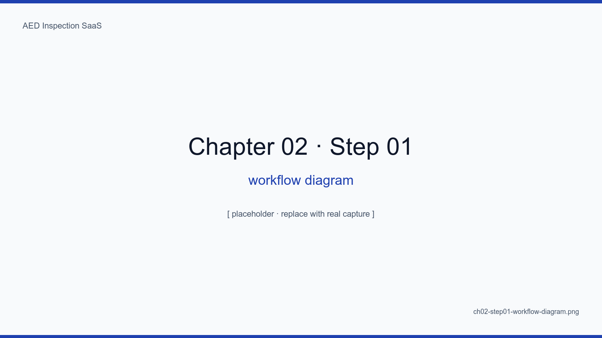
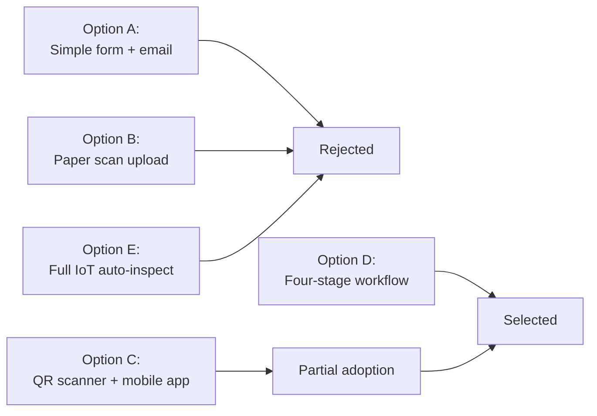
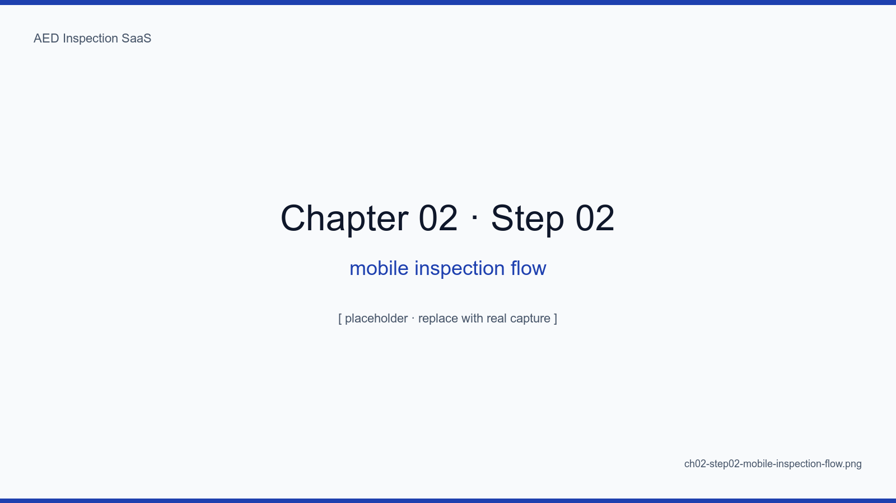
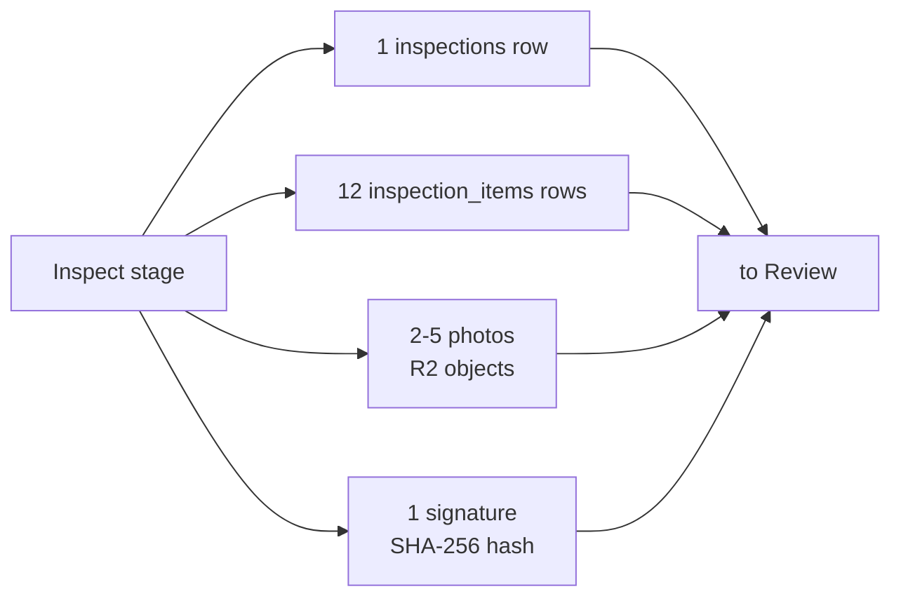
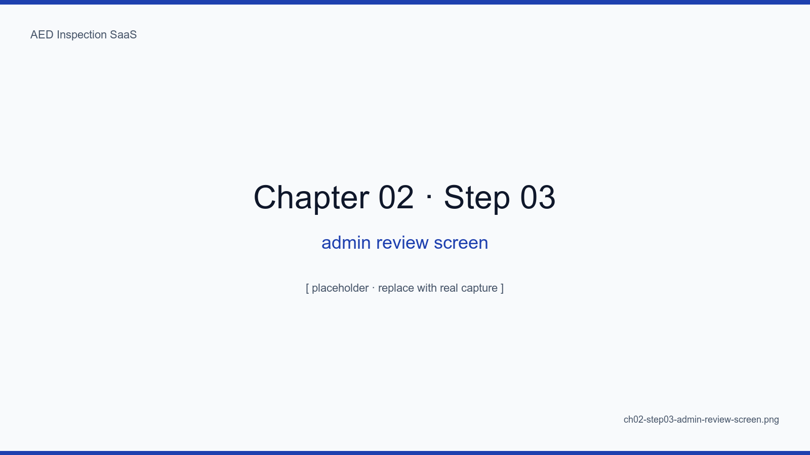
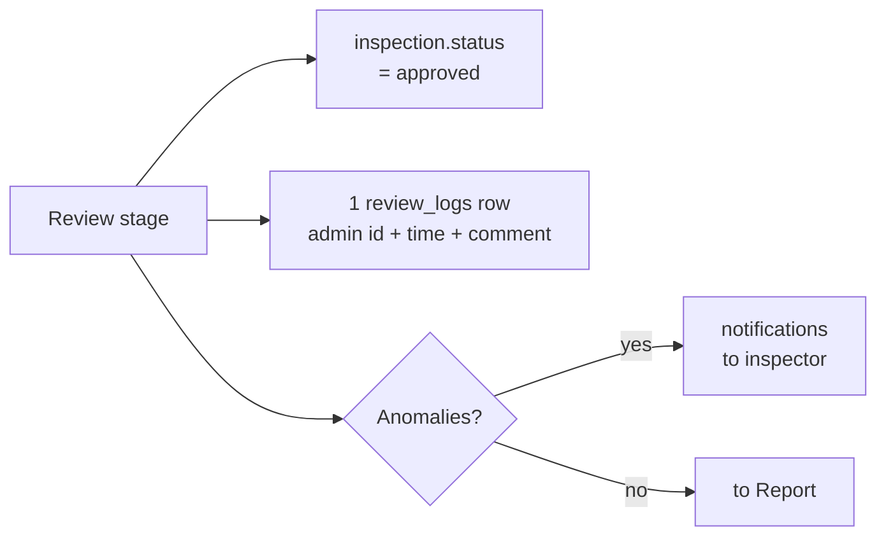
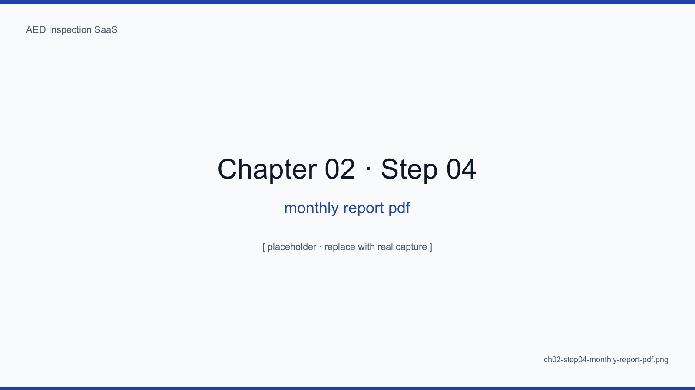
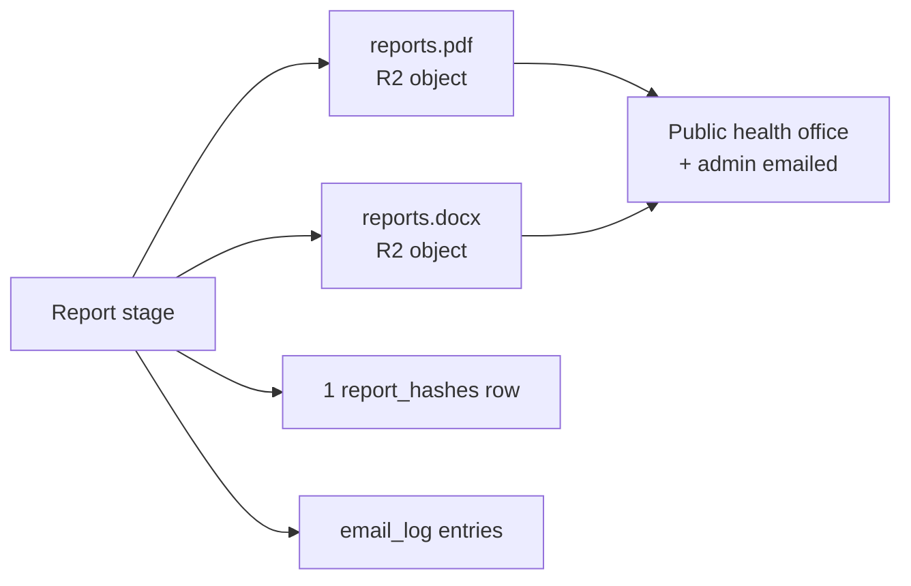
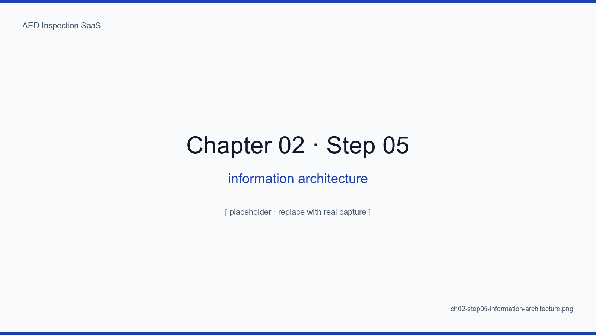

# Chapter 2. Discovering the Four-Stage Workflow

## Learning Objectives

- Understand why the inspection workflow decomposes into four stages — Schedule, Inspect, Review, Report — by comparison against five alternatives
- Identify who, on which screen, with what inputs and outputs, acts at each stage, including the mobile/desktop split
- Explain the principle of mobile-first (inspector) plus desktop-first (administrator), with its costs and benefits
- Diagram the mapping between workflow stages and the domain model, tracing the data flow at each stage
- Show how the workflow diagram drives the IA (information architecture), and how the IA flattens the user learning curve

## The Big Picture

A paper checklist collapses everything into one step: "fill in the boxes."
Digitizing pries that single step apart into four — **Schedule, Inspect,
Review, Report**. Each stage has a different user, a different screen, and
different validation rules. These four stages form the skeleton of the IA.

This decomposition is not where we accidentally arrived. We compared five
candidate workflows along their pros, cons, cost, learning curve, and
security profile, and four stages emerged as the only solution. Section 2.1
presents that comparison as a table.

Each stage is a **one-way flow**. Data moves Schedule -> Inspect -> Review
-> Report and never the other way. Reverse flow (e.g., editing inspection
data from the Report stage) is explicitly forbidden. This one-way principle
is the first defense of data integrity; chapter 9's SHA-256 hash chain is
the second.

Finally, each stage **forces a different device form factor**. Inspect is
mobile-first (a worker in the field, one hand on the phone). Review is
desktop-first (an administrator processing 100 cards in bulk). Report is
download-first (a public health office receiving PDF/DOCX). This split is
not just responsive layout — it is intrinsic to the workflow.

<!-- SCREENSHOT: ch02-step01-workflow-diagram -->

*Figure 2-1. The pipeline reads left to right. Each arrow is labeled with input, output, and the role responsible.*
<!-- /SCREENSHOT -->

## 2.1 Five Alternative Workflows Compared

We started with five candidate workflows on the table.



| Item | A. Form+email | B. Paper scan | C. QR + app | D. Four-stage (selected) | E. Full IoT |
|---|---|---|---|---|---|
| Paper dependency | 0% | 100% | 0% | 0% | 0% |
| Inspector learning curve | 5 min | 1 min | 30 min | 15 min | 0 min (auto) |
| Initial install cost | Low | Very low | Medium | Medium | Very high |
| Per-device monthly run cost | $0.5 | $0.3 | $1.0 | $0.8 | $5.0+ |
| Auto-detect misses | No | No | Partial | Yes | Yes |
| Time-series asset | Partial | No | Yes | Yes | Yes |
| Signature anti-tamper | No | No | Partial | Yes | Yes (n/a) |
| Security attack surface | Low | Medium | Medium | Medium | High |
| % of sites where adoptable | 80% | 95% | 60% | 90% | 5% |

**Option A (simple form + email)**: Mail an inspector a form link each
month and collect responses. Simplest possible, but weak on time-series
accumulation and miss detection. Marginal improvement over paper.

**Option B (paper scan upload)**: Keep paper, store the scan in the cloud.
Lowest barrier to adoption, but inherits every limitation of paper:
unsearchable, unverifiable, unanalyzable. Digitization's value is never
realized.

**Option C (QR scanner + mobile app)**: Affix a QR code to each device,
the inspector scans with an app and proceeds. Attractive but the learning
curve is steep (30 minutes plus app install), which is hard for inspectors
over fifty. Initial QR labeling for a 100-device site costs about 8 hours
of labor plus label production. We keep QR as an **optional** path while
keeping the core flow on the mobile web.

**Option D (four-stage workflow — selected)**: Four-stage pipeline of
quick input -> sign -> dispatch -> archive. Mobile web means no app
install, 15-minute learning curve, and full coverage of time-series
accumulation, anti-tampering, and auto-reporting.

**Option E (full IoT auto-inspect)**: IoT sensors on every AED. Ideal in
theory, but the per-device cost runs 300,000-500,000 KRW, and the existing
50,000 deployed AEDs cannot all be replaced. Only meaningful for some
greenfield installations.

Conclusion: at the intersection of 90% site adoptability + 15-minute
learning curve + time-series asset + $0.8/device/month, Option D is the
unique solution. The four-stage flow is the SaaS's core.

## 2.2 Stage 1 — Schedule

At 00:00 on the first of every month, the cron-worker creates the month's
inspection schedule for every active AED. Nobody clicks "create 100
inspections this month." This is the first essential difference from paper
operations: paper requires the inspector to actively notice "I should
inspect this month," while digital makes the system the active requester.

### 2.2.1 Trigger

- cron expression: `0 0 1 * *` (first of the month, midnight KST)
- input: list of active devices (`devices.is_active = true`)
- output: N rows in `inspection_schedule` (status: `pending`,
  due_date: end of month)

### 2.2.2 Automation Policy

- D-7, D-3, D-1 reminder emails
- Same-day-of-deadline alert to administrator if not yet inspected
- Day-after-deadline automatic report to headquarters

### 2.2.3 Failure Mode

If the cron container is down, the schedule is never created. This single
point of failure is covered by Uptime Kuma (chapter 15). At 02:00 on the
first of each month, a healthcheck verifies that schedules were created
and fires SMS + email + Slack alerts on failure.

## 2.3 Stage 2 — Inspect

The inspector fills the 12-item form on a phone, draws a signature, and
attaches a photo. This is where 90% of user value is produced.

<!-- SCREENSHOT: ch02-step02-mobile-inspection-flow -->

*Figure 2-2. The inspector flow as a five-screen sequence.*
<!-- /SCREENSHOT -->

### 2.3.1 Six-screen Flow (ASCII Wireframes)

```
+- Screen 1: Pick target ----+
|  [Map view]                |
|  - Main 1F (12 devices)    |
|  - Library 2F (3 devices)  |
|  - Dorm A (5 devices)      |
+----------------------------+
            |
            v
+- Screen 2: Device card ----+
|  AED-A12 (Philips HS1)     |
|  Last inspected: 2024-04-01|
|  [Start inspection >]      |
+----------------------------+
            |
            v
+- Screen 3: 12 items --------+
|  (*) 1. Body         [OK]   |
|  (*) 2. Battery indic[OK]   |
|  ( ) 3. Battery exp  [...]  |
|  ...                        |
|  [Attach photo +]           |
+----------------------------+
            |
            v
+- Screen 4: Photo -----------+
|  [Camera capture]           |
|  [Pick from gallery]        |
|  *EXIF auto-stripped        |
+----------------------------+
            |
            v
+- Screen 5: Signature -------+
|  +----------------+         |
|  |   (signature)  |         |
|  +----------------+         |
|  [Clear]  [Confirm v]       |
+----------------------------+
            |
            v
+- Screen 6: Done -----------+
|  v Submitted                |
|  Awaiting admin review      |
|  [Next device >]            |
+----------------------------+
```

### 2.3.2 Auto-fill UX

The form pre-fills with last month's values plus device metadata, so the
inspector only taps what changed. On average 11 of 12 items match the
prior month, so actual input shrinks to 1-2 items. Chapter 8 covers the
implementation.

### 2.3.3 Offline Queue

Basement-level inspections frequently lose signal. Inputs are queued in
IndexedDB and flushed by background sync on reconnect. The inspector can
finish a full inspection regardless of signal status.

### 2.3.4 Stage Output



## 2.4 Stage 3 — Review

The administrator reviews and approves results in bulk on a desktop screen.
For a 100-device site, one administrator must process 100 inspections per
month. A click-each-card UX is operationally impossible — bulk processing
is core.

<!-- SCREENSHOT: ch02-step03-admin-review-screen -->

*Figure 2-3. Filters on the left (pending, rejected, approved); on the right, a 12-item summary plus photo previews.*
<!-- /SCREENSHOT -->

### 2.4.1 Bulk Approval — 100 Devices in One Click

Clicking through 100 cards one by one is operationally impossible. We
provide an "approve all filtered" button (e.g., approve 95 cards flagged
"no anomalies"). The administrator then reviews only the 5 cards with
flagged items individually. Measured 100-card review time drops from
2.5 hours (paper) to about 10 minutes — a 15x reduction.

### 2.4.2 Rejection Comments and Resubmission

A rejection pushes the administrator's comment to the inspector by push
notification, and the inspector can immediately re-author on mobile.
Resubmission does not create a new inspection row but instead transitions
the same row's status: `pending` -> `submitted` -> `rejected` ->
`resubmitted`. Chapter 9 covers this state machine's integrity guarantees.

### 2.4.3 Stage Output



## 2.5 Stage 4 — Report

At month end the system generates and sends reports automatically. Human
intervention is reduced to "review the report and click OK."

<!-- SCREENSHOT: ch02-step04-monthly-report-pdf -->

*Figure 2-4. Page one of the auto-generated monthly report. Site name, period, 12-item statistics, and a list of un-inspected devices.*
<!-- /SCREENSHOT -->

### 2.5.1 DOCX + PDF, Simultaneously

Chapter 10 explores this. The short version: public health offices want to
edit DOCX, sites want to archive PDF. Both are generated from the same
source data simultaneously, and both files' SHA-256 hashes are stored
together in the database for instant tamper detection.

### 2.5.2 R2 Retention with Presigned URLs

Generated documents are written immediately to Cloudflare R2 with a
SHA-256 hash and a presigned URL. The presigned URL expires in 7 days; on
expiry, the user re-issues. Storage cost for a 100-device site's five
years of reports is roughly 30 KB x 60 = 1.8 MB per device, 180 MB site
total — well inside the free tier (10 GB).

### 2.5.3 Stage Output



## 2.6 IA Mapping

<!-- SCREENSHOT: ch02-step05-information-architecture -->

*Figure 2-5. The sidebar IA. (1) Schedule, (2) Inspect, (3) Review, (4) Reports map one-to-one onto the workflow stages.*
<!-- /SCREENSHOT -->

```
Sidebar
├─ Schedule       (results of stage 1)
├─ Inspect        (stage 2 input — mobile-first)
├─ Review         (stage 3 — desktop-first)
└─ Reports        (stage 4 deliverables)
```

When workflow and IA align one-to-one, users know what comes next without
having to look at the screen. We hypothesize that new users grasp the full
system flow about 4x faster than under paper-era handover (to be measured).
Chapter 4's architecture decision document records the verification plan
for this hypothesis.

### 2.6.1 Device Form Factor Policy

| Stage | Mobile-first | Desktop-first | Notes |
|---|---|---|---|
| Schedule | Partial | Yes | Admin calendar |
| Inspect | **Yes** | No | Field worker |
| Review | No | **Yes** | Bulk processing |
| Report | Partial | Yes | Download |

The mobile/desktop split is not just responsive layout — it is intrinsic
to the workflow. Inspection cards on desktop look oversized; the review
screen on mobile makes filters plus bulk operations impossible. Ignoring
the split degrades usability on both sides.

## Summary

- The four-stage workflow (Schedule, Inspect, Review, Report) is the
  skeleton of the SaaS. Quantitative comparison against five alternatives
  shows it is the unique intersection of site adoptability, learning curve,
  run cost, and time-series accumulation
- Each stage has different users, devices, and validation rules — the
  mobile/desktop split flows from the workflow, not from responsive design
- The workflow diagram becomes the IA, flattening the learning curve.
  Four stages = four sidebar items = four data model clusters
- Auto-scheduling, auto-fill UX, bulk review, and auto-reports are the
  core differentiators against paper. 100-card review time drops 2.5h
  -> 10m, a 15x reduction

## Next Chapter

The next chapter is an honest accounting of why we set Supabase and Vercel
aside in favor of self-hosting plus Cloudflare Edge, and how that choice
locks together with the four-stage workflow's run cost, scaling, and
legal data retention requirements.

## Capture Checklist

- [ ] `ch02-step01-workflow-diagram.png` — Mermaid diagram capture
- [ ] `ch02-step02-mobile-inspection-flow.png` — five mobile screens composed
- [ ] `ch02-step03-admin-review-screen.png` — desktop review (mosaic site name)
- [ ] `ch02-step04-monthly-report-pdf.png` — PDF page one preview
- [ ] `ch02-step05-information-architecture.png` — sidebar tree diagram
