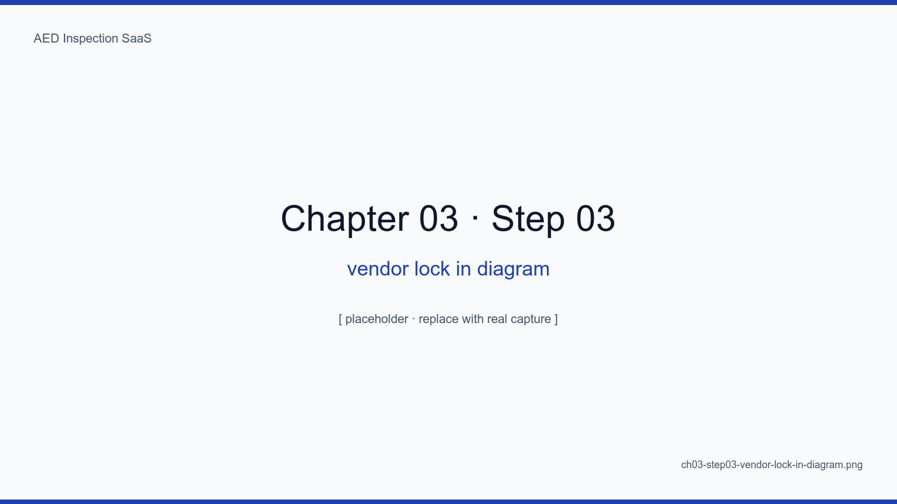
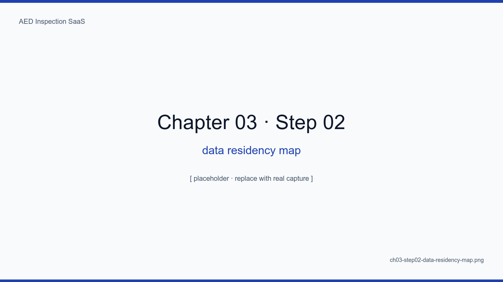
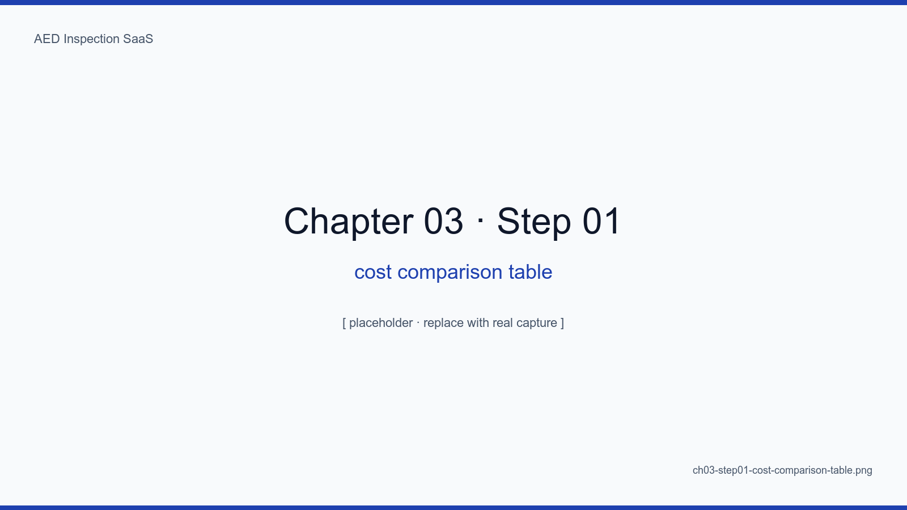
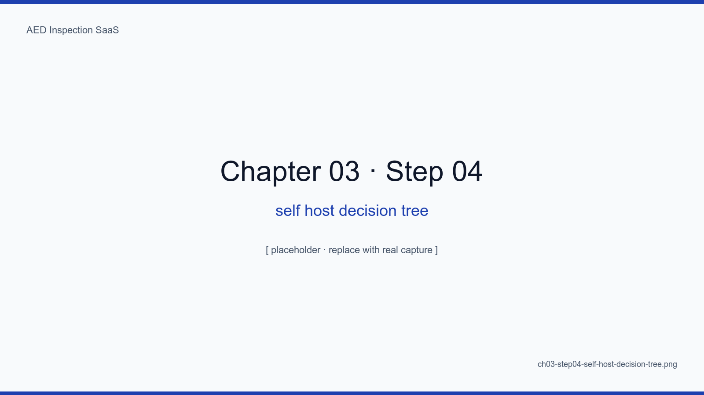

# Chapter 3. Why We Set Supabase and Vercel Aside

## Learning Objectives

- Identify where Supabase/Vercel strengths and our domain diverge
- Compare data residency, cost curves, and lock-in quantitatively
- Estimate the monthly bill at the 10,000-device scale under both scenarios
- State the trade-offs of self-hosting plus Cloudflare Edge honestly
- Map the constraints this decision imposes on the next chapter

## The Big Picture

Supabase is good. Vercel is even better. We use neither — for one reason:
**inspection data is recommended to remain inside the country under medical
data guidance, and five years of signature images cannot be hostage to an
external cloud's pricing curve**. On top of that, BaaS lock-in is vendor
pricing lock-in; once tied in, migration eventually costs more than the
SaaS itself.

## 3.1 Supabase Strengths — What We Walked Away From

- Auth, DB, Storage, and Realtime in five minutes
- RLS (Row Level Security) is essentially the textbook answer for multi-tenant isolation
- pgvector, edge functions, dashboard — all powerful

We walked away from all of it. The next sections explain why.

<!-- SCREENSHOT: ch03-step03-vendor-lock-in-diagram -->

*Figure 3-1. Delegating Auth, DB, Storage, and Functions to a single BaaS turns migration cost into a multiplicative bill across four modules.*
<!-- /SCREENSHOT -->

## 3.2 Data Residency

Personal information protection law and medical guidance recommend keeping
inspector PII, site coordinates, and site photos within national borders.
Tokyo and Singapore Supabase regions are not "domestic."

<!-- SCREENSHOT: ch03-step02-data-residency-map -->

*Figure 3-2. User → cloud region → backup location. Crossing a border at any hop pulls in extra consent and disclosure obligations.*
<!-- /SCREENSHOT -->

<!-- TODO: Cite the actual statute and Ministry guidance -->

## 3.3 Cost Curve — The 10,000-device Scenario

At 100 devices, Supabase Pro at $25/month is fine. At 10,000 — our target
horizon — the bill becomes meaningful.

<!-- SCREENSHOT: ch03-step01-cost-comparison-table -->

*Figure 3-3. Supabase Pro vs. self-hosted plus Cloudflare. The two curves cross around 1,000 devices and diverge by an order of magnitude at 10,000.*
<!-- /SCREENSHOT -->

| Scale | Supabase Pro | Self-hosted + Cloudflare |
|---|---|---|
| 100 | $25/mo | ~$15/mo (server) |
| 1,000 | $200+/mo | ~$30/mo |
| 10,000 | $1,500+/mo | ~$80/mo |

<!-- TODO: Refine with real R2 egress + Postgres disk + server spec numbers -->

## 3.4 Vercel Strengths — Trade-offs We Took

Vercel pulls 100% of Next.js out of the box. ISR, Edge Functions, Image
Optimization — one-line config. We still chose self-hosting because:

- We want **WAF and rate limiting layered as our own nginx + Cloudflare WAF**
- DOCX/PDF generation routinely uses 50MB of memory and several seconds of CPU, which fights serverless limits
- Six daily cron jobs need to run reliably; Vercel Cron's single-region execution does not pair well with backup jobs

## 3.5 Our Choice — abada-65 + Cloudflare Edge

A single self-managed server (`abada-65`) running Docker Compose, fronted
by Cloudflare Tunnel and WAF, with R2 as the only object store. Chapter 4
goes deeper.

<!-- SCREENSHOT: ch03-step04-self-host-decision-tree -->

*Figure 3-4. (1) Data residency duty? (2) Five-year operation at 10K? (3) Six cron jobs? (4) 50MB DOCX? (5) At least one operator? — All "yes" makes self-hosting the rational choice.*
<!-- /SCREENSHOT -->

### 3.5.1 An honest cost — your time

The real cost of self-hosting is the author's time. Backups, monitoring,
certificates, OS upgrades — all of it. Chapters 14 and 15 are about
managing that cost minute by minute.

<!-- TODO: Add measured operator time from the first year of production -->

## 3.6 Constraints That Land on the Next Chapter

Choosing self-hosting forces:

- **Auth must be implemented ourselves** → Auth.js (chapter 7)
- **No RLS** → query-level multi-tenant guards in Drizzle (chapters 5, 6)
- **Backup is our responsibility** → gpg + R2 mirror (chapter 14)
- **Monitoring is our responsibility** → Uptime Kuma (chapter 15)

## Summary

- Supabase and Vercel are excellent, but data residency, cost curves, and lock-in did not match this SaaS
- The bill diverges by an order of magnitude at 10,000 devices
- The real cost of self-hosting is operator time, which chapters 14 and 15 discipline minute by minute
- This decision determines the next chapter's abada-65 + Cloudflare Edge architecture

## Next Chapter

Next we draw the full architecture diagram for abada-65 plus Docker Compose
plus Cloudflare Tunnel and clarify each container's responsibilities.

## Capture Checklist

- [ ] `ch03-step01-cost-comparison-table.png` — spreadsheet capture
- [ ] `ch03-step02-data-residency-map.png`
- [ ] `ch03-step03-vendor-lock-in-diagram.png`
- [ ] `ch03-step04-self-host-decision-tree.png`
