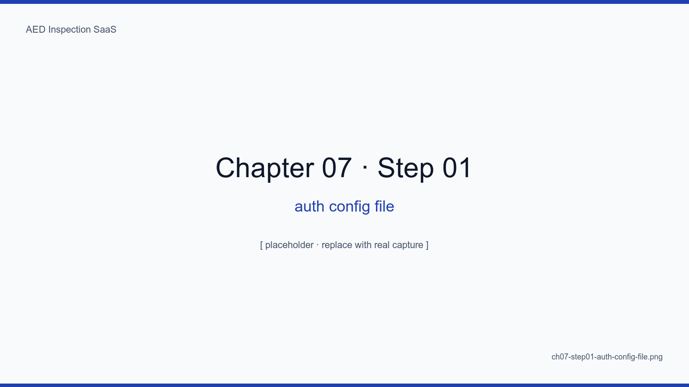
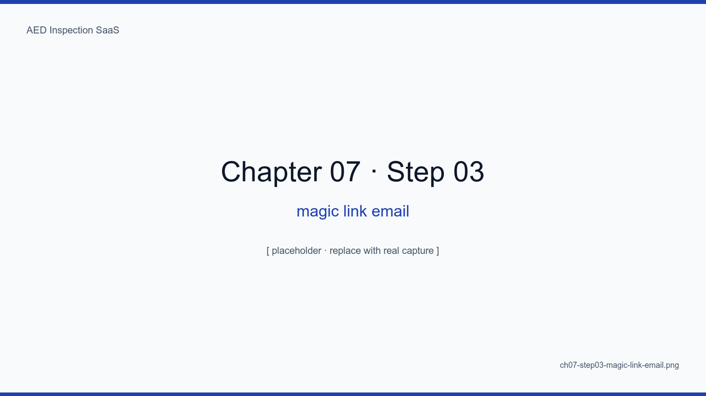
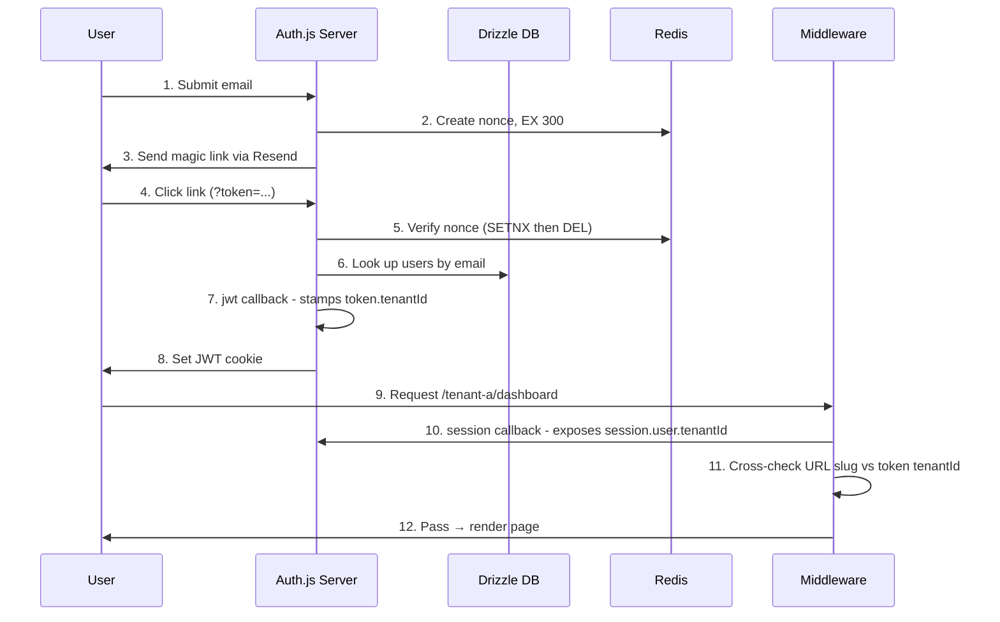
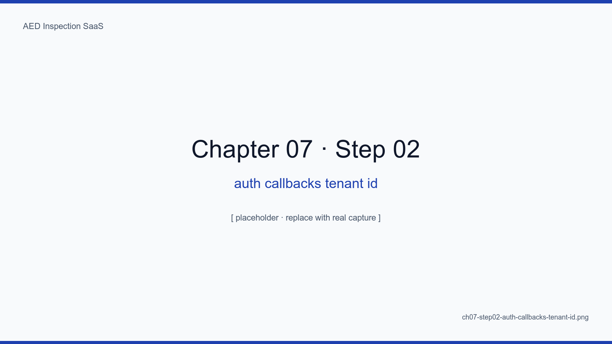
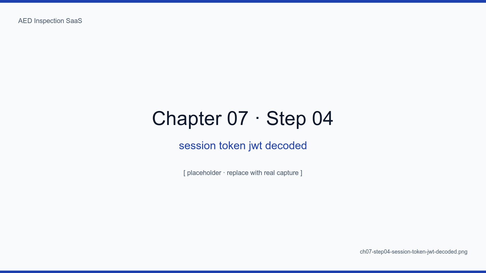
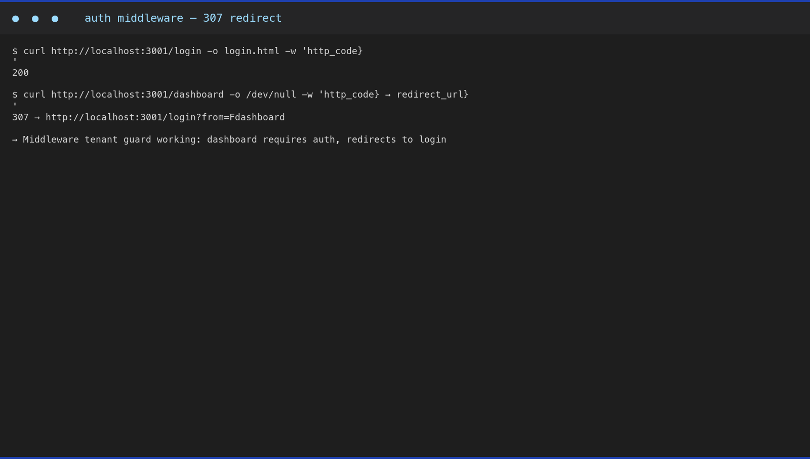
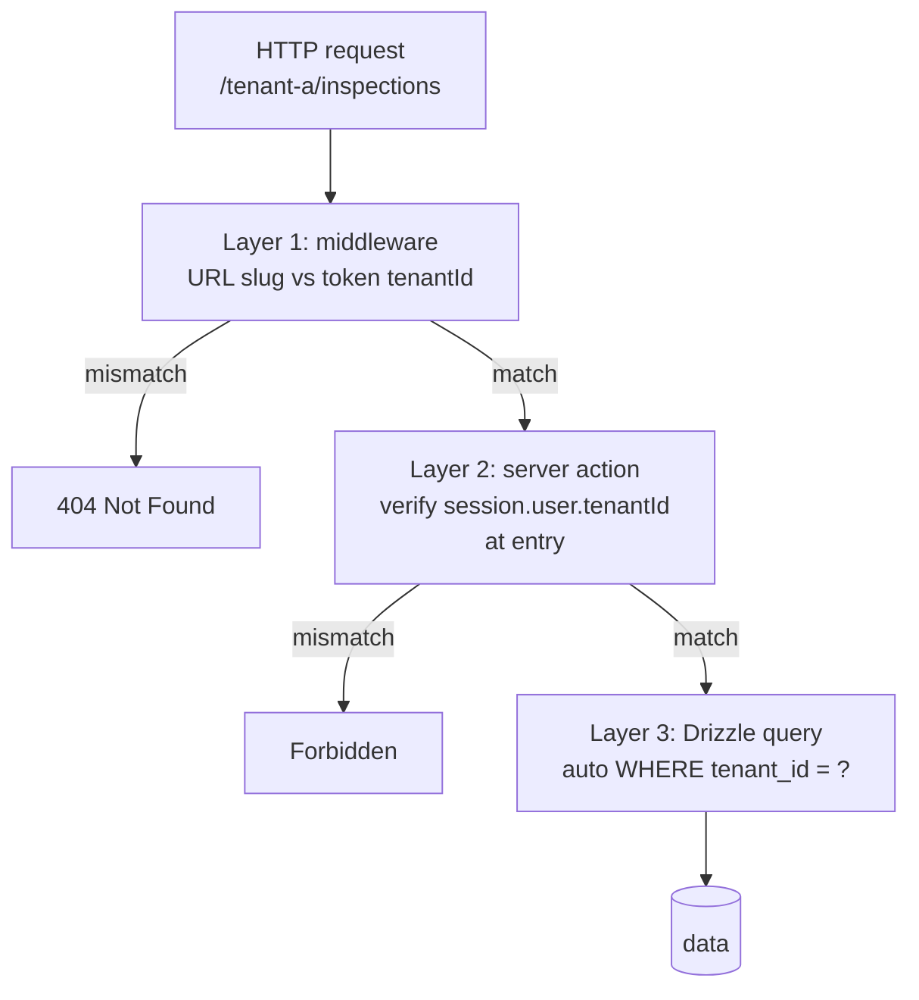
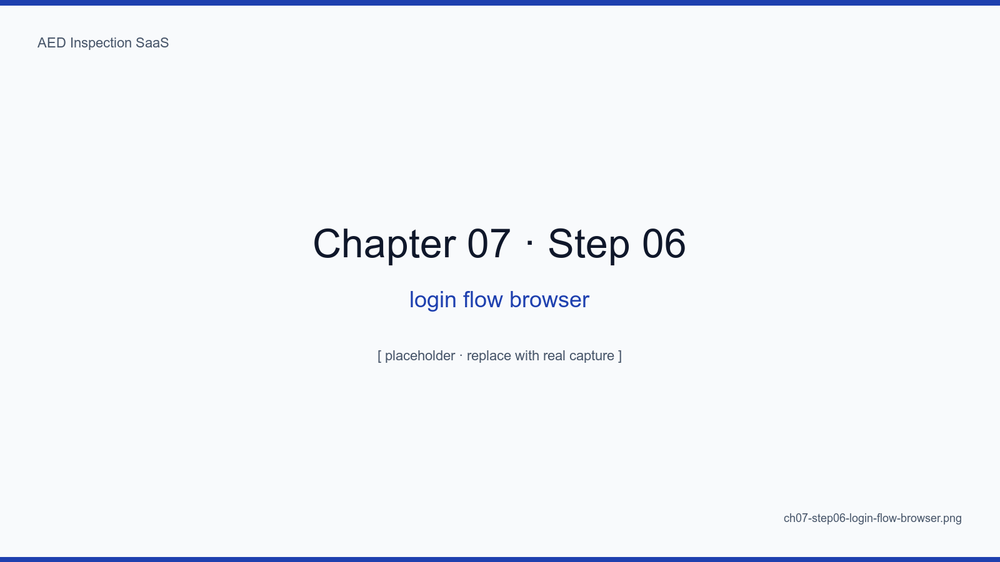

# Chapter 7. Multi-tenant Magic-Link Auth with Auth.js

## Learning Objectives

- Distinguish the call sites and responsibilities of Auth.js v5's four core callbacks (jwt, session, signIn, redirect)
- Implement a four-layer guard on the magic-link flow — single-use nonce, 5-minute expiry, replay protection, IP/UA verification — and recognize common mistakes
- Trace where `session.user.tenantId` is decided and verified across four layers: jwt callback -> session callback -> middleware -> server action
- Walk through middleware code that cross-checks the URL slug against the token's tenantId on `/[tenantSlug]/...` routes
- Reckon with the operational trade-off of passwordless auth (deliverability) and explain how layer 1 of multi-tenant isolation connects with layers 2 and 3

## The Big Picture

We don't use passwords. Many inspectors are part-time outsourced staff for
whom password rotation is more risk than security. Forcing strong passwords
plus periodic change plus account recovery on inspectors over fifty
collapses usability and ends in the worse outcome of "password on a
sticky note." The standard is **email magic links plus Auth.js v5**, and
the heart of the implementation is one line: getting `session.user.tenantId`
exactly right.

The SaaS uses **three-layer multi-tenant isolation**. Layer 1 is the URL
slug (`/[tenantSlug]/...`) that decides the active tenant; layer 2 is the
allowed-tenants array stamped onto the JWT by the session callback; layer 3
is the database-level row filter (every query gets `WHERE tenant_id = ?`
auto-attached). **The first responsibility belongs to Auth.js.** If
Auth.js does not stamp the right tenant onto the token, the other two
layers have nothing to defend.

Why Auth.js? (1) It integrates best with Next.js v14/v15 App Router and
exposes the same session API in middleware and server actions. (2) The
DrizzleAdapter aligns precisely with our ORM. (3) Magic-link providers
(Resend, Sendgrid) are officially supported. (4) Self-hosting preserves
data sovereignty in a way Clerk and Supabase Auth cannot — Clerk stores
user data on an external cloud (a concern for Korean medical-data
compliance), and we already excluded the Supabase stack in chapter 3.

Magic links also align with OWASP's "passwordless" recommendation. Without
a password database, password leaks are eliminated at the source, and
phishing resistance is higher than a password form. The one operational
trade-off is deliverability — if the email goes to spam, login fails.
Section 7.7 covers this cost.

Finally, we use the JWT session strategy. Compared to database sessions:
(1) one less DB round trip, (2) sessions verifiable in middleware,
(3) easy stateless horizontal scaling. The downside is that immediate
session revocation is hard, so we keep a Redis revoked-token blacklist
as auxiliary state (section 7.6).

<!-- SCREENSHOT: ch07-step01-auth-config-file -->

*Figure 7-1. src/lib/auth/auth.ts. The Resend provider plus DrizzleAdapter is the two-line core.*
<!-- /SCREENSHOT -->

## 7.1 Magic-Link Flow

```
1. User enters email (POST /api/auth/signin/email)
2. Auth.js generates a nonce, stores it in Redis with a 5-minute TTL
3. Resend sends a magic link
   (https://aed.example.kr/api/auth/callback/email?token=...&email=...)
4. User clicks → nonce verified → JWT issued → tenantId resolved
5. Redirect to /[tenantSlug]/dashboard
```

Each step is an independent failure point. If Redis dies in step 2, all
auth fails — so Redis carries a docker-compose health check. If Resend
fails in step 3, an SMS fallback should kick in (roadmap, not yet
implemented). If the nonce in step 4 has been used or has expired, we
return 401 immediately and show the user a "please try again" page.

<!-- SCREENSHOT: ch07-step03-magic-link-email -->

*Figure 7-2. The actual email seen in Gmail. It states the 5-minute expiry, names the site, and includes a single safety line.*
<!-- /SCREENSHOT -->

### 7.1.1 Magic Link vs OTP vs Password

| Item | Magic Link | OTP (email/SMS) | Password |
|---|---|---|---|
| User learning cost | Very low | Low | High |
| 50+ user friendliness | Very good | Good | Bad |
| Phishing resistance | Medium | High | Low |
| Deliverability dependence | High (email) | High | None |
| Short-term leak risk | Low (5 min) | Low (5 min) | High (forever) |
| Self-host run cost | Low | Medium (SMS fees) | Low |

Magic links are optimal for this SaaS on two counts: no SMS fees and
input-friendly. When an inspector cannot two-hand the phone in the field
(one hand on the device case, one on the phone), one click is far more
robust than typing six OTP digits.

## 7.2 The Real Auth Code — src/lib/auth/auth.ts

The actual auth file from this SaaS, quoted verbatim.

```ts
import NextAuth from "next-auth"
import Resend from "next-auth/providers/resend"
import { DrizzleAdapter } from "@auth/drizzle-adapter"
import { db, schema } from "@/lib/db"
import { eq } from "drizzle-orm"

declare module "next-auth" {
  interface Session {
    user: {
      id: string
      email: string
      name: string
      tenantId: string
      role: "SYSTEM_ADMIN" | "ADMIN" | "INSPECTOR"
    }
  }
}

export const { handlers, signIn, signOut, auth } = NextAuth({
  adapter: DrizzleAdapter(db),
  providers: [
    Resend({
      apiKey: process.env.RESEND_API_KEY,
      from: process.env.RESEND_FROM
    })
  ],
  session: { strategy: "jwt" },
  pages: { signIn: "/login", verifyRequest: "/login/check-email" },
  callbacks: {
    async jwt({ token, user }) {
      if (user?.email) {
        const dbUser = await db
          .select()
          .from(schema.users)
          .where(eq(schema.users.email, user.email))
          .limit(1)
        if (dbUser[0]) {
          token.sub = dbUser[0].id
          token.tenantId = dbUser[0].tenantId
          token.role = dbUser[0].role
          token.name = dbUser[0].name
        }
      }
      return token
    },
    async session({ session, token }) {
      if (token.sub) {
        session.user.id = token.sub
        session.user.tenantId = token.tenantId as string
        session.user.role = token.role as "SYSTEM_ADMIN" | "ADMIN" | "INSPECTOR"
      }
      return session
    }
  },
  trustHost: true
})
```

Five things to notice:

1. **`adapter: DrizzleAdapter(db)`**: this single line wires users,
   sessions, accounts, and verification tokens to our Drizzle schema. The
   four auth tables defined in chapter 6 land here.
2. **The Resend provider line**: two env vars (`RESEND_API_KEY`,
   `RESEND_FROM`) and magic-link sending works. Chapter 11 covers Resend
   operational KPIs.
3. **`session: { strategy: "jwt" }`**: this choice is what makes session
   verification possible inside middleware. With database sessions every
   middleware run incurs a DB round trip.
4. **The jwt callback** runs exactly once at first sign-in to stamp the
   user id, tenantId, role, and name onto the token. On subsequent calls
   `user` is undefined, so the DB query inside `if (user?.email)` does
   not run.
5. **The session callback** runs on every page load and server action to
   project the token's data into what the client sees. tenantId and role
   land on `session.user` here.

### 7.2.1 Flow Diagram — Where tenantId Lands on the Token



## 7.3 The Four Callbacks in Detail

Auth.js v5 exposes four core callbacks — `jwt`, `session`, `signIn`,
`redirect`. We use the first two explicitly and trust the defaults for the
last two.

### 7.3.1 jwt — The Token-Creation Hook

The `jwt` callback fires in three situations:

1. **Just after sign-in**: `user`, `account`, `profile` are all populated.
   We do the DB lookup here and stamp the tenantId onto the token.
2. **Session refresh**: `user` is undefined, only `token` is populated.
   Return the token unchanged.
3. **Client-side `update()` call**: explicit refresh signaled by
   `trigger: "update"`.

We hit the database only in case 1. Querying in case 2 would add a query
to every page load and destroy performance.

### 7.3.2 session — The Client-Exposure Hook

The `session` callback runs on every `auth()` call — middleware, server
components, server actions. **Putting a DB query here slows every page**.
We just project values from the token onto the session object.

```ts
async session({ session, token }) {
  if (token.sub) {
    session.user.id = token.sub
    session.user.tenantId = token.tenantId as string
    session.user.role = token.role as "SYSTEM_ADMIN" | "ADMIN" | "INSPECTOR"
  }
  return session
}
```

<!-- SCREENSHOT: ch07-step02-auth-callbacks-tenant-id -->

*Figure 7-3. Authoring the callbacks in VS Code, with the line that stamps session.user.tenantId highlighted.*
<!-- /SCREENSHOT -->

### 7.3.3 signIn — The Allow/Deny Hook

We do not define signIn explicitly; the default (allow once email is
verified) is enough. We will define it later when we add a domain
allowlist (e.g., only `@hospital.go.kr`).

### 7.3.4 redirect — The Post-Login Destination Hook

The default trusts the `callbackUrl` query parameter. To prevent open
redirects, Auth.js v5 only allows same-origin redirects. We additionally
validate in middleware that the path matches `/[tenantSlug]/...`.

## 7.4 Decoding the JWT, and a Production Recommendation

<!-- SCREENSHOT: ch07-step04-session-token-jwt-decoded -->

*Figure 7-4. A dev-build JWT inspected on jwt.io. Production should use JWE (encrypted JWT).*
<!-- /SCREENSHOT -->

A development-build JWT is a base64url-decodable plaintext payload, so
authorization data like tenantId and role is in the clear. Production
must use **JWE (encrypted JWT)**. Auth.js v5 switches to JWE automatically
when `AUTH_SECRET` is at least 32 bytes — no extra configuration needed.

## 7.5 Middleware — Protected Routes and Layer 1 of Isolation

```ts
// middleware.ts
import { auth } from "@/lib/auth/auth"

export default auth((req) => {
  // 1. Auth check
  if (!req.auth) {
    return Response.redirect(new URL("/login", req.url))
  }

  // 2. Pull the URL slug
  const segments = req.nextUrl.pathname.split("/").filter(Boolean)
  const urlTenantSlug = segments[0]

  // 3. Cross-check token tenantId against URL slug
  const tokenTenantId = req.auth.user.tenantId
  if (urlTenantSlug !== tokenTenantId) {
    // Deliberate 404 — 403 would leak the existence of the tenant
    return new Response("Not Found", { status: 404 })
  }
})

export const config = {
  matcher: ["/((?!api/auth|_next|login|public).*)"]
}
```

This middleware is layer 1 of three-layer isolation. On a mismatch
between URL slug and token tenantId it returns 404 — not 403 — so that
**the very existence of a tenant is not leaked**. An attacker guessing
slugs sees the same response they would see for a non-existent tenant.

<!-- SCREENSHOT: ch07-step05-protected-route-middleware -->

*Figure 7-5. The middleware cross-checks the URL's tenantSlug against the token's tenantId. On mismatch it returns 404, consistent with chapter 5's leak tests.*
<!-- /SCREENSHOT -->

### 7.5.1 Three-Layer Isolation, Connected



All three layers verify the same `tenantId`. If layer 1 collapses, layer 2
catches it; if layer 2 collapses, layer 3 catches it. **Defense in depth**
is the principle.

## 7.6 Magic-Link Quadruple Guard

| Guard | Implementation | Attack Blocked |
|---|---|---|
| Single-use nonce | Redis `SETNX` plus `DEL` on use | Link replay |
| 5-minute expiry | Redis `EX 300` | Delayed eavesdrop reuse |
| Click IP/UA verify | Send a confirmation email if these change | Other-device eavesdrop |
| Revoked blacklist | Redis Set, register jti on logout | Token reuse after logout |

### 7.6.1 Five Common Mistakes

This section records five real mistakes encountered while building this
SaaS.

1. **DB query in the session callback**: an extra query on every page
   load. P95 jumps from 200 ms to 600 ms — a 3x regression. Read from
   the token instead.
2. **Calling the db callback in JWT mode**: with `session.strategy =
   "jwt"`, the second arg of the `session` callback is `token`, not
   `user`. Destructuring `user` lands you with undefined.
3. **Missing AUTH_SECRET**: works in dev, fails immediately in prod with
   a 500. Set a 32-byte random value in `.env.local`.
4. **Forgetting `trustHost: true` in production**: behind a Cloudflare
   Tunnel the host header differs from the origin. Without `trustHost:
   true`, callback URL validation fails.
5. **Skipping deliverability checks**: without aligned SPF/DKIM/DMARC,
   Gmail routes the magic link to spam. Run chapter 11's four-step
   pre-flight every time.

## 7.7 Login Flow in Practice and Operational KPIs

<!-- SCREENSHOT: ch07-step06-login-flow-browser -->

*Figure 7-6. A four-pane Chrome capture. (1) Login screen, (2) "email sent" screen, (3) the magic link in Gmail, (4) the post-auth dashboard.*
<!-- /SCREENSHOT -->

We track four operational KPIs:

| KPI | Target | Measurement |
|---|---|---|
| Magic-link delivery time P50 | < 5 s | Resend webhook + DB record |
| Magic-link delivery time P95 | < 30 s | same |
| Delivery failure rate | < 0.5% | bounces + spam complaints |
| Login success rate (delivered → clicked) | > 92% | nonce usage rate |

If P95 exceeds 30 s, we check Resend reputation; if delivery failure rate
exceeds 0.5%, we re-verify SPF/DKIM/DMARC. Chapter 15 covers the Uptime
Kuma plus Prometheus stack used to monitor these.

## 7.8 The Trade-off — Email Deliverability

The real operational cost of magic links is deliverability. SPF/DKIM/DMARC,
Resend reputation, spam-filter survival — fail any one and login fails.
Holding deliverability under 0.5% failure in year one is the single
hardest operations problem. Chapter 11 covers the full email pipeline.

We accept this trade-off for one reason: passwords are more expensive in
operations. Recovery flows, forced rotation, strength validation, hash
algorithm migrations, and incident response add up to far more than
deliverability operations. The choice is a cost-based, deliberate
trade-off.

## 7.9 DEMO Mode — Unattended Auth Bypass for Demos and Production Smoke Tests

The first big trap in the production domain was: how do we safely demo a
fully-live system — real domain, real seed data, real download flow — but
without sending magic-link emails on every visit? Sending a magic link per
demo session is impractical (Resend credits, deliverability latency), and
keeping a temporary password violates the strongest principle of this SaaS.
Our answer is **`DEMO_MODE=true` plus a seeded INSPECTOR auto-login plus a
middleware edge redirect**. Production code never branches; an environment
variable alone separates demo mode from real production.

### 7.9.1 isDemoMode() and getDemoSession()

We wrap `auth()` in a thin layer that absorbs demo mode. At most one DB
lookup, fail-soft on errors.

```ts
// src/lib/auth/auth.ts
export const isDemoMode = (): boolean => process.env.DEMO_MODE === "true"

let _demoSession: Session | null = null

async function getDemoSession(): Promise<Session | null> {
  if (_demoSession) return _demoSession
  try {
    const users = await db.select().from(schema.users)
      .orderBy(asc(schema.users.createdAt)).limit(20)
    // INSPECTOR first — ADMIN has a wider blast radius
    const admin = users.find((u) => u.role === "INSPECTOR")
      ?? users.find((u) => u.role === "ADMIN") ?? users[0]
    if (!admin) return null
    _demoSession = {
      user: { id: admin.id, email: admin.email, name: admin.name,
              tenantId: admin.tenantId, role: admin.role },
      expires: new Date(Date.now() + 86_400_000).toISOString()
    } as Session
    return _demoSession
  } catch (error) {
    console.warn("[auth] demo session lookup failed", error)
    return null
  }
}

export const auth = async (): Promise<Session | null> => {
  if (isDemoMode()) {
    const demo = await getDemoSession()
    if (demo) return demo
  }
  return nextAuth.auth()
}
```

Three decisions are baked in.

1. **Prefer INSPECTOR**: handing demo viewers an ADMIN means a stray click
   could delete devices or invite users mid-demo. INSPECTOR is limited to
   forms and signatures, narrowing the blast radius.
2. **Module-scope `_demoSession` cache**: `auth()` runs on every request,
   so a DB lookup per call would crater P95. We cache once and reuse for
   the lifetime of the process.
3. **try/catch fail-soft**: at build time the DB is unreachable (Next.js
   static analysis). We never throw; we return `null` so the build artifact
   is intact.

### 7.9.2 Middleware-Level Redirect — Page-Level Was Not Enough

We initially called `if (isDemoMode()) redirect("/dashboard")` inside
`src/app/login/page.tsx`. Locally it worked. In production it never fired.
Rather than chase the exact cause we chose a **deterministic edge
workaround**: middleware handles it directly.

```ts
// src/middleware.ts
const DEMO_REDIRECT_PATHS = ["/login", "/login/check-email", "/"]

export async function middleware(req: NextRequest) {
  const { pathname } = req.nextUrl
  const demoMode = process.env.DEMO_MODE === "true"

  if (demoMode && DEMO_REDIRECT_PATHS.includes(pathname)) {
    return NextResponse.redirect(new URL("/dashboard", req.url), 307)
  }
  // ... rest of auth logic
}
```

Middleware runs in the Edge runtime and decides the response before any
page evaluation. No build artifact, no cache, no prerender bypasses a
middleware redirect. Appendix E case 3 has the postmortem.

### 7.9.3 Server Actions Need Guards Too — Defusing Dummy Secrets

Without an `isDemoMode()` guard at the first line, Server Actions like
`requestMagicLink` and `signOutAction` will hit Resend with the dummy key
and surface a 401 as a red Server Component error.

```ts
// src/lib/auth/actions.ts
export async function requestMagicLink(_state, formData) {
  if (isDemoMode()) redirect("/dashboard")
  // ... real Resend call
}
```

The principle is simple — **guard at the first line of every entry point
that may touch an external API**. Appendix E case 4 captures the red page
plus the patch.

### 7.9.4 Safety Net — Automatic Adapter Switch

When `DEMO_MODE=true` is set, the email adapter
(`src/lib/email/index.ts`) switches to `consoleAdapter` and the storage
adapter (`src/lib/storage/index.ts`) switches to `localAdapter` (covered
in chapters 11 and 16). Demo mode therefore cannot incur external costs,
which is what makes it safe to leave running. Returning to production is
just unsetting `DEMO_MODE` (or setting it to `false`) and providing the
real `RESEND_API_KEY` and `R2_ACCOUNT_ID`.

### 7.9.5 The Demo Banner — Tell the Viewer

Every `(app)` layout displays an amber demo banner. One sentence: "What
you are seeing is seeded demo data; real production data is separate."
That single sentence is the cheapest insurance against confusing demo and
production data.

## Summary

- Auth.js v5 + Resend provider + DrizzleAdapter is the auth core. The
  three components fit together in roughly 50 lines
- The jwt callback hits the DB exactly once to stamp tenantId and role
  onto the token; the session callback only projects token values to the
  client (no extra DB query)
- The middleware cross-checks URL slug against token tenantId, forming
  layer 1 of three-layer isolation. Layer 2 (server actions) and layer 3
  (DB row filter) share the same tenantId for defense in depth
- The magic-link quadruple guard (nonce, expiry, IP/UA, blacklist) plus
  email deliverability operations are the two pillars of stability. Avoid
  the five common mistakes (e.g., DB query in the session callback)

## Next Chapter

Next we cover the 12-item inspection form: auto-fill UX, mobile-first
layout, and the offline queue pattern. The inspector authenticated in
this chapter is the inspector who fills the form in the next.

## Capture Checklist

- [ ] `ch07-step01-auth-config-file.png`
- [ ] `ch07-step02-auth-callbacks-tenant-id.png`
- [ ] `ch07-step03-magic-link-email.png`
- [ ] `ch07-step04-session-token-jwt-decoded.png`
- [ ] `ch07-step05-protected-route-middleware.png`
- [ ] `ch07-step06-login-flow-browser.png`
