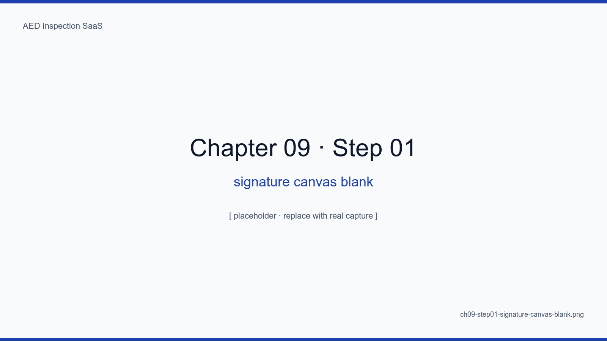
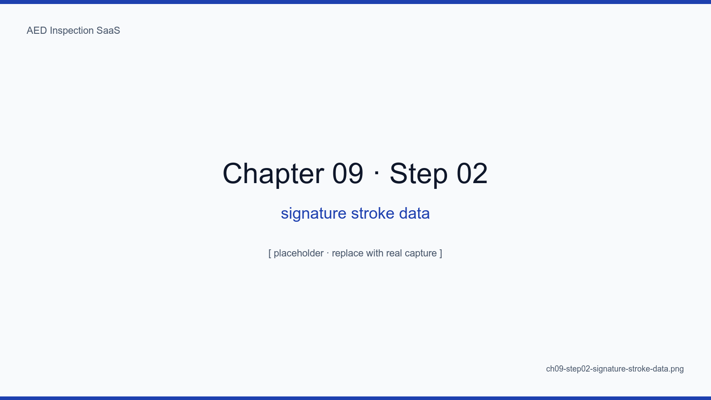
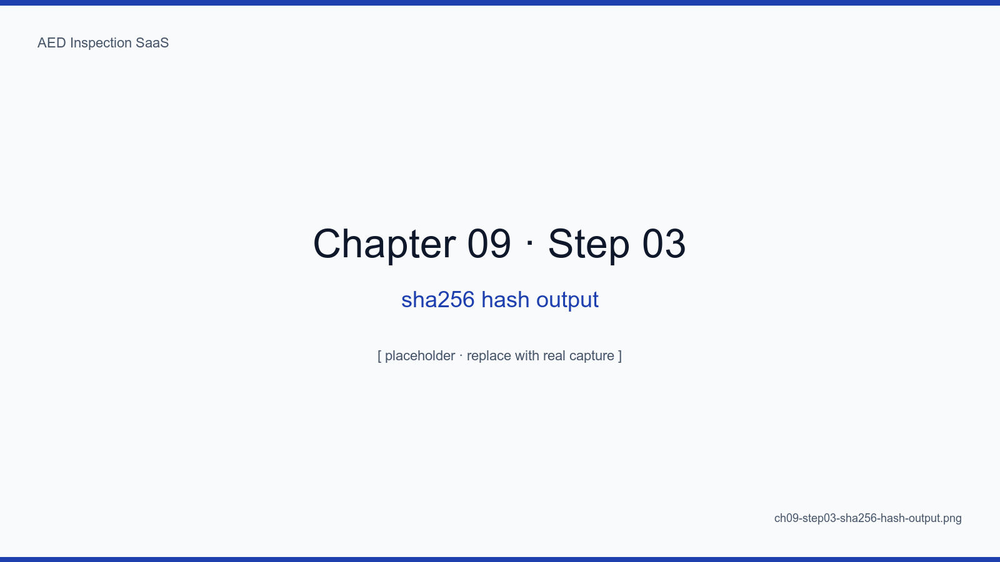
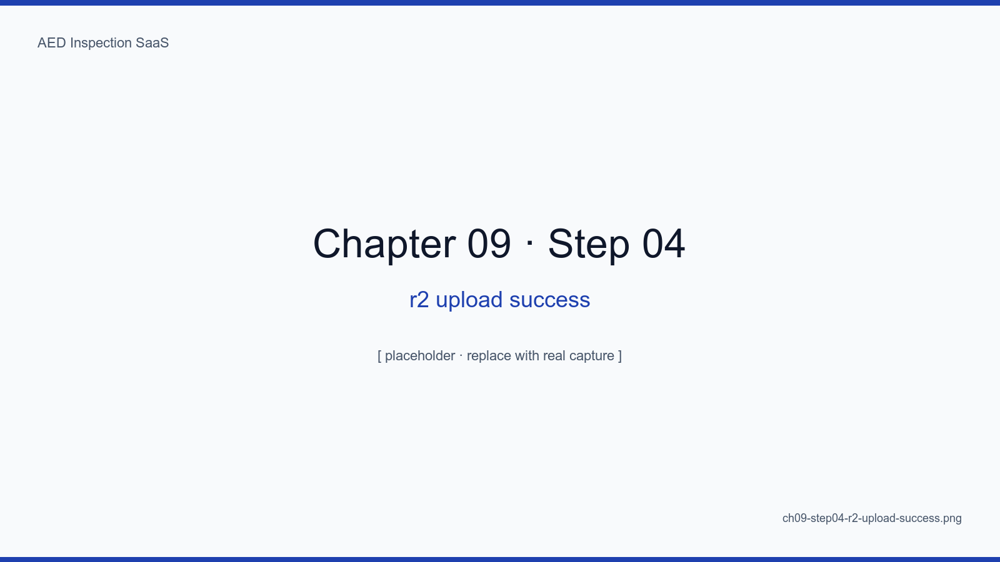
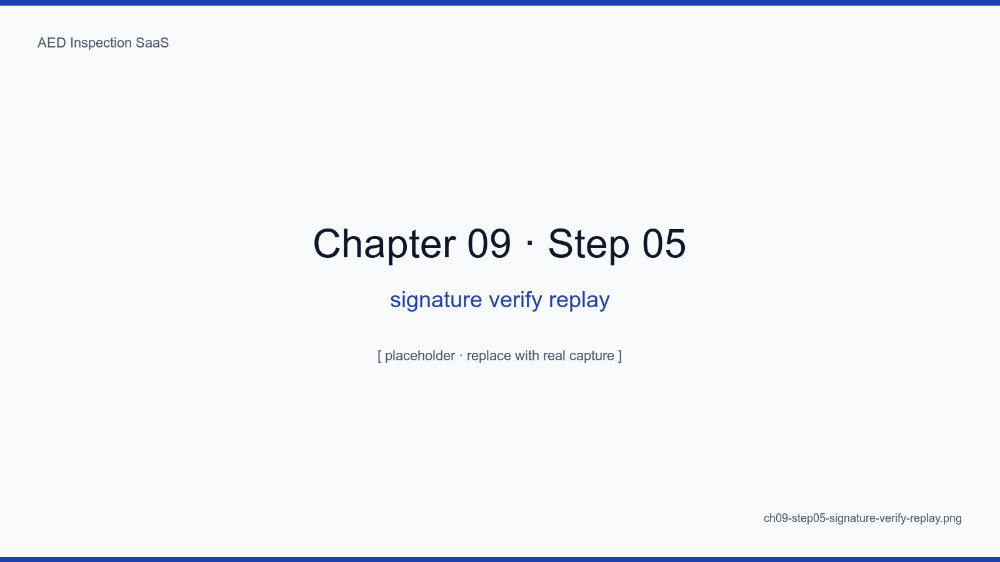
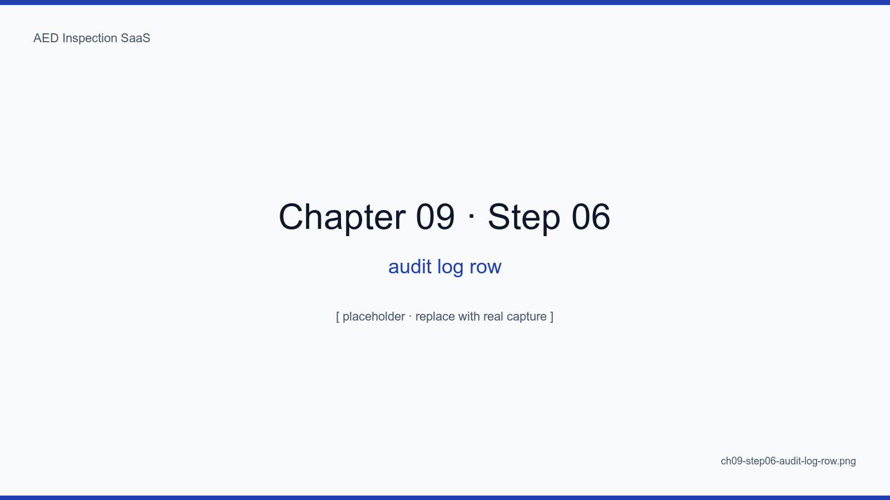

# Chapter 9. E-signature Canvas, SHA-256, R2

## Learning Objectives

- Implement a mobile-friendly signature pad on HTML Canvas
- Save signatures as SVG path plus PNG and stamp them with a SHA-256 hash
- Use Cloudflare R2 presigned URLs to upload directly from the browser, sparing the server
- Prove "this signature belongs to this moment" by replaying the stroke sequence on audit
- Block five common forgery attempts via tests

## The Big Picture

The e-signature is the legal evidence of the SaaS. Our goal is not to
mimic paper but to be **stronger than paper**. Three pillars:
preserve raw stroke data, chain signatures with SHA-256, embed time into
R2 object keys.

<!-- SCREENSHOT: ch09-step01-signature-canvas-blank -->

*Figure 9-1. The mobile canvas. A faint guide line gives the same spatial sense as a paper checklist.*
<!-- /SCREENSHOT -->

## 9.1 Capturing Strokes

```ts
// Save mouse/touch events as a sequence of (x, y, t, pressure)
type Stroke = { x: number; y: number; t: number; p?: number }
```

<!-- SCREENSHOT: ch09-step02-signature-stroke-data -->

*Figure 9-2. One signature's raw strokes. Saving this sequence lets us replay it later for audits.*
<!-- /SCREENSHOT -->

### 9.1.1 SVG plus PNG

- **SVG**: vector, embeds in DOCX/PDF without quality loss
- **PNG**: previews, search indexing, third-party tool compatibility

## 9.2 SHA-256 Hash Chain

```ts
const sigBlob = new Blob([svg])
const digest = await crypto.subtle.digest("SHA-256", await sigBlob.arrayBuffer())
const hashHex = bufferToHex(digest)
```

<!-- SCREENSHOT: ch09-step03-sha256-hash-output -->

*Figure 9-3. Signing twice with even one pixel difference produces a completely different hash — the starting point of forgery detection.*
<!-- /SCREENSHOT -->

### 9.2.1 Chaining

We set `signatures.previousHash = hash of the previous signature` so
modifying any single signature breaks every signature that came after.
(Inspired by the Tier 1 MVP pattern from the SAP project.)

## 9.3 Direct Upload to R2 (Presigned)

The server never receives the object; it just hands out a **presigned URL**
the client PUTs to.

```ts
// app/api/r2/presign/route.ts
const url = await s3Client.getSignedUrl(
  new PutObjectCommand({ Bucket, Key: `sig/${tenantId}/${id}.svg`, ... }),
  { expiresIn: 60 }
)
return Response.json({ url })
```

<!-- SCREENSHOT: ch09-step04-r2-upload-success -->

*Figure 9-4. Chrome DevTools Network. PUT https://...r2.cloudflarestorage.com/... 200. The server only handed out a 60-second presigned URL.*
<!-- /SCREENSHOT -->

### 9.3.1 Key Naming

```
sig/{tenantId}/{inspectionId}/{timestamp}.svg
sig/{tenantId}/{inspectionId}/{timestamp}.png
```

The timestamp inside the key structurally prevents accidental overwrites.

## 9.4 Audit — Replaying a Signature

<!-- SCREENSHOT: ch09-step05-signature-verify-replay -->

*Figure 9-5. The audit screen plays the signature back at half speed so a human can compare pressure, speed, and angle to the inspector's usual signature.*
<!-- /SCREENSHOT -->

## 9.5 Five Forgery Attempts, All Blocked

| Attempt | Block |
|---|---|
| Capture and reuse on another inspection | The hash is bound to inspectionId in the table |
| Edit the signature SVG directly | Recomputed hash mismatches |
| Overwrite the R2 object | Timestamps in the key, version-locked |
| Forge tenant_id in the DB | Three-layer guards from chapter 5 |
| Tamper with the clock | Server time and cloudflared edge timestamp recorded together |

<!-- SCREENSHOT: ch09-step06-audit-log-row -->

*Figure 9-6. One row of audit_logs. signature.create logs inspector_id, ip, ua, hash, replay_token together.*
<!-- /SCREENSHOT -->

## Summary

- The goal is not to imitate paper but to surpass it in integrity
- SVG + PNG dual storage, SHA-256 chaining, and timestamp-in-key form the three integrity axes
- Direct presigned uploads keep server memory and CPU pressure near zero
- Five common forgery attempts are blocked structurally

## Next Chapter

Next we generate DOCX and PDF reports from inspection data simultaneously
and satisfy two readers at once: sites want PDF, regulators want DOCX.

## Capture Checklist

- [ ] `ch09-step01-signature-canvas-blank.png`
- [ ] `ch09-step02-signature-stroke-data.png`
- [ ] `ch09-step03-sha256-hash-output.png`
- [ ] `ch09-step04-r2-upload-success.png`
- [ ] `ch09-step05-signature-verify-replay.png`
- [ ] `ch09-step06-audit-log-row.png`
