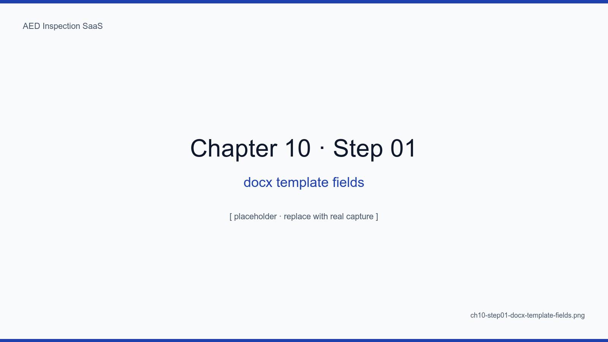
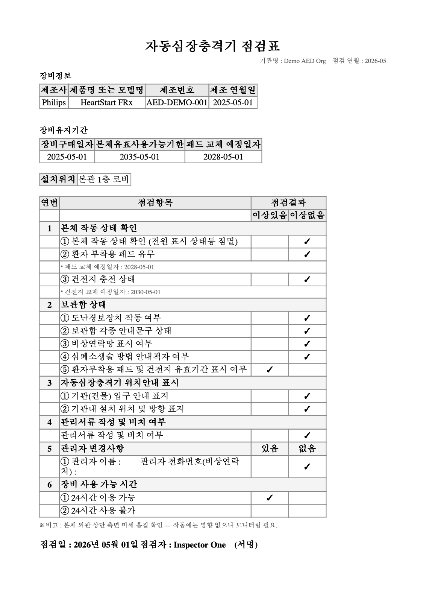
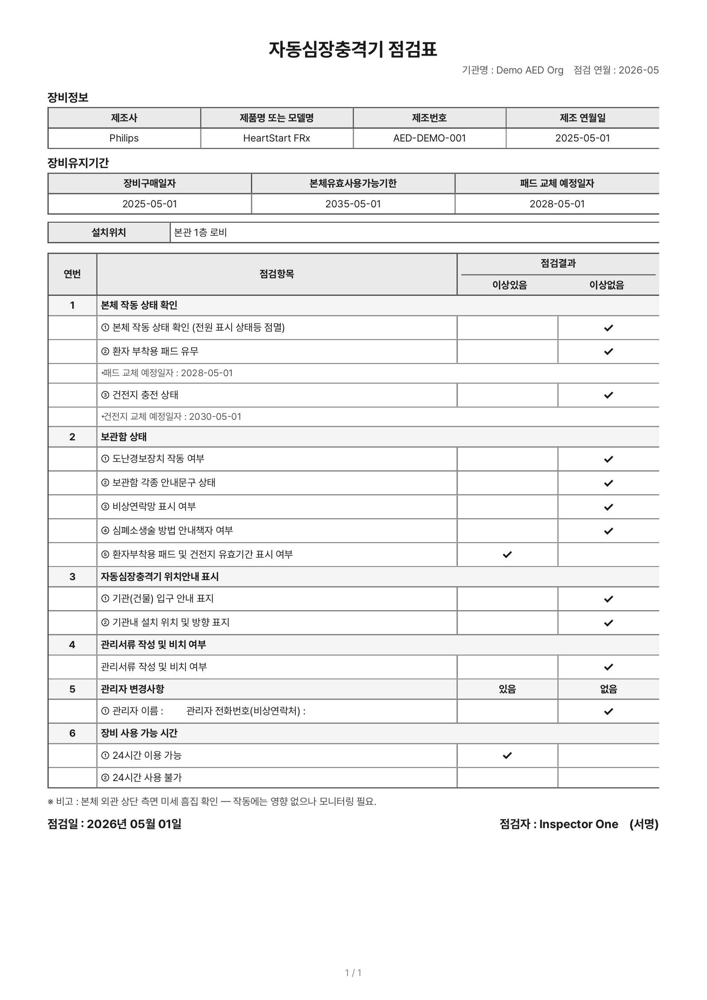
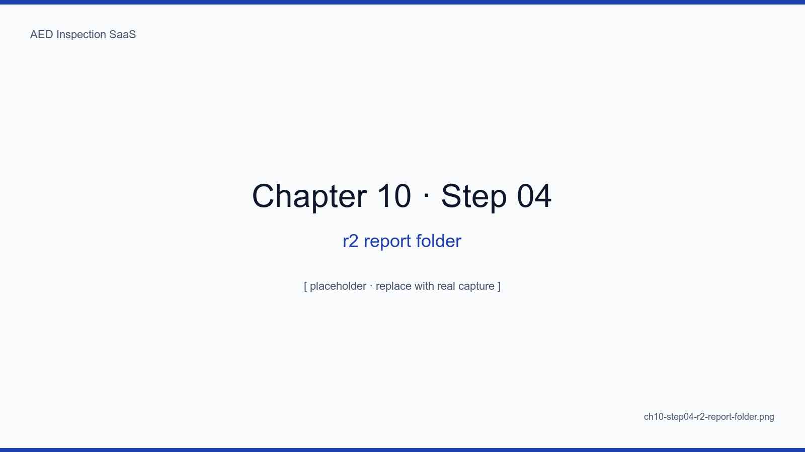
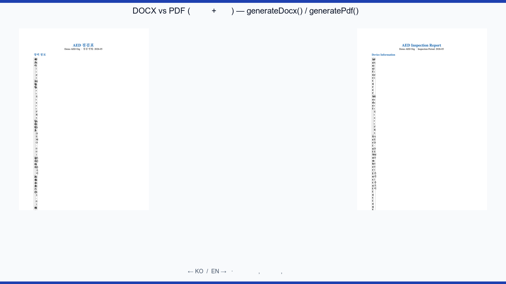

# Chapter 10. Generating DOCX and PDF Together

## Learning Objectives

- Use docxtemplater to fill the official ministerial DOCX template directly
- Generate PDFs with React PDF (not puppeteer) to spare memory and time
- Generate one site's monthly report in under five seconds via batched queues
- Satisfy two demands at once: sites want PDF, regulators want DOCX
- Apply retry-and-partial-output patterns when generation fails

## The Big Picture

Report generation is the SaaS's "month-end peak" — traffic for five days
runs at 50x the normal rate. So we abandon synchronous generation in
favor of **queue-based batching**. One queue job emits both the DOCX for
regulators and the PDF for site archives.

<!-- SCREENSHOT: ch10-step01-docx-template-fields -->

*Figure 10-1. assets/templates/monthly-report.docx opened in LibreOffice. Placeholders like {tenant.name} and {#inspections}{/inspections} sit on the official template.*
<!-- /SCREENSHOT -->

## 10.1 DOCX — docxtemplater

```ts
const zip = new PizZip(await readFile(templatePath))
const doc = new Docxtemplater(zip, { paragraphLoop: true, linebreaks: true })
doc.render({ tenant, period, inspections })
const buf = doc.getZip().generate({ type: "nodebuffer" })
```

<!-- SCREENSHOT: ch10-step02-docxtemplater-output -->

*Figure 10-2. The output as opened in LibreOffice. The 12 items, site name, and inspector name all populate correctly inside the table.*
<!-- /SCREENSHOT -->

### 10.1.1 Avoiding Layout Breakage

`paragraphLoop: true` and `linebreaks: true` are critical. Broken
placeholders inside complex tables fail the regulator's review.

## 10.2 PDF — React PDF

```tsx
import { Document, Page, Text, View, pdf } from "@react-pdf/renderer"

export const MonthlyReport = ({ data }) => (
  <Document>
    <Page size="A4">
      <View>
        <Text>{data.tenant.name} Monthly Inspection Report</Text>
        {/* ... */}
      </View>
    </Page>
  </Document>
)
```

<!-- SCREENSHOT: ch10-step03-pdf-generated-preview -->

*Figure 10-3. Viewed in PDF.js. Pretendard Korean font is embedded; a SHA-256-derived short watermark sits in the upper right.*
<!-- /SCREENSHOT -->

### 10.2.1 Why Not puppeteer

A single Chrome instance via puppeteer eats 200MB+. Generating reports for
100 sites concurrently takes the container down. React PDF lands at ~10MB.

## 10.3 Queue-based Batching

The cron-worker enqueues a generation job for every active tenant at 02:00
on the first of the month. Chapter 12 has the details.

### 10.3.1 Partial Failure

One failure out of 100 must not fail the entire batch.
`Promise.allSettled` plus a separate report of failures handles this.

## 10.4 R2 Layout

```
reports/{tenantId}/{yyyy-mm}/{tenantSlug}-{yyyymm}.docx
reports/{tenantId}/{yyyy-mm}/{tenantSlug}-{yyyymm}.pdf
```

<!-- SCREENSHOT: ch10-step04-r2-report-folder -->

*Figure 10-4. The R2 dashboard, sorted by tenantId then year-month. Searching is intuitive.*
<!-- /SCREENSHOT -->

## 10.5 Side-by-side Verification

<!-- SCREENSHOT: ch10-step05-side-by-side-docx-pdf -->

*Figure 10-5. Same data, DOCX on the left and PDF on the right. We visually verify table alignment, margins, and pagination match.*
<!-- /SCREENSHOT -->

<!-- TODO: Add automated visual regression test results (pixelmatch) -->

## Summary

- Month-end peak demands queue-based batching; synchronous generation forbidden
- DOCX via docxtemplater, PDF via React PDF — avoiding puppeteer cuts memory by 20x
- One job emits both formats, satisfying both audiences
- Tolerating partial failure plus separate reporting prevents one bad site from wrecking the batch

## Next Chapter

Next we send those reports via Resend + React Email and wrestle with the
real operational challenge — email deliverability.

## Capture Checklist

- [ ] `ch10-step01-docx-template-fields.png`
- [ ] `ch10-step02-docxtemplater-output.png`
- [ ] `ch10-step03-pdf-generated-preview.png`
- [ ] `ch10-step04-r2-report-folder.png`
- [ ] `ch10-step05-side-by-side-docx-pdf.png`
