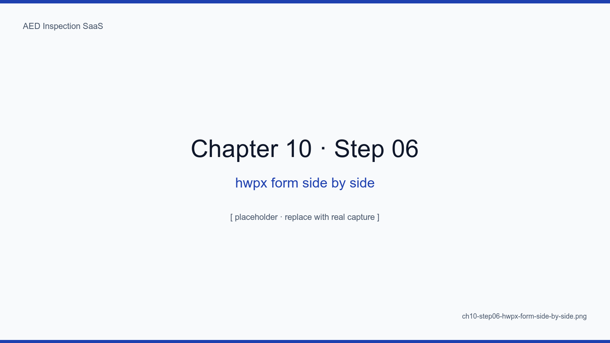
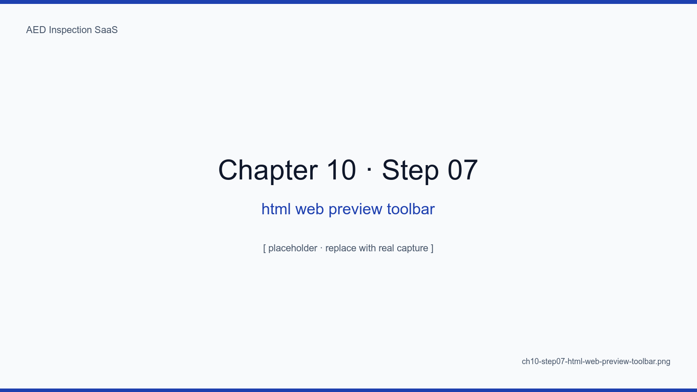
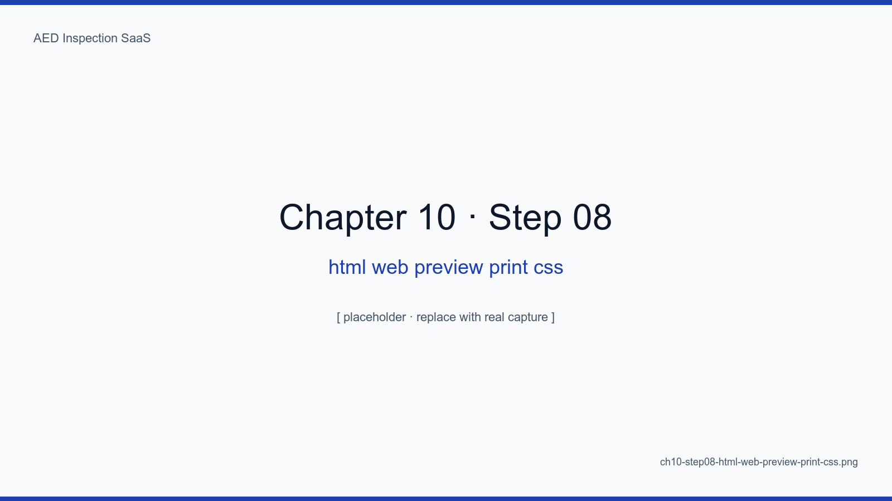

# Chapter 10. Generating DOCX and PDF Together

## Learning Objectives

- Use docxtemplater to fill the official ministerial DOCX template directly
- Generate PDFs with React PDF (not puppeteer) to spare memory and time
- Generate one site's monthly report in under five seconds via batched queues
- Satisfy two demands at once: sites want PDF, regulators want DOCX
- Apply retry-and-partial-output patterns when generation fails

## The Big Picture

Report generation is the SaaS's "month-end peak" — traffic for five days
runs at 50x the normal rate. So we abandon synchronous generation in
favor of **queue-based batching**. One queue job emits both the DOCX for
regulators and the PDF for site archives.

<!-- SCREENSHOT: ch10-step01-docx-template-fields -->

*Figure 10-1. assets/templates/monthly-report.docx opened in LibreOffice. Placeholders like {tenant.name} and {#inspections}{/inspections} sit on the official template.*
<!-- /SCREENSHOT -->

## 10.1 DOCX — docxtemplater

```ts
const zip = new PizZip(await readFile(templatePath))
const doc = new Docxtemplater(zip, { paragraphLoop: true, linebreaks: true })
doc.render({ tenant, period, inspections })
const buf = doc.getZip().generate({ type: "nodebuffer" })
```

<!-- SCREENSHOT: ch10-step02-docxtemplater-output -->

*Figure 10-2. The output as opened in LibreOffice. The 12 items, site name, and inspector name all populate correctly inside the table.*
<!-- /SCREENSHOT -->

### 10.1.1 Avoiding Layout Breakage

`paragraphLoop: true` and `linebreaks: true` are critical. Broken
placeholders inside complex tables fail the regulator's review.

## 10.2 PDF — React PDF

```tsx
import { Document, Page, Text, View, pdf } from "@react-pdf/renderer"

export const MonthlyReport = ({ data }) => (
  <Document>
    <Page size="A4">
      <View>
        <Text>{data.tenant.name} Monthly Inspection Report</Text>
        {/* ... */}
      </View>
    </Page>
  </Document>
)
```

<!-- SCREENSHOT: ch10-step03-pdf-generated-preview -->

*Figure 10-3. Viewed in PDF.js. Pretendard Korean font is embedded; a SHA-256-derived short watermark sits in the upper right.*
<!-- /SCREENSHOT -->

### 10.2.1 Why Not puppeteer

A single Chrome instance via puppeteer eats 200MB+. Generating reports for
100 sites concurrently takes the container down. React PDF lands at ~10MB.

## 10.3 Queue-based Batching

The cron-worker enqueues a generation job for every active tenant at 02:00
on the first of the month. Chapter 12 has the details.

### 10.3.1 Partial Failure

One failure out of 100 must not fail the entire batch.
`Promise.allSettled` plus a separate report of failures handles this.

## 10.4 R2 Layout

```
reports/{tenantId}/{yyyy-mm}/{tenantSlug}-{yyyymm}.docx
reports/{tenantId}/{yyyy-mm}/{tenantSlug}-{yyyymm}.pdf
```

<!-- SCREENSHOT: ch10-step04-r2-report-folder -->

*Figure 10-4. The R2 dashboard, sorted by tenantId then year-month. Searching is intuitive.*
<!-- /SCREENSHOT -->

## 10.5 Side-by-side Verification

<!-- SCREENSHOT: ch10-step05-side-by-side-docx-pdf -->

*Figure 10-5. Same data, DOCX on the left and PDF on the right. We visually verify table alignment, margins, and pagination match.*
<!-- /SCREENSHOT -->

<!-- TODO: Add automated visual regression test results (pixelmatch) -->

## 10.6 Matching the HWPX Form 1:1 — 12 Items in 6 Groups

The first feedback we got from a regulator after the first deploy was
short: "Your tables don't match the form." The Ministry's HWPX (Hangul
Word XML) source is not a flat list of twelve items — it is a layout of
**six groups holding twelve items, with ① ② ③ sub-markers inside each
group, pad/battery replacement dates inline, a 24-hour-availability
branch, and a signature wedged in the lower-right corner**. We extract
the original HWPX (`docs/forms/aed-inspection-form-mohw.hwpx`, 54 KB) into
text and reproduce that visual structure 1:1.

```ts
// src/lib/inspection/items.ts (excerpt)
export const INSPECTION_ITEMS = [
  // 1. Main unit operating status (3 items)
  { code: "OP_POWER",   group: 1, sub: "①", labelKo: "본체 작동 상태 확인 (전원 표시 상태등 점멸)", ... },
  { code: "OP_PAD",     group: 1, sub: "②", labelKo: "환자 부착용 패드 유무", ... },
  { code: "OP_BATTERY", group: 1, sub: "③", labelKo: "건전지 충전 상태", ... },
  // 2. Cabinet status (5: BX_ALARM, BX_GUIDE, BX_EMG, BX_CPR, BX_EXP)
  // 3. Location signage (2: LOC_ENT, LOC_DIR)
  // 4. Management documentation (1: DOC_FILE)
  // 6. 24-hour availability (1: TIME_24)  ← group 5 is metadata
] as const
```

We **corrected the count from 14 to 12** along the way. The early scaffold
included `OP_CONNECTOR` and `OP_EXTERIOR`, neither of which appear in the
HWPX. Re-extracting the form removed both (`9dd4982`). The lesson: **the
authority on a regulatory form is the source file, not an LLM**.

### 10.6.1 Group 5 = Metadata, So We Skip the Number

Group 5 ("administrator changes") is recorded as device-record history
rather than an OK/NG check. So group numbers in INSPECTION_ITEMS are
1, 2, 3, 4, 6 — **5 is intentionally skipped** to keep the visual layout
of the form aligned with the code constant. That single decision keeps the
DOCX/PDF renderer simple.

### 10.6.2 Sub-Item Indentation and Inline Metadata

Within each group, the ① ② ③ sub-markers express hierarchy via a single
indent. Pad (BX_EXP) and battery (OP_BATTERY) replacement dates are
inlined next to the label — placing them in a separate row breaks the
form. The 24-hour question (TIME_24) gets its own cell in group 6. The
signature is the last cell of the last row, not a separate footer.

```ts
// src/lib/documents/docx.ts (excerpt)
function renderItemRow(item: InspectionItem, result: "OK" | "NG"): TableRow {
  const indent = item.sub ? "    " : ""
  const labelText = `${indent}${item.sub} ${item.labelKo}`
  const inlineMeta = item.code === "BX_EXP"
    ? ` (replaced: ${formatDate(device.padReplacedAt)})`
    : item.code === "OP_BATTERY"
    ? ` (replaced: ${formatDate(device.batteryReplacedAt)})`
    : ""
  return new TableRow({ children: [
    cell(labelText + inlineMeta),
    cell(result === "OK" ? "OK" : "NG")
  ]})
}
```

<!-- SCREENSHOT: ch10-step06-hwpx-form-side-by-side -->

*Figure 10-6. The Ministry HWPX in Hangul 2024 (left) and our DOCX (right). Six groups, sub-markers, and inline replacement dates all match.*
<!-- /SCREENSHOT -->

## 10.7 HTML Web Preview at `/inspections/[id]`

DOCX and PDF require download to view, which is awkward on mobile. So we
added a page that renders the same form directly in the browser —
`/inspections/[id]`. Print-friendly CSS, a `?lang=en` toggle, and a
unified toolbar for download / send / sign. By the end of year one this
became the most-used screen in the operation.

```tsx
// src/app/(app)/inspections/[id]/page.tsx (excerpt)
export const dynamic = "force-dynamic"

export default async function InspectionPreviewPage({ params, searchParams }) {
  const session = await auth()
  const locale = searchParams.lang === "en" ? "en" : "ko"
  const t = getLabels(locale)
  const [inspection] = await withTenant(session.user.tenantId)
    .inspections().findById(params.id)
  // group rows by group number (six groups)
  const groupedItems = (group: number) =>
    INSPECTION_ITEMS.filter((i) => i.group === group)
  return <PrintableForm ... />
}
```

Three design decisions matter.

1. **Print CSS** — `@media print { .toolbar { display: none } body { margin: 18mm } }`.
   Cmd-P prints A4 immediately. When a regulator wants a paper file, we
   are ready.
2. **Language toggle** — flipping `?lang=en` switches to the English
   layout. Useful when an inspector is non-Korean.
3. **Unified toolbar** — DOCX, PDF, language, sign, send in one row. The
   "Web preview (HWPX layout)" card on `/send` is the first entry point.

<!-- SCREENSHOT: ch10-step07-html-web-preview-toolbar -->

*Figure 10-7. `/inspections/[id]`. The top toolbar carries five actions: DOCX, PDF, language, sign, send.*
<!-- /SCREENSHOT -->

<!-- SCREENSHOT: ch10-step08-html-web-preview-print-css -->

*Figure 10-8. Chrome print preview. @media print rules drop the toolbar and banner; only the form table remains.*
<!-- /SCREENSHOT -->

## Summary

- Month-end peak demands queue-based batching; synchronous generation forbidden
- DOCX via docxtemplater, PDF via React PDF — avoiding puppeteer cuts memory by 20x
- One job emits both formats, satisfying both audiences
- Tolerating partial failure plus separate reporting prevents one bad site from wrecking the batch

## Next Chapter

Next we send those reports via Resend + React Email and wrestle with the
real operational challenge — email deliverability.

## Capture Checklist

- [ ] `ch10-step01-docx-template-fields.png`
- [ ] `ch10-step02-docxtemplater-output.png`
- [ ] `ch10-step03-pdf-generated-preview.png`
- [ ] `ch10-step04-r2-report-folder.png`
- [ ] `ch10-step05-side-by-side-docx-pdf.png`
- [ ] `ch10-step06-hwpx-form-side-by-side.png` — HWPX 1:1 match
- [ ] `ch10-step07-html-web-preview-toolbar.png` — web preview toolbar
- [ ] `ch10-step08-html-web-preview-print-css.png` — print CSS
