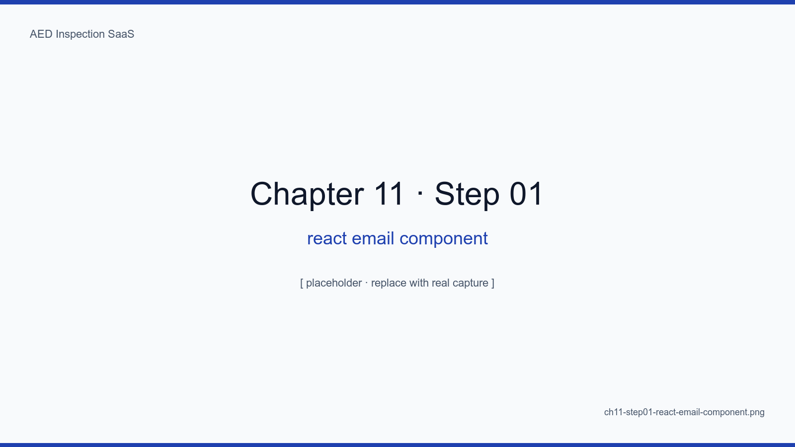
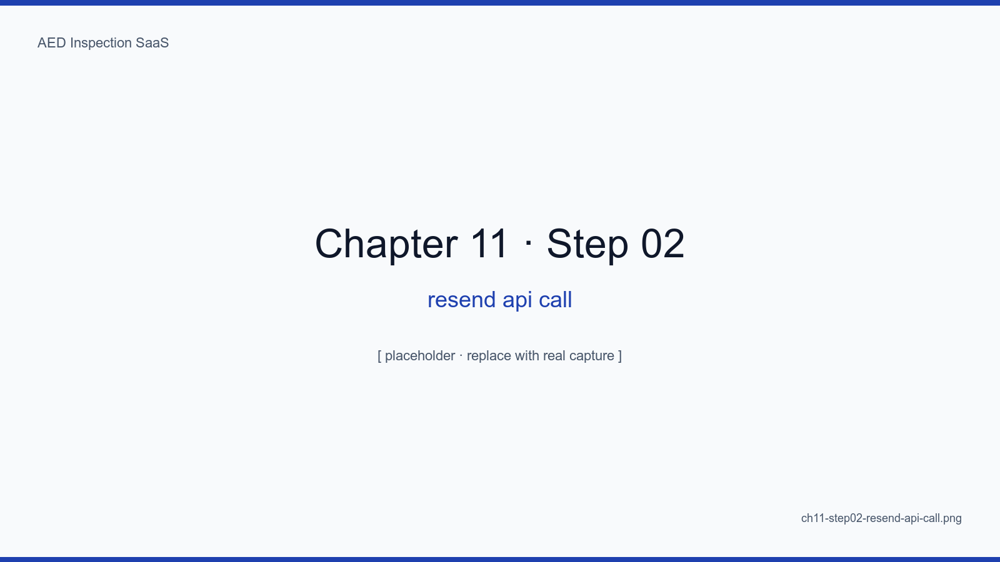
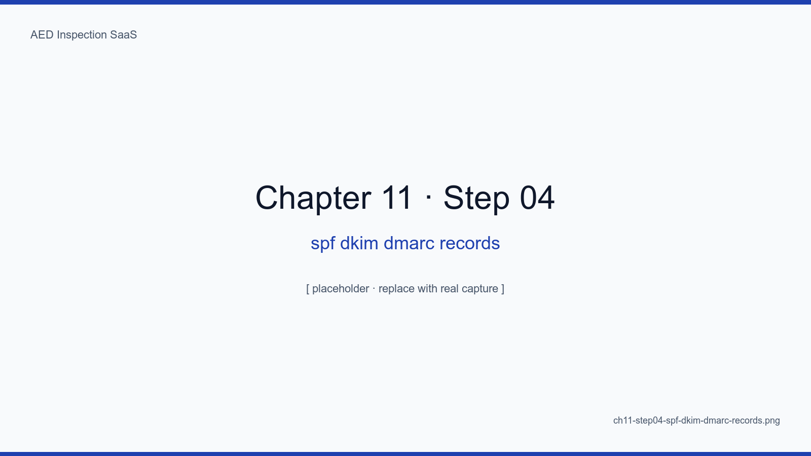
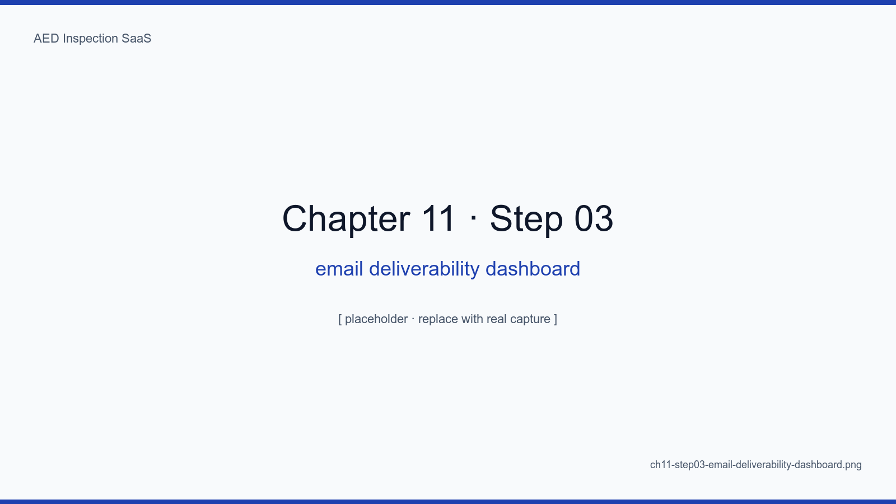
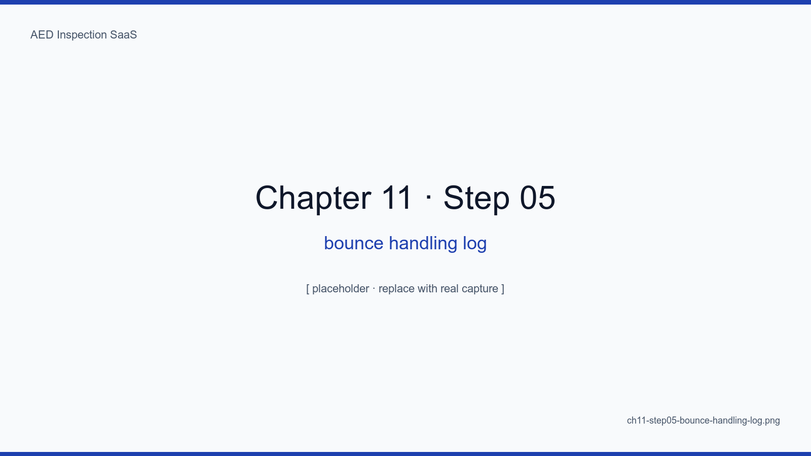
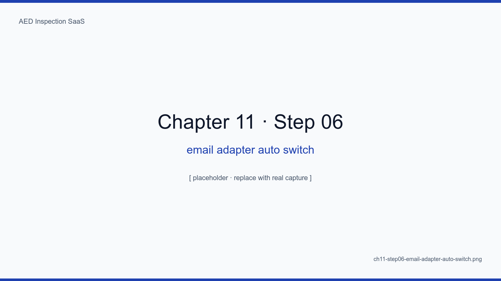
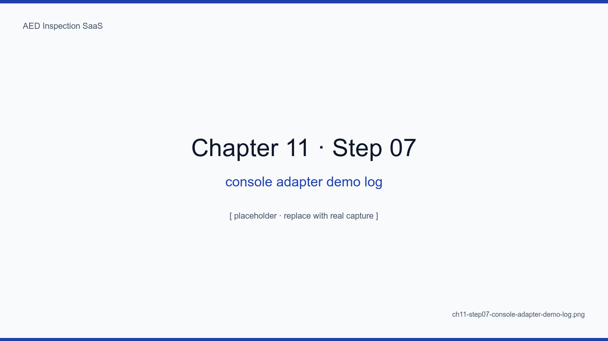

# Chapter 11. Resend + React Email Attachments

## Learning Objectives

- Componentize report-delivery emails with React Email
- Send DOCX/PDF attachments under 5MB reliably via the Resend API
- Hold deliverability above 95% by configuring SPF/DKIM/DMARC
- Handle bounces and retries automatically
- Distinguish operational concerns of magic-link emails versus report emails

## The Big Picture

Email is the SaaS's most external dependency. No matter how well we build,
once a recipient mail server suspects us we are done. The crux is not code
but **DNS records and Resend reputation**.

## 11.1 React Email Component

```tsx
export function MonthlyReportEmail({ tenant, period, downloadUrl }) {
  return (
    <Html>
      <Head />
      <Preview>{tenant.name} {period} monthly inspection report</Preview>
      <Body>
        <Container>
          <Heading>{tenant.name} {period} report</Heading>
          <Text>See the attachment or follow the link below.</Text>
          <Link href={downloadUrl}>{downloadUrl}</Link>
        </Container>
      </Body>
    </Html>
  )
}
```

<!-- SCREENSHOT: ch11-step01-react-email-component -->

*Figure 11-1. Live preview from `pnpm email dev`. We can see Gmail/Outlook/iOS rendering side by side.*
<!-- /SCREENSHOT -->

## 11.2 Resend API

```ts
await resend.emails.send({
  from: "AED Inspection <reports@aed.example.kr>",
  to: tenant.adminEmail,
  subject: `${tenant.name} ${period} monthly inspection report`,
  react: <MonthlyReportEmail {...} />,
  attachments: [
    { filename: `${slug}-${yyyymm}.docx`, content: docxBuffer },
    { filename: `${slug}-${yyyymm}.pdf`, content: pdfBuffer },
  ],
})
```

<!-- SCREENSHOT: ch11-step02-resend-api-call -->

*Figure 11-2. The Resend response JSON. Storing `id` in audit_logs lets us trace delivery later.*
<!-- /SCREENSHOT -->

### 11.2.1 The 5MB Attachment Limit

When DOCX + PDF together exceed 5MB, we drop the attachments and embed an
R2 download link in the body instead. Automatic.

## 11.3 Deliverability — SPF/DKIM/DMARC

| Record | Role |
|---|---|
| SPF | Authorized senders for our domain |
| DKIM | Message signature integrity |
| DMARC | Policy when SPF/DKIM fails (quarantine/reject) |

<!-- SCREENSHOT: ch11-step04-spf-dkim-dmarc-records -->

*Figure 11-3. Cloudflare DNS panel. include:spf.resend.com, resend._domainkey, _dmarc — three records cover the essentials.*
<!-- /SCREENSHOT -->

## 11.4 Deliverability Dashboard

<!-- SCREENSHOT: ch11-step03-email-deliverability-dashboard -->

*Figure 11-4. 30-day stats. Holding delivered above 95% is the operating KPI.*
<!-- /SCREENSHOT -->

## 11.5 Bounce Handling

```ts
// app/api/webhooks/resend/route.ts
case "email.bounced": {
  await markEmailBlocked(payload.email)
  await notifyAdmin(...)
}
```

<!-- SCREENSHOT: ch11-step05-bounce-handling-log -->

*Figure 11-5. An audit_logs row of `email.bounce`. Three bounces from the same address triggers an auto-block plus admin notification.*
<!-- /SCREENSHOT -->

## 11.6 Magic Link vs Report — Operational Differences

| Aspect | Magic link | Report |
|---|---|---|
| Frequency | Per inspector login | Once a month |
| Attachment | None | 5–20MB |
| Cost of failure | High (login blocked) | Moderate (resend possible) |
| Domain split | `auth@` | `reports@` recommended |

Splitting domains is a firewall: a problem with one type of mail does not
kill the other.

## 11.7 Adapter Auto-Switch — Resend, Console, and Demo Safety

One of the worst incidents on the first production deploy was a container
holding a dummy Resend key (`re_dev_xxx`) hitting the real Resend endpoint,
returning 401, and surfacing as a red Server Component error (Appendix E
case 4). The policy since then is simple — **decide the adapter at module
load time, not at call time**.

```ts
// src/lib/email/index.ts
import { resendAdapter } from "./resend"
import { consoleAdapter } from "./console"

export interface EmailAdapter {
  send(opts: EmailSendOptions): Promise<{ id: string }>
}

const useConsole =
  process.env.DEMO_MODE === "true" ||
  process.env.EMAIL_DRIVER === "console" ||
  !process.env.RESEND_API_KEY ||
  process.env.RESEND_API_KEY.startsWith("re_dev")

export const email: EmailAdapter = useConsole ? consoleAdapter : resendAdapter
```

The selection rule is a four-level OR.

| Condition | Adapter |
|---|---|
| `DEMO_MODE=true` | console (demo mode) |
| `EMAIL_DRIVER=console` | console (forced override) |
| `RESEND_API_KEY` missing | console (safe fallback) |
| `RESEND_API_KEY=re_dev*` | console (dev key pattern) |
| otherwise | Resend (real send) |

The intent is **fail-safe**, not fail-closed. If the operator forgets to
provide a key, external sends are blocked and we log instead. "Demo
stopped because a secret was missing" is a scenario we never want.

### 11.7.1 consoleAdapter — What We Log

```ts
// src/lib/email/console.ts (excerpt)
export const consoleAdapter: EmailAdapter = {
  async send(opts) {
    const id = `console_${Date.now()}_${Math.random().toString(36).slice(2,8)}`
    console.log("[email/console]", {
      id, to: opts.to, subject: opts.subject,
      attachments: opts.attachments?.map((a) => ({
        filename: a.filename, size: a.content.length
      }))
    })
    return { id }
  }
}
```

We never log the body — protecting personal data and signature attachments.
We log subject, recipient, attachment filenames, and sizes. To return to
production it is enough to set `RESEND_API_KEY`; calling code does not
change.

### 11.7.2 Same Pattern, Same Safety — Storage

`src/lib/storage/index.ts` follows the same pattern (chapter 16). When
`DEMO_MODE` is set or `R2_ACCOUNT_ID` is missing, `localAdapter` writes
files to `/tmp/aed-storage/` and returns a relative
`/api/local-storage/{key}` URL. In production it returns an R2 presigned
URL. **Every adapter that touches an external service follows the same
auto-switch rule** — that is the operating principle.

<!-- SCREENSHOT: ch11-step06-email-adapter-auto-switch -->

*Figure 11-6. Three combinations of environment variables and the resulting adapter. Calling code is identical.*
<!-- /SCREENSHOT -->

<!-- SCREENSHOT: ch11-step07-console-adapter-demo-log -->

*Figure 11-7. `docker compose logs app`. The `[email/console]` line shows to, subject, and attachment filenames; the body is never logged.*
<!-- /SCREENSHOT -->

## Summary

- DNS, not code, decides 80% of deliverability — SPF/DKIM/DMARC are non-negotiable
- React Email components ensure cross-client compatibility automatically
- The 5MB attachment limit triggers an automatic switch to an R2 download link
- Splitting auth and report domains is operationally wise

## Next Chapter

Next we cover the cron-worker's six jobs — schedule, notify, backup,
report, cleanup, retry — and how they coexist reliably in one container.

## Capture Checklist

- [ ] `ch11-step01-react-email-component.png`
- [ ] `ch11-step02-resend-api-call.png`
- [ ] `ch11-step03-email-deliverability-dashboard.png`
- [ ] `ch11-step04-spf-dkim-dmarc-records.png`
- [ ] `ch11-step05-bounce-handling-log.png`
- [ ] `ch11-step06-email-adapter-auto-switch.png` — adapter auto-switch
- [ ] `ch11-step07-console-adapter-demo-log.png` — console output
