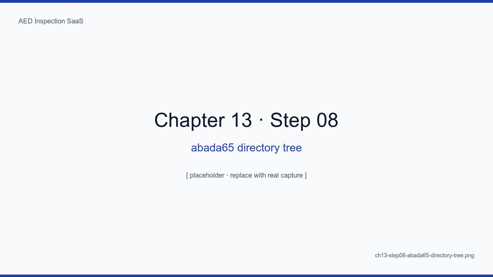
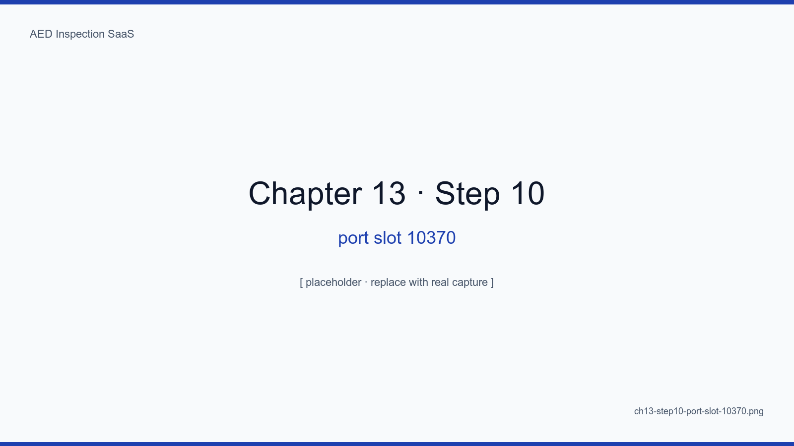
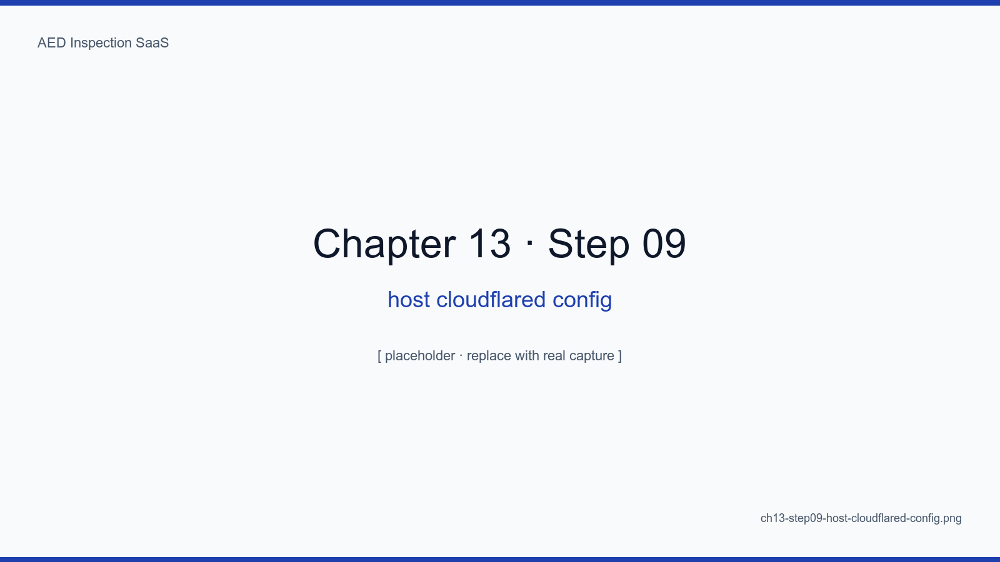

# Chapter 13. Deploying with Docker Compose and Cloudflare Tunnel

## Learning Objectives

- Deploy this SaaS to a clean Ubuntu 22.04 server in under 30 minutes
- Install Docker, Compose v2, and cloudflared
- Configure 25 essential variables in `.env.production`
- Build an unattended deploy pipeline with GitHub Actions
- Verify the first 200 from the outside world

## The Big Picture

Deployment is not a mystery. It is a 30-cell shell script, neatly arranged.
This chapter walks each command line by line, with a screenshot beside the
text.

<!-- SCREENSHOT: ch13-step01-server-fresh-ubuntu -->

*Figure 13-1. Right after provisioning. 200GB disk, 8GB RAM, kernel 5.15. We start here.*
<!-- /SCREENSHOT -->

## 13.1 Installing Docker

```bash
curl -fsSL https://get.docker.com | sh
sudo usermod -aG docker $USER
docker compose version
```

<!-- SCREENSHOT: ch13-step02-docker-install -->

*Figure 13-2. Docker 25.x with Compose v2.*
<!-- /SCREENSHOT -->

## 13.2 Cloning the Repo + Environment Variables

```bash
sudo mkdir -p /data/aed
sudo chown $USER:$USER /data/aed
cd /data/aed
git clone https://github.com/saintgo7/saas-aed.git .
cp .env.example .env.production
$EDITOR .env.production   # fill in 25 variables (see Appendix B)
```

<!-- SCREENSHOT: ch13-step03-clone-repo-env -->

*Figure 13-3. .env.production via VS Code Remote SSH. Secret values are mosaicked when capturing (see SCREENSHOT_WORKFLOW section 4).*
<!-- /SCREENSHOT -->

## 13.3 Cloudflare Tunnel Token

```bash
# Cloudflare Dashboard → Zero Trust → Networks → Tunnels → Create
# After creating the tunnel, paste the token into CLOUDFLARED_TOKEN
```

<!-- SCREENSHOT: ch13-step04-cloudflared-token-setup -->

*Figure 13-4. Extract the token after `--token` from the docker run command Cloudflare suggests, and copy it into the env var.*
<!-- /SCREENSHOT -->

## 13.4 First Boot

```bash
docker compose --env-file .env.production up -d
docker compose ps
```

<!-- SCREENSHOT: ch13-step05-compose-up-all-healthy -->

*Figure 13-5. One minute after first boot. Once everything is healthy, move on.*
<!-- /SCREENSHOT -->

## 13.5 Verifying the First 200

```bash
curl -sS https://aed.example.kr/healthz
# ok
```

<!-- SCREENSHOT: ch13-step06-public-url-first-200 -->

*Figure 13-6. curl 200 from a laptop, login screen in the browser. Zero inbound ports, yet reachable from the outside.*
<!-- /SCREENSHOT -->

## 13.6 GitHub Actions Unattended Deploy

```yaml
# .github/workflows/deploy.yml (excerpt)
on: { push: { branches: [main] } }
jobs:
  deploy:
    runs-on: ubuntu-latest
    steps:
      - uses: actions/checkout@v4
      - uses: webfactory/ssh-agent@v0.9.0
      - run: ssh deploy@abada-65 "cd /data/aed && git pull && docker compose pull && docker compose up -d"
      - run: |
          for i in 1 2 3 4 5; do
            sleep 10
            curl -fsS https://aed.example.kr/healthz && exit 0
          done
          exit 1
```

<!-- SCREENSHOT: ch13-step07-github-actions-deploy-yml -->

*Figure 13-7. push → 3 minutes → 200. The five-attempt health check absorbs cold starts during migrations.*
<!-- /SCREENSHOT -->

### 13.6.1 First Major Incident — BusyBox wget

We started with a BusyBox `wget` health check inside nginx and lost
production briefly to it. Replaced with a one-liner Node.js fetch (commits
`49a1976`, `f79a3b1`).

The seven other pitfalls from the first deploy are catalogued in Appendix
E — Cloudflare's one-year cache, five consecutive GitHub Actions failures,
the missing page redirect, the Server Component error, the seed unique
violation, the standalone container's `0.0.0.0` leak, and the `git pull`
stash workflow. If this chapter is the assembly manual, Appendix E is the
emergency-room log right after assembly.

## 13.7 abada-65 Directory, Port, and Tunnel Convention (Real Deployment)

This SaaS lives on the abada-65 host alongside other SaaS projects. The
host has a stable convention; we follow it without exception.

### 13.7.1 Directory Layout

```
/data/
├── abada-kr/
│   ├── aed-abada-kr/
│   │   └── aed.abada.kr/         ← this SaaS
│   │       ├── docker-compose.yml
│   │       ├── .env              ← 600 mode, owned by blackpc
│   │       ├── src/              ← Next.js app
│   │       └── data/
│   │           ├── postgres/     ← relative bind mount
│   │           └── redis/
│   └── k-guide-abada-kr/
│       └── k-guide.abada.kr/
└── infra-config/
    └── projects/.../docker-compose.yml   ← compose mirror
```

The pattern is `/data/{org}/{name}-{org}/{full-domain}/`. With multiple
SaaS coexisting on one host, this is the most decisive isolation
convention. Never use `/home` — another SaaS reaching `~/` could leak
state.

<!-- SCREENSHOT: ch13-step08-abada65-directory-tree -->

*Figure 13-8. `tree -L 3 /data/abada-kr/aed-abada-kr` on the abada-65 host. One SaaS, one directory.*
<!-- /SCREENSHOT -->

### 13.7.2 Port Slot — 10xxx Convention with 127.0.0.1 Binding

This SaaS uses `127.0.0.1:10370 → app:3000`. The container is not exposed
to the network — only the host cloudflared can reach it. Slot 10371 is
reserved for staging-aed, 10372 for a future split-api.

```yaml
# docker-compose.yml (excerpt)
services:
  app:
    ports:
      - "127.0.0.1:10370:3000"   # not exposed externally
    networks: [aed-prod-net]
  postgres:
    # no ports — internal network only
    networks: [aed-prod-net]
  redis:
    networks: [aed-prod-net]

networks:
  aed-prod-net:
    name: aed-prod-net
```

postgres and redis have no external ports at all. Only the app container
on the same `aed-prod-net` reaches them. The earlier in-compose nginx +
cloudflared have been **removed** — the host-level cloudflared is the
single source of truth.

<!-- SCREENSHOT: ch13-step10-port-slot-10370 -->

*Figure 13-9. Host port binding shown by `ss -tnlp`. The bind address is `127.0.0.1`, not `0.0.0.0`.*
<!-- /SCREENSHOT -->

### 13.7.3 Host-Level cloudflared, Single Tunnel

cloudflared does not run as a container. A single systemd-managed tunnel
on the host handles ingress for every SaaS.

```yaml
# /etc/cloudflared/config.yml (excerpt)
tunnel: e8e3c4a4-...
credentials-file: /etc/cloudflared/e8e3c4a4-....json

ingress:
  - hostname: aed.abada.kr
    service: http://localhost:10370
  - hostname: k-guide.abada.kr
    service: http://localhost:10380
  - service: http_status:404
```

Adding a SaaS means adding one ingress line and running
`systemctl reload cloudflared`. cloudflared is no longer in this SaaS's
docker-compose (split out in commit `23c765b`).

<!-- SCREENSHOT: ch13-step09-host-cloudflared-config -->

*Figure 13-10. /etc/cloudflared/config.yml. One tunnel routes every SaaS hostname on the host.*
<!-- /SCREENSHOT -->

### 13.7.4 .env Filename and Compose v1 Compatibility

The previous `.env.production` is now plain `.env` to match the abada-65
convention. Some hosts still ship Compose v1, so the recommended invocation
prefers `docker compose` and falls back to `docker-compose`.

```bash
docker compose --env-file .env up -d 2>/dev/null || \
docker-compose --env-file .env up -d
```

## 13.8 Rollback

```bash
docker compose down
git checkout v1.4.2
docker compose up -d
```

If images map 1:1 to git tags, rollback is a 30-second affair.

## Summary

- Deployment is fundamentally a ~30-cell shell script
- One Cloudflare Tunnel token equals zero inbound ports
- /healthz separation plus five-attempt health check absorbs cold starts
- GitHub Actions completes the push → 3 minutes → 200 pipeline unattended

## Next Chapter

Next we set up the operational insurance: daily backups, gpg encryption,
and an R2 mirror — and explain why we rehearse recovery every six months.

## Capture Checklist

- [ ] `ch13-step01-server-fresh-ubuntu.png`
- [ ] `ch13-step02-docker-install.png`
- [ ] `ch13-step03-clone-repo-env.png` — secrets mosaicked
- [ ] `ch13-step04-cloudflared-token-setup.png` — token mosaicked
- [ ] `ch13-step05-compose-up-all-healthy.png`
- [ ] `ch13-step06-public-url-first-200.png`
- [ ] `ch13-step07-github-actions-deploy-yml.png`
- [ ] `ch13-step08-abada65-directory-tree.png` — abada-65 directory convention
- [ ] `ch13-step09-host-cloudflared-config.png` — host cloudflared single tunnel
- [ ] `ch13-step10-port-slot-10370.png` — 127.0.0.1:10370 binding
