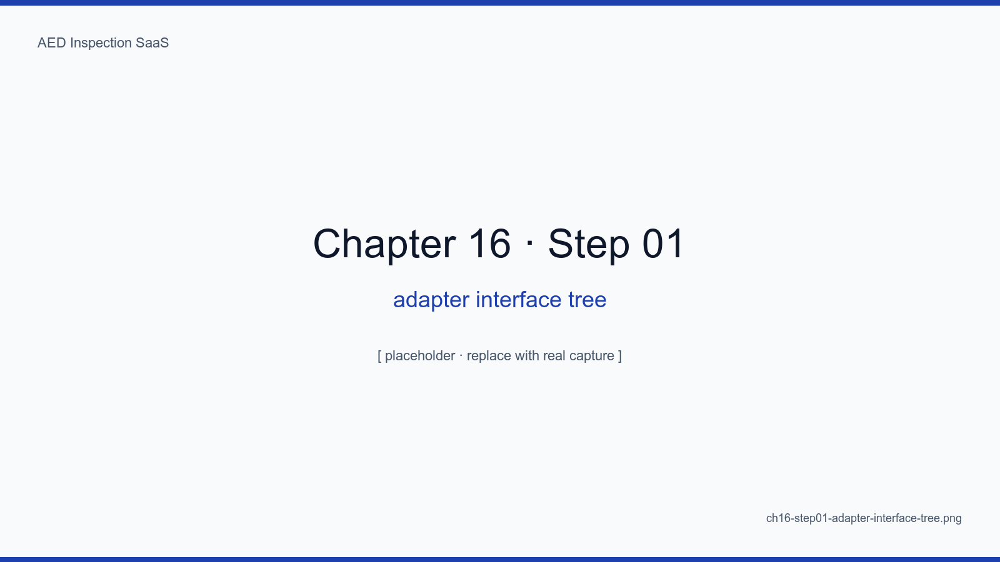
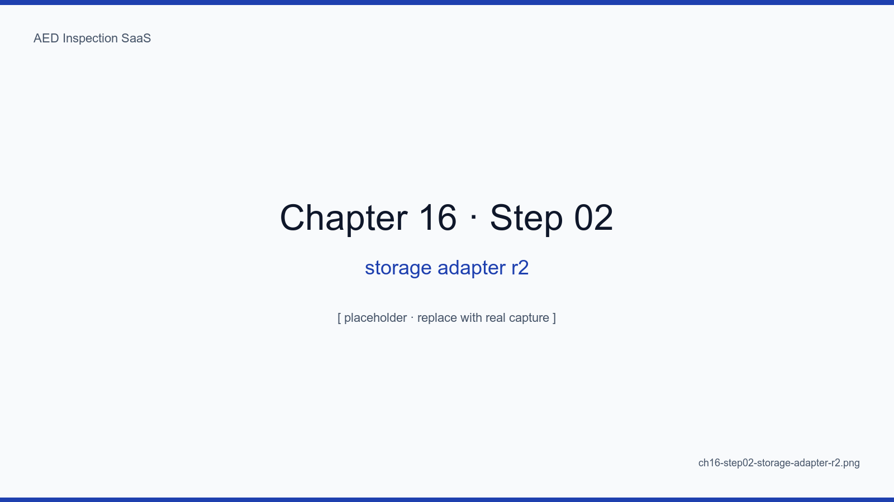
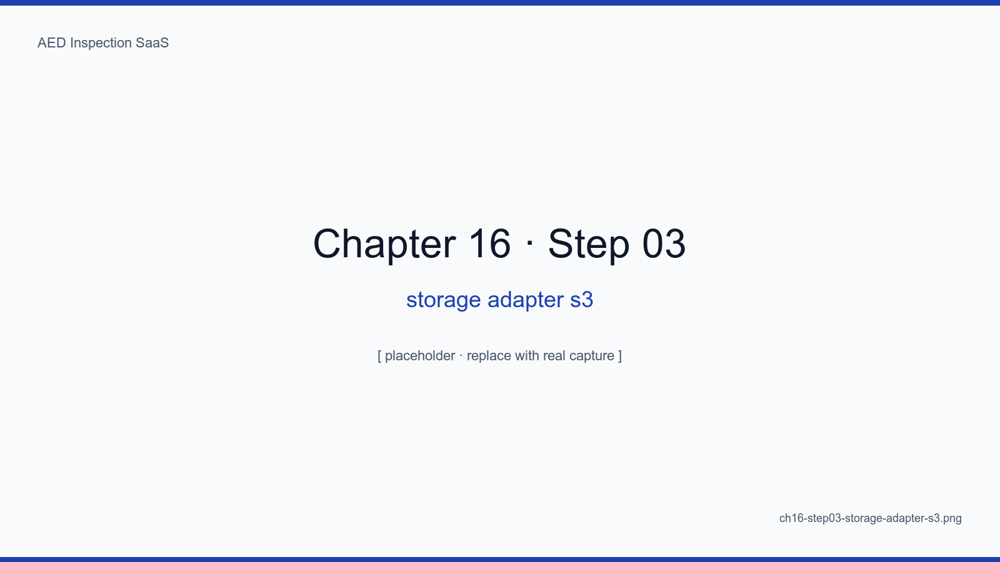
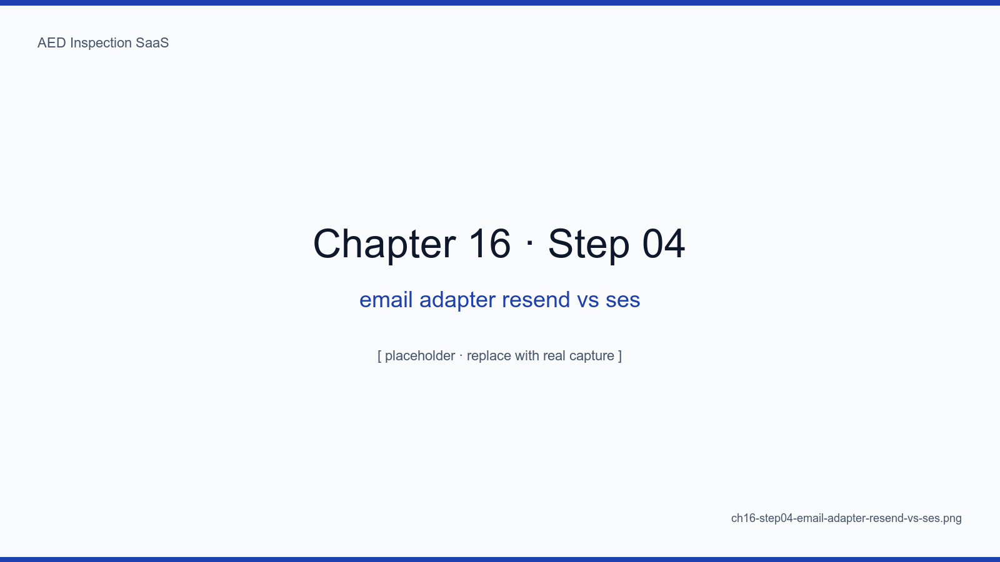
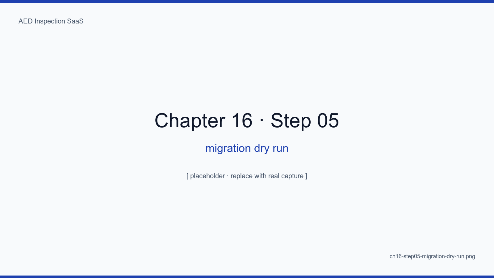

# Chapter 16. The Adapter Pattern as Insurance

## Learning Objectives

- Apply the adapter pattern to three areas: storage, email, and auth
- Constrain vendor names like "Cloudflare R2" to four files in the codebase
- Verify a vendor migration via a dry run
- Avoid the three adapter anti-patterns (leakage, over-abstraction, 1:1 mapping)
- Write the runbook for a 30-minute migration scenario

## The Big Picture

We chose self-hosting, but we keep the posture of being able to **move at
any time**. The adapter pattern is the tool. If R2 disappears, Resend goes
under, or abada-65 falls over, the migration becomes a four-file change.

<!-- SCREENSHOT: ch16-step01-adapter-interface-tree -->

*Figure 16-1. Only lib/adapters/{storage,email,auth}/index.ts is exposed externally; concrete implementations live in r2.ts, s3.ts, gcs.ts, and friends.*
<!-- /SCREENSHOT -->

## 16.1 Storage Adapter

```ts
export interface StorageAdapter {
  putObject(key: string, body: Buffer | Uint8Array, opts?): Promise<{ etag: string }>
  getSignedUrl(key: string, ttlSec: number): Promise<string>
  deleteObject(key: string): Promise<void>
}
```

<!-- SCREENSHOT: ch16-step02-storage-adapter-r2 -->

*Figure 16-2. r2.ts. R2 is S3-compatible, so the same SDK changes only the endpoint. The most rewarding part of the adapter pattern.*
<!-- /SCREENSHOT -->

<!-- SCREENSHOT: ch16-step03-storage-adapter-s3 -->

*Figure 16-3. s3.ts. If R2 disappears, an environment-variable change moves us to AWS S3.*
<!-- /SCREENSHOT -->

## 16.2 Email Adapter

```ts
export interface EmailAdapter {
  send(input: EmailInput): Promise<{ id: string }>
}
```

<!-- SCREENSHOT: ch16-step04-email-adapter-resend-vs-ses -->

*Figure 16-4. resend.ts (left) and ses.ts (right). Aside from attachment and bounce handling, they are nearly identical.*
<!-- /SCREENSHOT -->

## 16.3 Auth Adapter

Auth.js already follows the adapter pattern, so swapping out
DrizzleAdapter is the only change.

## 16.4 Three Anti-Patterns

| Anti-pattern | Avoidance |
|---|---|
| **Leakage** (R2-specific options on the Storage interface) | Generalize options as a string-keyed `extras` |
| **Over-abstraction** (mirroring every SDK method 1:1) | Expose only the four or five methods we actually use |
| **1:1 mapping** (thin wrapper) | Rename in our domain words (putObject vs uploadFile) |

## 16.5 The 30-Minute Migration Runbook

```bash
# Storage: R2 → S3
1. Create the AWS S3 bucket (5 minutes)
2. rclone copy r2:* s3:* (variable, depending on volume)
3. .env.production: STORAGE_PROVIDER=s3 + STORAGE_ENDPOINT change
4. docker compose up -d --no-deps app cron-worker
5. Verify /healthz

# Email: Resend → AWS SES
1. SES domain verification (24-48h — done in advance)
2. .env.production: EMAIL_PROVIDER=ses
3. compose restart
```

<!-- SCREENSHOT: ch16-step05-migration-dry-run -->

*Figure 16-5. CI matrix — Storage R2/S3/MinIO × Email Resend/SES across four combinations all pass the same integration tests.*
<!-- /SCREENSHOT -->

## 16.6 Limits of Our Adapters

We do not adapter-ize DOCX/PDF generation, since we don't use external
services for them. Same for the cron-worker. Only **current external
dependencies plus near-future candidates** get adapters; we don't abstract
all possible futures.

## Summary

- Adapt only three areas (storage, email, auth); leave the rest unwrapped
- Vendor names appear in only four files — zero lock-in
- The three anti-patterns (leakage, over-abstraction, 1:1) are consciously avoided
- Maintain a 30-minute migration runbook and dry-run it monthly

## Next Chapter

Next we plan for scale — what breaks at 1,000 and 10,000 devices, and the
four decisions that determine when to take each next step.

## Capture Checklist

- [ ] `ch16-step01-adapter-interface-tree.png`
- [ ] `ch16-step02-storage-adapter-r2.png`
- [ ] `ch16-step03-storage-adapter-s3.png`
- [ ] `ch16-step04-email-adapter-resend-vs-ses.png`
- [ ] `ch16-step05-migration-dry-run.png`
