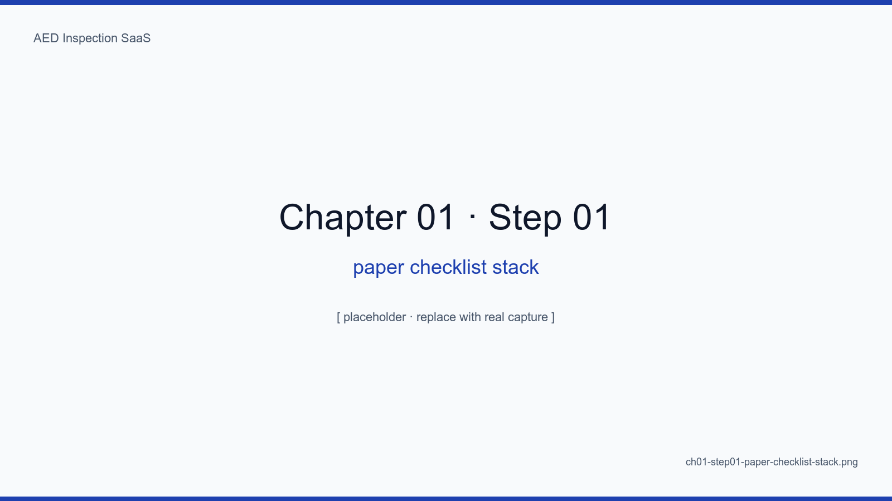
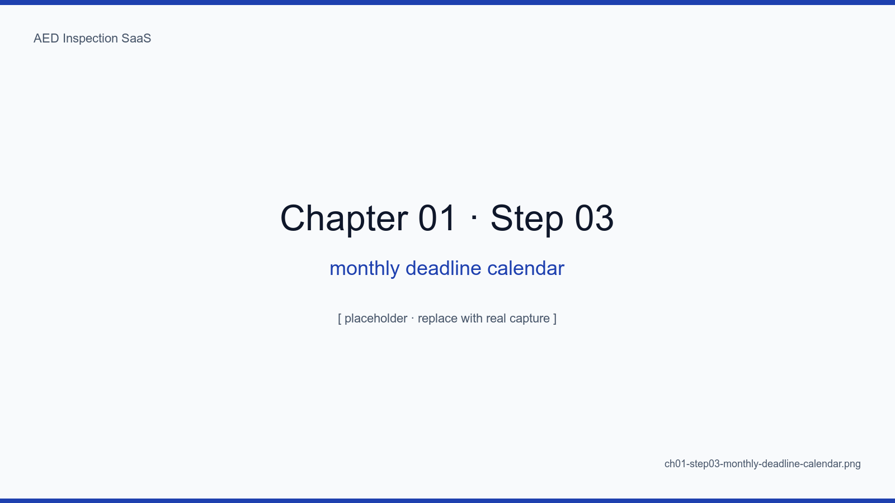
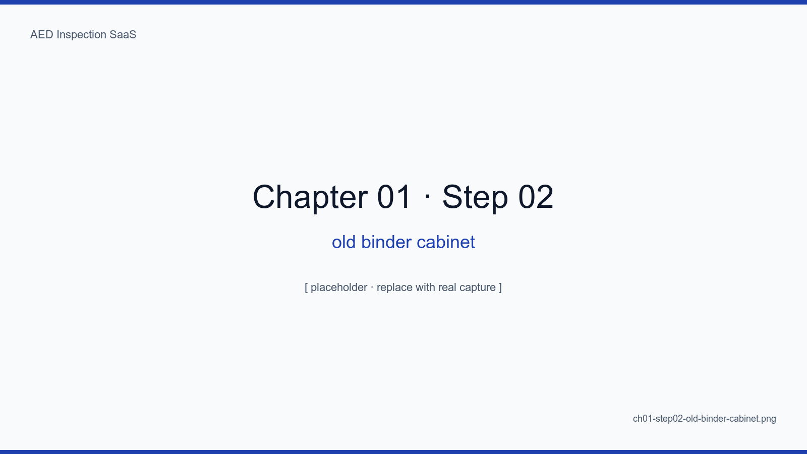
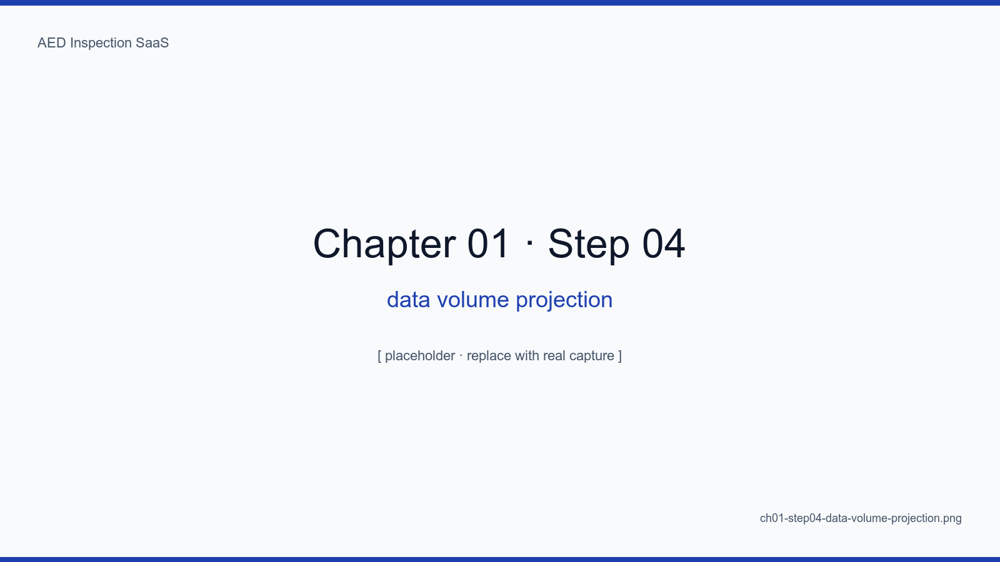

# 1장. AED 점검 현장의 종이 점검표 문제

## 학습 목표

- 자동심장충격기(AED) 의무 점검 제도의 법적 배경을 이해한다
- 종이 점검표 운영의 6가지 현장 문제를 구체 사례로 식별한다
- 점검 데이터의 시계열 자산 가치를 디지털화 관점에서 평가한다
- "한 사람의 생명을 살리는 장비"라는 도메인 특성이 SaaS 설계에 미치는 영향을 설명한다
- 본 SaaS가 해결하려는 핵심 문제를 한 문장으로 요약한다

## 핵심 개념

전국 8만여 대의 공공 AED는 「응급의료에 관한 법률」에 따라 매월 점검이
의무화되어 있다. 그러나 점검 결과는 여전히 종이 점검표에 수기로 작성되어
파일철에 보관되며, 보고는 분기·반기 단위로 PDF 스캔 후 이메일 발송된다.
이 종이 워크플로우는 누락·소실·재작성·서명 위변조라는 4가지 만성 문제를
끌어안고 있고, 무엇보다도 **점검 이력이 시계열 자산으로 축적되지 않는다**.

이 책의 모든 설계 결정은 "종이 점검표를 그대로 디지털로 옮기는 것"을 거부하고,
"디지털이라야만 할 수 있는 것"을 추구한다는 한 가지 원칙에서 비롯된다.

<!-- SCREENSHOT: ch01-step01-paper-checklist-stack -->

*그림 1-1. 종이 점검표 1년치 실제 사진. 점검자 서명, 사진 스테이플러, 손 글씨 정정 자국이 그대로 남아 있다. 이 묶음 한 다발이 곧 한 시설의 한 달치 점검 증거다.*
<!-- /SCREENSHOT -->

## 1.1 법적 배경 — 왜 매월 점검인가

「응급의료에 관한 법률」 시행령 제26조의5는 AED 설치자에게 매월 1회 이상의
정기 점검과 결과 보고 의무를 부과한다. 보건복지부 고시 「자동심장충격기
관리·운영지침」은 점검 항목을 12개로 구체화하고, 점검자 서명과 사진 보관을
요구한다.

<!-- TODO: 실제 법령 조문과 고시 본문 인용 (출처 명시) -->
<!-- TODO: 2024년 개정 사항(서명 디지털화 허용 여부) 확인 후 반영 -->

법은 매월 점검을 요구하지만, 결과를 어떻게 보관·보고할지는 사실상 시설의
재량에 맡긴다. 그 틈에서 종이 점검표가 사실상의 표준이 되었다.

<!-- SCREENSHOT: ch01-step03-monthly-deadline-calendar -->

*그림 1-2. 100대 AED를 운영하는 한 시설의 점검 데드라인 캘린더. 빨간 점은 미점검, 초록 점은 완료. 종이 운영 시스템에서는 이 그림 자체가 존재하지 않는다.*
<!-- /SCREENSHOT -->

## 1.2 종이 점검표의 6가지 현장 문제

### 1.2.1 누락

월말이 되어서야 "이번 달 점검 안 했네?"를 발견한다. 종이는 알람을 보내지 않는다.

### 1.2.2 소실과 훼손

캐비닛에 1년만 두어도 누렇게 바랜다. 화재·수해·이사 한 번이면 통째로 사라진다.

<!-- SCREENSHOT: ch01-step02-old-binder-cabinet -->

*그림 1-3. 한 보건소 자료실의 점검 바인더. 캐비닛 위층은 햇빛에 변색되었고, 아래층은 습기로 일부 페이지가 들러붙었다. 이 한 칸의 데이터를 디지털화하면 하드디스크 한 폴더에 들어간다.*
<!-- /SCREENSHOT -->

<!-- TODO: 실제 시설에서 5년치 점검표가 사라진 사례 인터뷰 인용 -->

### 1.2.3 재작성

감사 직전 "지난 6개월치를 한꺼번에 작성"하는 일이 일어난다. 점검 자체가 아닌
점검표 작성이 목적이 되는 본말전도.

### 1.2.4 서명 위변조

종이 위 서명은 검증할 길이 없다. 점검자가 바뀌어도 서명만 똑같으면 통과한다.

### 1.2.5 보고 지연

종이 점검표 → 스캔 → PDF → 이메일이라는 4단계를 사람이 매번 반복한다.

### 1.2.6 데이터 자산화 실패

100대의 AED를 5년간 점검해도 "지난달 배터리 교체 분포"를 즉시 알 수 없다.
종이 위 정보는 검색되지 않는다.

## 1.3 점검 데이터의 시계열 자산 가치

매월 1회, 100대, 12항목, 5년이면 곧 36만 건의 데이터 포인트다. 이것이 종이가
아니라 정형 데이터로 쌓이면 다음이 가능해진다.

- **고장 예측**: 배터리 교체 주기 학습
- **공급망 최적화**: 패드 만료 일괄 추적
- **감사 자동화**: 보건소 보고 1분 생성
- **위치 정확도 보정**: 점검자 GPS 로그를 통한 좌표 갱신

종이 점검표는 데이터를 "기록"하지만, 디지털 점검은 데이터를 "축적"한다.

<!-- SCREENSHOT: ch01-step04-data-volume-projection -->

*그림 1-4. 100대 × 12항목 × 60개월 = 72,000행을 시계열 차트로 그린 모형 화면. 종이로는 영영 보이지 않던 패턴 — 여름철 배터리 교체 급증, 12월 패드 만료 클러스터 — 이 한눈에 드러난다.*
<!-- /SCREENSHOT -->

<!-- TODO: 실제 1년 운영 후 축적된 데이터 통계 (총 점검 수, 항목별 분포) 추가 -->

## 1.4 도메인 특성 — 생명을 살리는 장비

AED는 일반 IoT 장비와 다르다. 평소에는 한 번도 작동하지 않다가, 단 한 번의
심정지 상황에서 즉시 작동해야 한다. 이 도메인 특성은 SaaS 설계에 두 가지
요구를 강제한다.

1. **점검 누락 = 생명 위험**: 알림은 광고가 아니라 안전 장치다. 절대 놓치면 안 된다
2. **데이터 무결성 = 법적 증거**: 서명·사진·타임스탬프가 사후 감사 시 증거가 된다

이 두 요구가 본 SaaS의 모든 아키텍처 결정에 그림자를 드리운다.

## 1.5 해결하려는 문제, 한 문장

> "전국에 흩어진 AED 100~10,000대의 매월 점검을 누락 없이 수행하고,
> 결과를 위변조 불가능한 형태로 축적하며, 보고서를 1분 내에 생성한다."

이것이 본 SaaS가 풀려는 단 하나의 문제다.

## 요약

- AED 매월 점검은 법적 의무이며, 종이 점검표는 누락·소실·위변조·자산화 실패의 6가지 만성 문제를 안고 있다
- 디지털화의 진짜 가치는 "기록"이 아니라 "시계열 자산화"에 있다
- AED는 생명을 살리는 장비라는 도메인 특성이 알림과 무결성을 비기능 요건이 아닌 핵심 요건으로 끌어올린다
- 본 SaaS의 미션은 한 문장으로 압축된다: 누락 없는 점검, 위변조 불가능한 축적, 1분 보고서

## 다음 장 미리보기

다음 장에서는 이 문제를 풀기 위해 우리가 발견한 **4단계 워크플로우**를 소개한다.
점검자가 모바일에서 어떻게 12개 항목을 채우고 서명하고 사진을 첨부하는지,
관리자가 어떤 순서로 검토·승인·보고하는지, 그리고 그 흐름이 어떻게 본 SaaS의
화면 IA(정보 구조)를 결정했는지 차례대로 살펴본다.

## 캡처 체크리스트

- [ ] `ch01-step01-paper-checklist-stack.png` — 종이 점검표 1년치 실물 사진 (시설 협조)
- [ ] `ch01-step02-old-binder-cabinet.png` — 5년 묵은 캐비닛 사진
- [ ] `ch01-step03-monthly-deadline-calendar.png` — 데드라인 캘린더 모형 화면
- [ ] `ch01-step04-data-volume-projection.png` — 36만 데이터 포인트 시각화 차트
