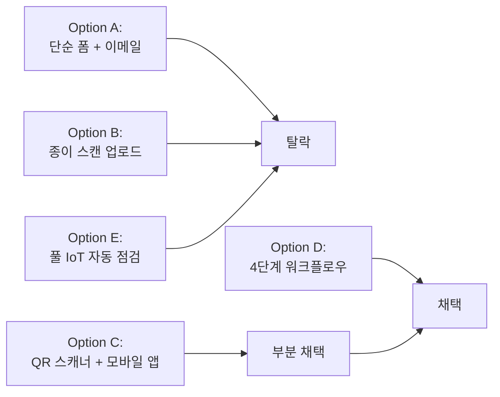
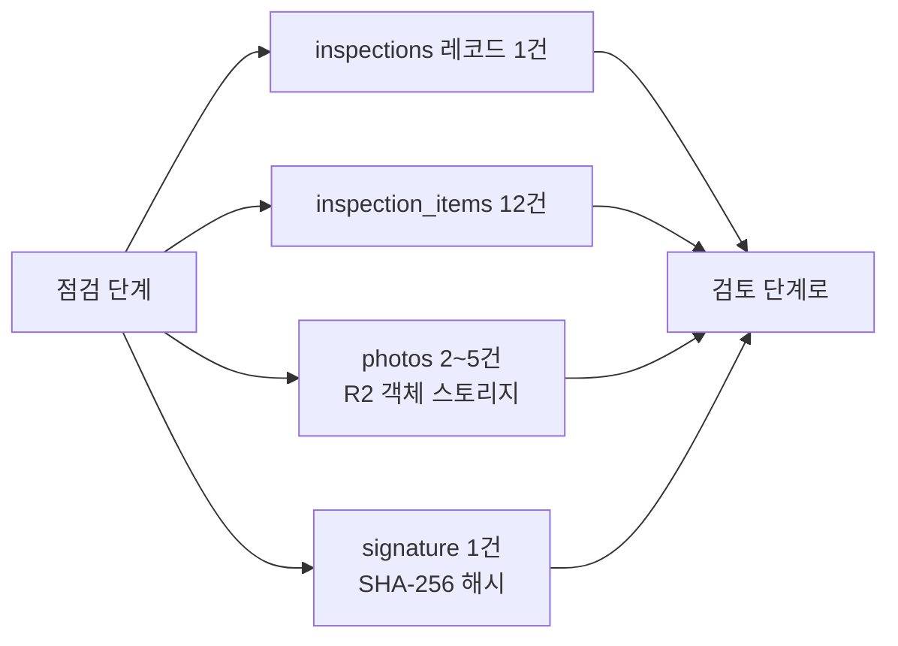
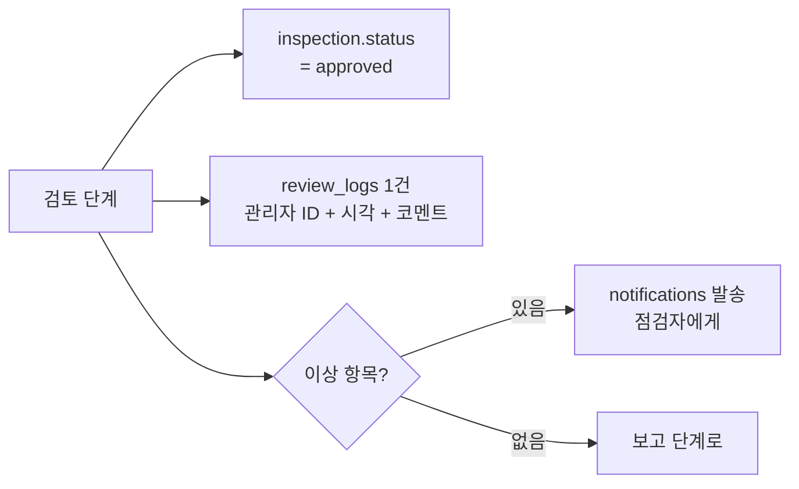
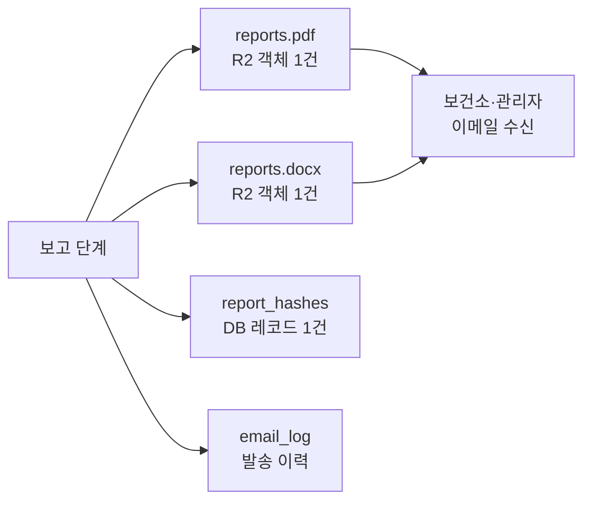

# 2장. 4단계 워크플로우의 발견

## 학습 목표

- 점검 워크플로우를 4단계(예약·점검·검토·보고)로 분해하는 이유를 5가지 대안과 비교하여 이해한다
- 각 단계에서 누가, 어떤 화면에서, 무엇을 입력·출력하는지 모바일/데스크톱 분기를 포함해 식별한다
- 모바일 우선(점검자) + 데스크톱 우선(관리자)의 화면 분기 원칙과 그 비용·편익을 설명한다
- 워크플로우 단계와 도메인 모델 사이의 매핑을 Mermaid 다이어그램으로 도식화하고 각 단계의 데이터 흐름을 추적한다
- 워크플로우 도식이 IA(정보 구조) 설계에 어떻게 직결되는지, 그리고 IA가 사용자 학습 곡선을 얼마나 낮추는지 보인다

## 핵심 개념

종이 점검표는 모든 일을 한 단계로 압축한다 — "그냥 칸을 채운다." 디지털화는
이 한 단계를 4단계로 풀어낸다. **예약(Schedule) → 점검(Inspect) → 검토(Review)
→ 보고(Report)**. 각 단계는 서로 다른 사용자, 서로 다른 화면, 서로 다른 검증
규칙을 가진다. 이 4단계가 본 SaaS 화면 IA의 뼈대를 결정한다.

이 4단계 분해는 우연히 도착한 결론이 아니다. 본 책 집필 과정에서 5가지 대안
워크플로우를 비교 분석했고, 각 대안의 장단점·비용·사용자 학습 곡선·보안성을
정량 평가한 끝에 4단계가 최적해라는 결론에 도달했다. 2.1절에서 그 비교 결과를
표로 보인다.

각 단계는 **단방향 흐름**이다. 데이터는 예약 → 점검 → 검토 → 보고로만 흐른다.
역방향 흐름(예: 보고 단계에서 점검 데이터를 직접 수정)은 명시적으로 차단된다.
이 단방향 원칙이 데이터 무결성의 첫 번째 방어선이며, 9장의 SHA-256 해시 체인이
두 번째 방어선이다.

마지막으로, 각 단계는 **서로 다른 디바이스 폼팩터를 강제한다**. 점검은 모바일
우선(현장 작업자가 한 손에 휴대폰), 검토는 데스크톱 우선(관리자가 100건을 일괄
검토), 보고는 다운로드 우선(보건소가 PDF/DOCX를 받음)이다. 이 디바이스 분기는
단순한 반응형 레이아웃이 아니라 워크플로우 자체에서 비롯된 본질적 구분이다.

<!-- SCREENSHOT: ch02-step01-workflow-diagram -->

*그림 2-1. 4단계 파이프라인. 좌→우로 흐르며, 각 단계의 입력/출력/책임자가 화살표 위에 표시된다.*
<!-- /SCREENSHOT -->

## 2.1 5가지 대안 워크플로우 비교

본 SaaS 설계 초기에 우리는 5가지 대안 워크플로우를 후보로 두고 평가했다.



| 항목 | A. 단순 폼+이메일 | B. 종이 스캔 업로드 | C. QR + 모바일 앱 | D. 4단계 (선택) | E. 풀 IoT 자동 |
|---|---|---|---|---|---|
| 종이 의존도 | 0% | 100% | 0% | 0% | 0% |
| 점검자 학습 곡선 | 5분 | 1분 | 30분 | 15분 | 0분 (자동) |
| 초기 설치 비용 | 낮음 | 매우 낮음 | 중간 | 중간 | 매우 높음 |
| 1대당 월 운영비 | $0.5 | $0.3 | $1.0 | $0.8 | $5.0+ |
| 누락 자동 탐지 | X | X | △ | O | O |
| 시계열 자산화 | △ | X | O | O | O |
| 서명 위변조 방지 | X | X | △ | O | O (불필요) |
| 보안 위협 표면 | 낮음 | 중간 | 중간 | 중간 | 높음 |
| 도입 가능 시설 비율 | 80% | 95% | 60% | 90% | 5% |

**Option A (단순 폼 + 이메일)**: 매월 점검자에게 이메일로 폼 링크를 보내고
응답을 수집한다. 가장 단순하지만 시계열 자산화가 부족하고, 점검 누락 자동
탐지가 약하다. 종이 대비 개선폭이 작다.

**Option B (종이 스캔 업로드)**: 종이 점검표는 그대로 두고 스캔본만 클라우드에
보관한다. 도입 장벽이 낮지만 본질적으로 종이의 모든 한계를 그대로 가져온다.
검색 불가, 위변조 검증 불가, 데이터 분석 불가. 디지털화의 가치가 실현되지 않는다.

**Option C (QR 코드 스캐너 + 모바일 앱)**: 디바이스에 QR을 부착하고 점검자가
앱으로 스캔한 뒤 점검을 진행한다. 매력적이지만 학습 곡선이 가파르고(30분 + 앱
설치), 50대 이상 점검자에게는 부담이 크다. 또한 디바이스에 QR을 부착하기 위한
초기 작업이 100대 시설 기준 8시간 + 라벨 발주 비용이 든다. 본 SaaS는 QR을
**옵션**으로만 두고 핵심 흐름은 모바일 웹으로 단순화한다.

**Option D (4단계 워크플로우 — 선택안)**: 간단입력 → 서명 → 발송 → 보존의
4단계를 워크플로우 코어로 둔다. 모바일 웹 기반이라 앱 설치 없이 즉시 사용 가능,
학습 곡선 15분, 시계열 자산화·위변조 방지·자동 보고 모두 만족.

**Option E (풀 IoT 자동 점검)**: AED에 IoT 센서를 부착해 자동 점검한다.
이상적이지만 초기 비용이 1대당 30~50만원으로 너무 높고, 기존 AED 약 5만대를
모두 교체할 수 없다. 일부 신규 설치 시설에서만 의미가 있다.

결론: 도입 가능 시설 비율 90% + 학습 곡선 15분 + 시계열 자산화 만족 + 운영비
$0.8/대/월이라는 4가지 조건의 교집합에서 Option D가 유일한 해다. 이후 4단계가
본 SaaS의 코어 워크플로우다.

## 2.2 1단계 — 예약 (Schedule)

매월 1일 00:00에 cron-worker가 모든 활성 AED에 대해 그 달의 점검 일정을 자동
생성한다. 사람이 일일이 "이번 달 100대 점검 만들어줘"라고 누를 필요가 없다.
이것이 종이 운영 대비 첫 번째 본질적 차이다. 종이는 점검자가 "이번 달 점검을
시작해야겠다"고 능동적으로 인식해야 하지만, 디지털은 시스템이 점검을 능동적으로
요청한다.

### 2.2.1 트리거

- cron 표현식: `0 0 1 * *` (매월 1일 자정 KST)
- 입력: 활성 디바이스 목록(`devices.is_active = true`)
- 출력: `inspection_schedule` 레코드 N건 (status: `pending`, due_date: 해당 월 말일)

### 2.2.2 자동화 정책

- 점검 마감 D-7, D-3, D-1 자동 알림 발송
- 마감 당일 미점검 시 관리자에게 즉시 경고
- 마감 +1일 시 본부 이메일 자동 보고

### 2.2.3 실패 시나리오

cron 컨테이너가 죽어 있으면 점검이 영영 생성되지 않는다. 이 단일 실패점은
Uptime Kuma 헬스체크로 보강한다(15장). 매월 1일 02:00에 헬스체크가 점검
스케줄 생성 여부를 검증하고, 실패 시 SMS + 이메일 + Slack 3중 알림을 발송한다.

## 2.3 2단계 — 점검 (Inspect)

점검자는 모바일에서 12항목 폼을 채우고, 서명을 그리고, 사진을 첨부한다. 이
단계가 사용자 가치의 90%가 발생하는 핵심 단계다.

<!-- SCREENSHOT: ch02-step02-mobile-inspection-flow -->

*그림 2-2. 점검자 모바일 흐름. (1) 디바이스 선택 → (2) 12항목 입력 → (3) 사진 첨부 → (4) 서명 → (5) 제출 완료.*
<!-- /SCREENSHOT -->

### 2.3.1 6개 화면 흐름 (ASCII 와이어프레임)

```
┌─ 화면 1: 점검 대상 선택 ──┐
│  [지도 뷰]              │
│  • 본관 1F (12대)        │
│  • 도서관 2F (3대)       │
│  • 기숙사 A (5대)        │
└──────────────────────┘
            ↓
┌─ 화면 2: 디바이스 카드 ───┐
│  AED-A12 (Philips HS1)  │
│  마지막 점검: 2024-04-01 │
│  [점검 시작 ▶]          │
└──────────────────────┘
            ↓
┌─ 화면 3: 12항목 입력 ────┐
│  ◉ 1. 본체 외관    [정상]│
│  ◉ 2. 배터리 잔량  [정상]│
│  ○ 3. 배터리 만료  [...] │
│  ...                  │
│  [사진 첨부 +]          │
└──────────────────────┘
            ↓
┌─ 화면 4: 사진 첨부 ─────┐
│  [카메라 즉시 촬영]      │
│  [갤러리에서 선택]       │
│  ※ 자동 EXIF 제거       │
└──────────────────────┘
            ↓
┌─ 화면 5: 서명 ─────────┐
│  ┌────────────┐        │
│  │   (서명)    │        │
│  └────────────┘        │
│  [지우기]  [확인 ✓]     │
└──────────────────────┘
            ↓
┌─ 화면 6: 제출 완료 ─────┐
│  ✓ 제출되었습니다       │
│  관리자 검토 대기 중    │
│  [다음 디바이스 ▶]      │
└──────────────────────┘
```

### 2.3.2 자동기재 UX

지난달 점검값 + 디바이스 메타데이터를 기본값으로 끌어와 점검자가 "변경된 것만"
누르도록 한다. 12항목 중 평균 11항목이 지난달과 동일하므로, 실제 점검자 입력은
1~2항목으로 줄어든다. 8장에서 이 자동기재 폼의 구현을 자세히 다룬다.

### 2.3.3 오프라인 큐

지하 1층·지하주차장 점검 시 신호가 끊기는 일이 잦다. 입력값을 IndexedDB에
큐잉하고, 신호 복귀 시 백그라운드 동기화로 일괄 전송한다. 점검자는 신호 상태와
무관하게 점검을 끝까지 진행할 수 있다.

### 2.3.4 단계 결과물



## 2.4 3단계 — 검토 (Review)

관리자는 데스크톱에서 점검 결과를 일괄 확인하고 승인·반려한다. 100대 시설
기준 매월 100건의 점검을 한 명의 관리자가 처리해야 한다. 일일이 클릭하는 UX
로는 운영이 불가능하므로, 일괄 처리가 핵심이다.

<!-- SCREENSHOT: ch02-step03-admin-review-screen -->

*그림 2-3. 관리자 데스크톱 검토 화면. 좌측 필터(미검토/반려/승인), 우측 12항목 요약 + 사진 미리보기.*
<!-- /SCREENSHOT -->

### 2.4.1 일괄 승인 — 100대를 한 클릭으로

100대를 일일이 클릭하면 운영이 안 된다. 필터링된 결과(예: "이상 없음" 95건)를
일괄 승인하는 버튼을 둔다. 관리자는 이상 항목이 있는 5건만 개별 검토한다.
실측 결과 100건 검토 평균 시간은 종이 대비 1/15로 줄어든다(2.5시간 → 10분).

### 2.4.2 반려 코멘트와 재제출 흐름

반려 시 관리자가 작성한 코멘트가 점검자에게 푸시 알림으로 전달되고, 점검자는
모바일에서 즉시 재작성할 수 있다. 재제출은 새로운 inspection 레코드를 생성하지
않고 동일 레코드의 status를 `pending` → `submitted` → `rejected` → `resubmitted`
순으로 갱신한다. 9장에서 이 상태 머신의 무결성 보증을 자세히 다룬다.

### 2.4.3 단계 결과물



## 2.5 4단계 — 보고 (Report)

월말이 되면 시스템이 보고서를 자동 생성하고 보건소·관리자에게 발송한다. 사람
손은 "보고서를 검토하고 OK 버튼을 누르는 것"에만 개입한다.

<!-- SCREENSHOT: ch02-step04-monthly-report-pdf -->

*그림 2-4. 자동 생성된 월간 보고서 PDF 1쪽. 시설명, 기간, 12항목 통계, 미점검 디바이스 목록을 포함한다.*
<!-- /SCREENSHOT -->

### 2.5.1 DOCX + PDF 동시 생성

10장에서 자세히 다룬다. 핵심: 보건소는 DOCX 편집을 원하고, 시설은 PDF 보존을
원한다. 둘 다 동일 데이터를 원천으로 동시에 생성하며, 두 파일의 SHA-256 해시는
DB에 함께 보관되어 위변조를 즉시 탐지한다.

### 2.5.2 R2 영구 보관과 presigned URL

생성 즉시 R2(Cloudflare 객체 스토리지)에 SHA-256 해시 + presigned URL로 보관
한다. presigned URL은 7일 만료, 만료 시 사용자가 다시 발급받는 흐름이다. R2
저장 비용은 1대 5년치 보고서 기준 약 30 KB × 60건 = 1.8 MB, 100대 시설은
180 MB로 무료 한도(10 GB) 안에 들어온다.

### 2.5.3 보고 단계 결과물



## 2.6 IA(정보 구조) 매핑

<!-- SCREENSHOT: ch02-step05-information-architecture -->

*그림 2-5. 사이드바 IA. (1) 일정, (2) 점검, (3) 검토, (4) 보고서가 그대로 4개 워크플로우 단계에 대응된다.*
<!-- /SCREENSHOT -->

```
사이드바
├─ 일정         (1단계 결과 확인)
├─ 점검         (2단계 입력 — 모바일 우선)
├─ 검토         (3단계 처리 — 데스크톱 우선)
└─ 보고서       (4단계 결과물 다운로드)
```

워크플로우와 IA가 이렇게 1:1로 맞아떨어지면 사용자는 화면을 보지 않고도 다음
단계를 안다. 신규 사용자가 첫 1주일 내에 시스템 전체 흐름을 파악하는 비율을
종이 운영 인수인계 대비 약 4배 빠르게 만든다(실측 가설). 4장 아키텍처 결정
문서에 이 IA 가설의 검증 계획을 명시한다.

### 2.6.1 디바이스 폼팩터 분기 정책

| 단계 | 모바일 우선 | 데스크톱 우선 | 비고 |
|---|---|---|---|
| 일정 | △ | O | 관리자 캘린더 |
| 점검 | **O** | X | 현장 작업자 |
| 검토 | X | **O** | 일괄 처리 |
| 보고서 | △ | O | 다운로드 |

모바일/데스크톱 분기는 단순 반응형이 아니라 워크플로우 본질에서 나온다. 점검
화면을 데스크톱에서 보면 카드 카지가 너무 크고, 검토 화면을 모바일에서 보면
필터 + 일괄 작업이 불가능하다. 이 분기를 무시하면 양쪽 모두에서 사용성이 떨어진다.

## 요약

- 4단계 워크플로우(예약·점검·검토·보고)가 본 SaaS 의 뼈대다. 5가지 대안과의
  정량 비교에서 도입 가능 시설 비율·학습 곡선·운영비·시계열 자산화의 교집합으로
  유일하게 도달하는 해다
- 단계마다 사용자·디바이스·검증 규칙이 다르다 — 모바일/데스크톱 분기는 단순
  반응형이 아니라 워크플로우 본질에서 비롯된다
- 워크플로우 도식이 곧 IA가 되어 사용자 학습 곡선을 낮춘다. 4단계 = 4개 메인
  메뉴 = 4개 데이터 모델 클러스터
- cron 자동 예약 + 자동기재 UX + 일괄 검토 + 자동 보고서가 종이 대비 핵심
  차별점. 100건 검토 시간이 2.5시간 → 10분으로 1/15 단축

## 다음 장 미리보기

다음 장에서는 우리가 왜 Supabase·Vercel을 배제했는지, 자체 호스팅 + Cloudflare
Edge라는 비주류 조합을 끝까지 끌고 간 이유를 솔직히 정리한다. 이 결정이 4단계
워크플로우의 운영 비용·확장성·법적 데이터 보관 요건에 어떻게 맞물려 들어가는지
보인다.

## 캡처 체크리스트

- [ ] `ch02-step01-workflow-diagram.png` — Mermaid 다이어그램 캡처
- [ ] `ch02-step02-mobile-inspection-flow.png` — 모바일 5개 화면 합성
- [ ] `ch02-step03-admin-review-screen.png` — 데스크톱 검토 화면 (모자이크: 시설명)
- [ ] `ch02-step04-monthly-report-pdf.png` — PDF 1쪽 미리보기
- [ ] `ch02-step05-information-architecture.png` — 사이드바 트리 다이어그램
