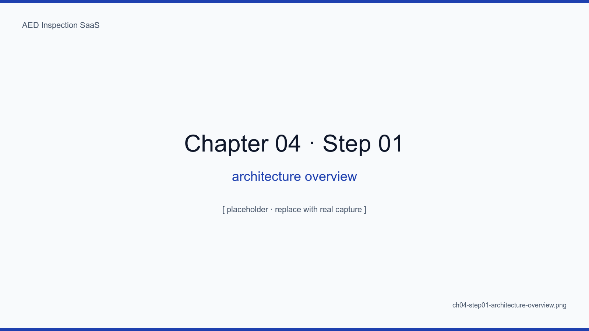
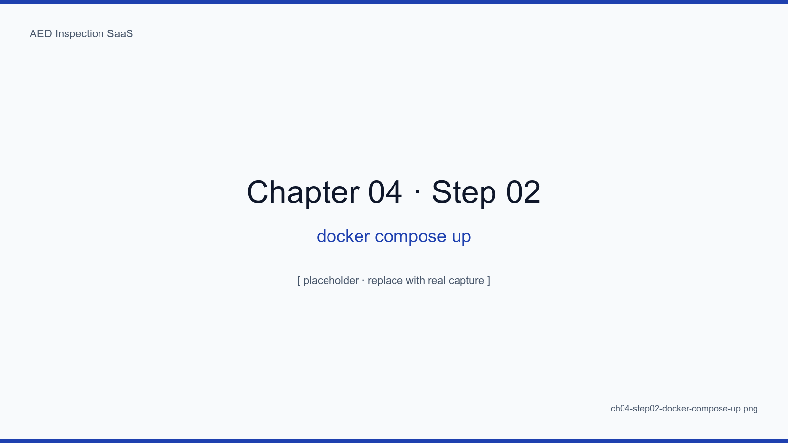
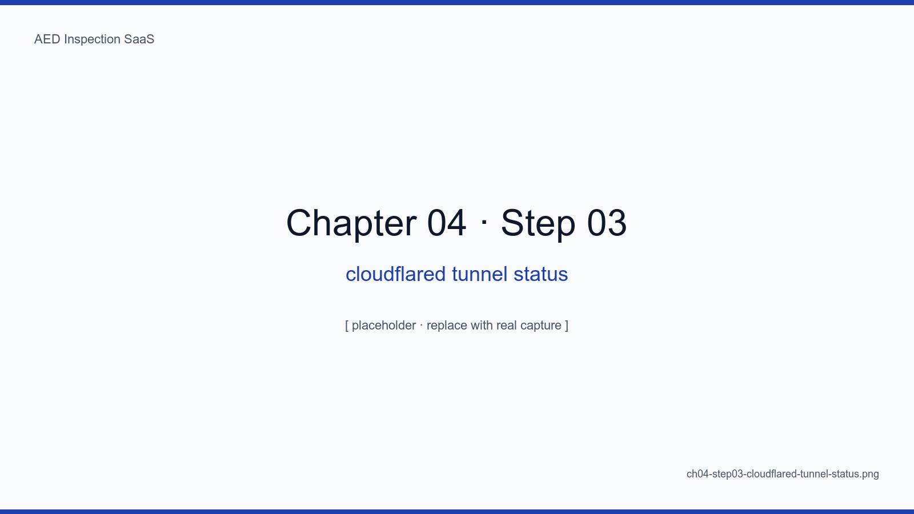
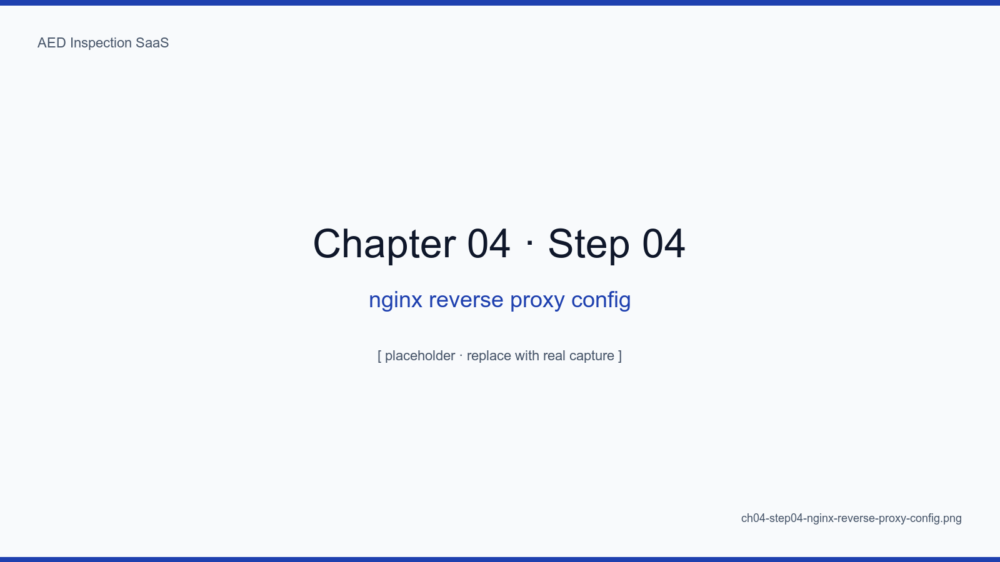
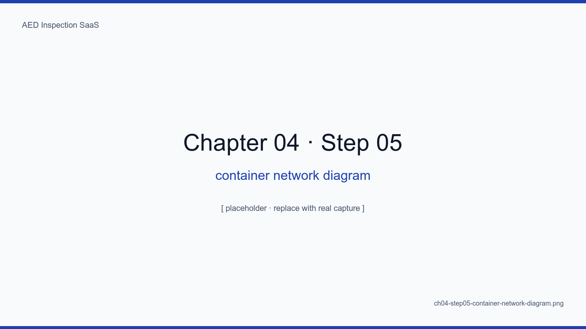
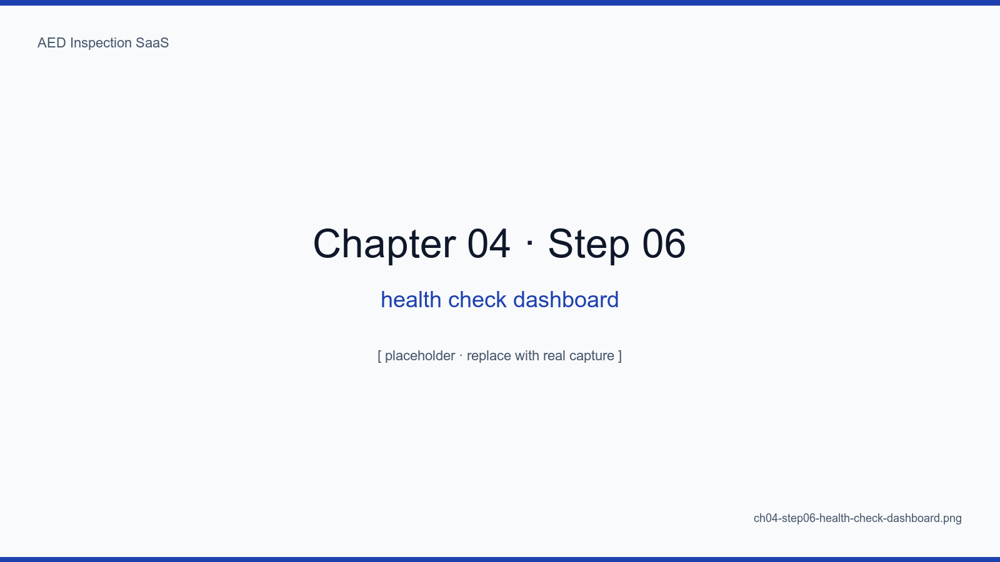

# 4장. abada-65 + Cloudflare Edge 아키텍처

## 학습 목표

- abada-65 서버 1대 위 Docker Compose 스택의 전체 구성도를 그릴 수 있다
- 각 컨테이너의 책임과 포트, 네트워크 격리를 식별한다
- Cloudflare Tunnel + WAF + R2 의 역할 분담을 설명한다
- 단일 서버 + Edge 구성의 SPOF(단일 장애점)를 식별하고 완화 전략을 마련한다
- 트래픽 한 번의 흐름(브라우저 → Edge → 컨테이너 → DB)을 9홉으로 추적한다

## 핵심 개념

본 SaaS의 인프라는 **abada-65 서버 1대 + Cloudflare Edge 1면**이다. 서버는
물리/가상 머신 1대, 그 위에 Docker Compose 로 6개 컨테이너가 떠 있고, 외부와의
모든 통신은 Cloudflare Tunnel 을 통한다. 인바운드 포트는 0이다 — 방화벽 설정
실수로 노출되는 사고 자체가 구조적으로 막힌다.

<!-- SCREENSHOT: ch04-step01-architecture-overview -->

*그림 4-1. 좌측: 사용자/점검자/관리자. 중앙 상단: Cloudflare Edge (DNS, WAF, Tunnel). 중앙 하단: abada-65 서버 (6개 컨테이너). 우측: R2 객체 저장소 + Resend (이메일).*
<!-- /SCREENSHOT -->

## 4.1 abada-65 서버 — 단일 호스트 구성

### 4.1.1 사양

- vCPU 4, RAM 8GB, Disk 200GB SSD (NVMe)
- Ubuntu 22.04 LTS, Docker 25.x, Docker Compose v2
- `/data` 하위에 모든 영속 볼륨 (운영 약속)

<!-- TODO: 실제 서버 사양 + 하드웨어 사진 첨부 -->

### 4.1.2 컨테이너 구성

```yaml
services:
  app:           # Next.js 14 (web + API)
  postgres:      # 16 (Drizzle ORM 대상)
  redis:         # 7 (rate-limit, magic-link nonce)
  cron-worker:   # node-cron + 6종 잡 (12장)
  nginx:         # 내부 리버스 프록시 + healthz
  cloudflared:   # Cloudflare Tunnel
```

<!-- SCREENSHOT: ch04-step02-docker-compose-up -->

*그림 4-2. 터미널: `docker compose up -d` 실행 직후. 6개 컨테이너 모두 healthy 상태로 들어왔다.*
<!-- /SCREENSHOT -->

## 4.2 Cloudflare Tunnel — 인바운드 0 포트

### 4.2.1 동작 원리

cloudflared 컨테이너가 Cloudflare 엣지로 **outbound 연결만** 맺는다. 사용자
요청은 엣지에서 이 터널을 타고 내려와 nginx → app 으로 전달된다.

<!-- SCREENSHOT: ch04-step03-cloudflared-tunnel-status -->

*그림 4-3. `cloudflared tunnel info` 결과. 4개 PoP(서울, 도쿄, 싱가포르, LA)에 동시 연결을 유지하며, 한 곳이 끊겨도 트래픽이 빠지지 않는다.*
<!-- /SCREENSHOT -->

### 4.2.2 효과

- **인바운드 포트 0**: 22도 닫는다 (필요 시 cloudflared SSH over Tunnel 사용)
- **DDoS 흡수**: 엣지에서 막힌다
- **WAF 규칙**: BOT, geo, rate-limit 모두 엣지에서

## 4.3 nginx — 내부 리버스 프록시

```nginx
server {
  listen 80;
  location /healthz { return 200 "ok"; }
  location / { proxy_pass http://app:3000; }
}
```

<!-- SCREENSHOT: ch04-step04-nginx-reverse-proxy-config -->

*그림 4-4. VS Code 에서 본 nginx.conf 핵심 라인 12줄. healthz 단독 처리는 cloudflared 헬스체크가 app 의 콜드 스타트와 무관하게 200을 받기 위함.*
<!-- /SCREENSHOT -->

### 4.3.1 healthz 분리의 이유

app 이 빌드 중이거나 마이그레이션 중일 때도 nginx 는 200 을 반환한다. cloudflared
가 헬스체크 실패로 터널을 내려버리는 사고를 방지한다 (저자의 1차 대형 사고
경험에서 도출된 패턴, `f79a3b1` 커밋 참고).

## 4.4 컨테이너 네트워크 격리

<!-- SCREENSHOT: ch04-step05-container-network-diagram -->

*그림 4-5. `frontend`, `backend`, `data` 3개 도커 네트워크. cloudflared/nginx 만 frontend, app 은 frontend+backend, db/redis 는 data.*
<!-- /SCREENSHOT -->

| 네트워크 | 멤버 |
|---|---|
| frontend | cloudflared, nginx |
| backend | nginx, app, cron-worker |
| data | app, cron-worker, postgres, redis |

DB 컨테이너는 frontend 네트워크에 절대 등장하지 않는다. nginx 가 SQL 인젝션을
당해도 DB 까지 한 홉이 더 필요하다.

## 4.5 트래픽 9홉

```
1. 브라우저
2. Cloudflare DNS
3. Cloudflare Edge (WAF, rate-limit, cache)
4. Cloudflare Tunnel
5. cloudflared (abada-65)
6. nginx (abada-65, frontend network)
7. app/Next.js (abada-65, backend network)
8. Drizzle / postgres (abada-65, data network)
9. 응답 역순 환원
```

<!-- TODO: 실제 trace 결과 (X-Ray 비슷한 도구로) 추가 -->

## 4.6 SPOF와 완화

abada-65 서버 1대가 죽으면 SaaS 가 죽는다. 솔직히 SPOF 다. 완화책은 다음이다.

| 위협 | 완화 |
|---|---|
| 디스크 폴트 | RAID-1 + 일 1회 R2 백업 (14장) |
| OS 다운 | 자동 재부팅 + Uptime Kuma 알림 (15장) |
| 데이터센터 단전 | 16장 어댑터 패턴으로 타사 이전 30분 시나리오 |
| Cloudflare 자체 | DNS 전환 시나리오 + 비상 직접 노출 모드 |

<!-- SCREENSHOT: ch04-step06-health-check-dashboard -->

*그림 4-6. Uptime Kuma. app, db, redis, cron, nginx, cloudflared, 그리고 외부에서 본 https://aed.example.kr/healthz 까지 7개 모니터.*
<!-- /SCREENSHOT -->

## 요약

- abada-65 1대 + Cloudflare Edge 1면 = 인바운드 0 포트 SaaS
- 6개 컨테이너 / 3개 네트워크로 책임 격리
- 단일 호스트 SPOF 는 솔직히 인정하되, 14·15·16장으로 완화한다
- nginx healthz 분리 패턴은 cloudflared 헬스체크와 빌드/마이그레이션 충돌 방지의 핵심

## 다음 장 미리보기

다음 장에서는 다기관(테넌트) 격리를 어떻게 3계층(URL · DB · 쿼리)으로 구현했는지,
그리고 한 줄 누락이 곧 데이터 유출이 되는 이 영역에서 우리가 어떤 가드레일을
세웠는지 다룬다.

## 캡처 체크리스트

- [ ] `ch04-step01-architecture-overview.png` — 전체 아키텍처 다이어그램
- [ ] `ch04-step02-docker-compose-up.png` — `docker compose up -d` 결과
- [ ] `ch04-step03-cloudflared-tunnel-status.png` — `cloudflared tunnel info`
- [ ] `ch04-step04-nginx-reverse-proxy-config.png` — VS Code nginx.conf
- [ ] `ch04-step05-container-network-diagram.png` — 네트워크 격리 다이어그램
- [ ] `ch04-step06-health-check-dashboard.png` — Uptime Kuma
