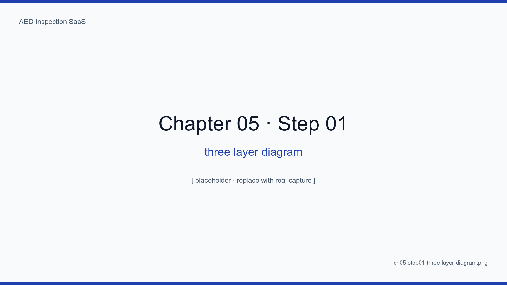
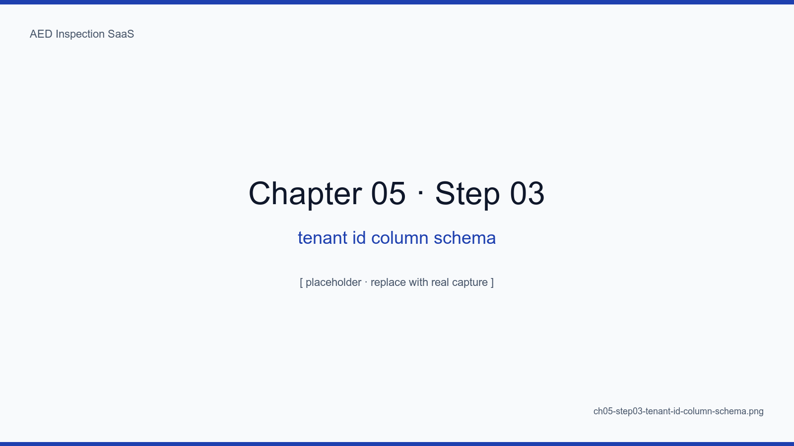
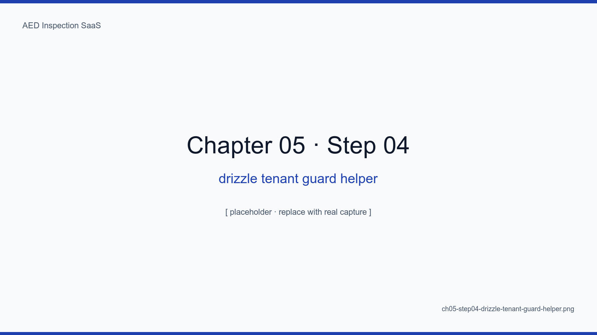
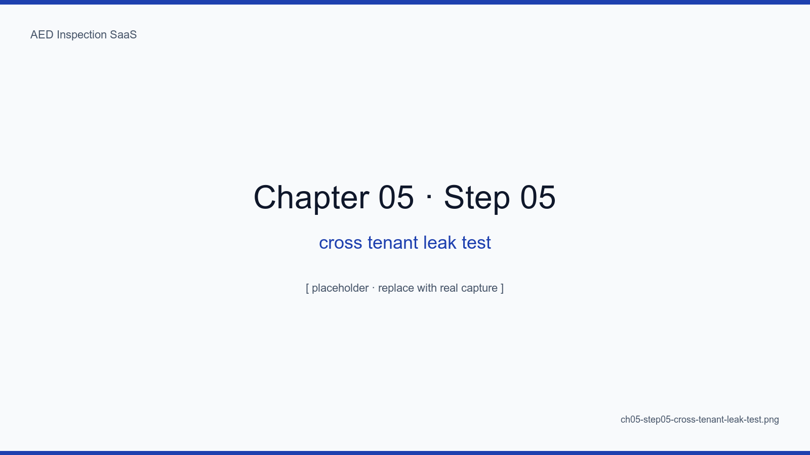

# 5장. 다기관 격리 3계층

## 학습 목표

- 다기관(multi-tenant) SaaS 의 4가지 격리 패턴(Pool, Bridge, Silo, Hybrid)을 비교한다
- 본 SaaS의 3계층 격리(URL · DB 컬럼 · 쿼리 가드)를 구체 코드로 구현한다
- "한 줄 누락이 곧 데이터 유출"인 영역에서 가드레일 3종 세트를 세운다
- 크로스 테넌트 누수를 자동 탐지하는 통합 테스트를 작성한다
- RLS 가 없는 환경에서도 동등한 안전성을 확보하는 방법을 정리한다

## 핵심 개념

다기관 SaaS 에서 가장 무서운 사고는 "A 시설 관리자가 B 시설 데이터를 본다"이다.
한 번이라도 이 사고가 나면 SaaS 를 닫아야 한다. 우리는 RLS 가 없는 자체 호스팅
Postgres 환경에서 **3계층 가드레일**로 이 사고를 구조적으로 차단한다.

1. **URL 계층**: `/{tenantSlug}/...` 으로 테넌트가 URL 에 박혀 있다
2. **DB 계층**: 모든 비공개 테이블에 `tenant_id` 컬럼이 not null 로 존재
3. **쿼리 계층**: `withTenant()` 헬퍼를 통과하지 않는 쿼리는 빌드가 깨진다

<!-- SCREENSHOT: ch05-step01-three-layer-diagram -->

*그림 5-1. 한 요청이 통과하는 3개 게이트. 한 게이트만 살아있어도 누수가 막히도록 다중 방어선을 깐다.*
<!-- /SCREENSHOT -->

## 5.1 1계층 — URL 테넌트 라우팅

Next.js 14 App Router 의 동적 세그먼트로 `app/[tenantSlug]/...` 구조를 짠다.
모든 페이지/API 라우트는 `params.tenantSlug` 를 받아 `tenant_id` 로 변환한 뒤
컨텍스트에 박는다.

<!-- SCREENSHOT: ch05-step02-url-tenant-routing -->
![URL 테넌트 라우팅 — app/[tenantSlug]/(authenticated)/inspect](../assets/screenshots/ch05-step02-url-tenant-routing.png)
*그림 5-2. VS Code 파일 트리. app/ 직계는 마케팅 페이지, [tenantSlug]/ 하위가 SaaS 본체. 라우팅만으로 단/다기관 분기가 끝난다.*
<!-- /SCREENSHOT -->

### 5.1.1 슬러그 리졸버

```ts
// src/lib/tenant/resolve.ts (예시)
export async function resolveTenant(slug: string) {
  const tenant = await db.query.tenants.findFirst({
    where: eq(tenants.slug, slug),
  })
  if (!tenant) notFound()
  return tenant
}
```

<!-- TODO: 실제 코드 src/lib/tenant/resolve.ts 발췌로 대체 -->

## 5.2 2계층 — DB 컬럼 강제

모든 비공개 테이블 정의에 `tenantId` 컬럼이 `notNull()` 로 존재한다. Drizzle
스키마 단계에서 이를 빠뜨릴 수 없도록 헬퍼를 만든다.

<!-- SCREENSHOT: ch05-step03-tenant-id-column-schema -->

*그림 5-3. drizzle/schema/_helpers.ts. 모든 도메인 테이블이 withTenantId() 를 통과해야 정의되며, 누락 시 타입이 깨진다.*
<!-- /SCREENSHOT -->

### 5.2.1 인덱스

`(tenant_id, ...)` 복합 인덱스를 모든 조회 키에 두어 테넌트 스캔 비용이 폭증하지
않게 한다.

```sql
CREATE INDEX idx_inspections_tenant_device_date
  ON inspections (tenant_id, device_id, inspected_at DESC);
```

## 5.3 3계층 — 쿼리 가드 (withTenant)

쿼리 작성 시 `db` 를 직접 쓰지 않고 `tenantDb(ctx)` 만 쓰도록 강제한다.
`tenantDb` 는 모든 select/insert/update/delete 에 자동으로
`where eq(table.tenantId, ctx.tenantId)` 를 합성한다.

<!-- SCREENSHOT: ch05-step04-drizzle-tenant-guard-helper -->

*그림 5-4. src/lib/tenant/db.ts. Drizzle 쿼리 빌더를 Proxy 로 감싸 모든 where 절에 tenantId 필터를 자동 추가한다. 이 한 함수가 누수 방지의 핵심.*
<!-- /SCREENSHOT -->

### 5.3.1 빌드 게이트

ESLint 룰로 `import { db } from '@/lib/db'` 직접 사용을 금지하고, `tenantDb`
또는 `publicDb`(공개 테이블 전용) 만 허용한다.

<!-- TODO: 실제 .eslintrc.cjs 룰 발췌 추가 -->

## 5.4 4가지 격리 패턴 비교

| 패턴 | 격리 수준 | 비용 | 본 SaaS 채택 |
|---|---|---|---|
| Pool (한 DB, tenant_id 컬럼) | 낮음 | 매우 낮음 | **3계층 가드와 결합해 채택** |
| Bridge (한 DB, 스키마 분리) | 중간 | 낮음 | X (마이그레이션 복잡) |
| Silo (DB 분리) | 높음 | 매우 높음 | X (10K 시점 비용 폭증) |
| Hybrid | 가변 | 가변 | 1만 대 이상 시점에 일부 대형 시설만 Silo 검토 (17장) |

## 5.5 크로스 테넌트 누수 테스트

<!-- SCREENSHOT: ch05-step05-cross-tenant-leak-test -->

*그림 5-5. tests/integration/tenant-leak.spec.ts. 테넌트 A 토큰으로 테넌트 B 의 inspectionId 를 조회 시도 → 404 가 아니면 실패. 모든 라우트에 자동 적용.*
<!-- /SCREENSHOT -->

```ts
// 의사 코드
for (const route of allProtectedRoutes) {
  test(`${route} blocks cross-tenant`, async () => {
    const res = await fetch(route, { headers: tokenForA })
    expect(res.status).toBe(404)  // not 200, not 403
  })
}
```

404를 반환하는 이유: 403 은 "리소스 존재" 정보를 노출한다.

## 5.6 RLS 없이 동등 안전성

Postgres RLS 는 강력하지만, 우리는 그 대신 **컴파일러와 ESLint** 를 활용한다.
`tenantDb` 를 통과하지 않은 쿼리는 빌드가 깨지고, 빌드 깨진 코드는 배포되지
않는다. 동등하지는 않지만 충분히 안전하다.

## 요약

- 3계층 격리(URL · DB · Query) 가 RLS 없는 환경의 안전 등가물
- `tenantDb` 한 함수가 누수 방지의 키스톤
- 빌드 단계 ESLint 룰 + 통합 테스트가 가드레일을 깨뜨릴 수 없게 만든다
- Silo 패턴은 17장 스케일링에서 부분 도입 가능성을 다룬다

## 다음 장 미리보기

다음 장에서는 8개 핵심 테이블의 데이터 모델과, 각 테이블이 워크플로우 4단계와
어떻게 매핑되는지 ER 다이어그램과 함께 짚어본다.

## 캡처 체크리스트

- [ ] `ch05-step01-three-layer-diagram.png` — 3계층 다이어그램
- [ ] `ch05-step02-url-tenant-routing.png` — VS Code 파일 트리
- [ ] `ch05-step03-tenant-id-column-schema.png` — Drizzle 스키마
- [ ] `ch05-step04-drizzle-tenant-guard-helper.png` — withTenant 코드
- [ ] `ch05-step05-cross-tenant-leak-test.png` — 통합 테스트 통과 화면
