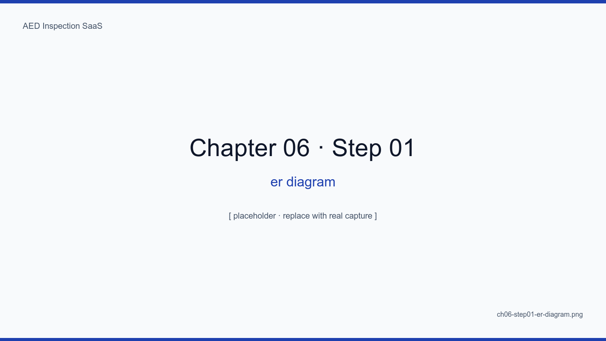
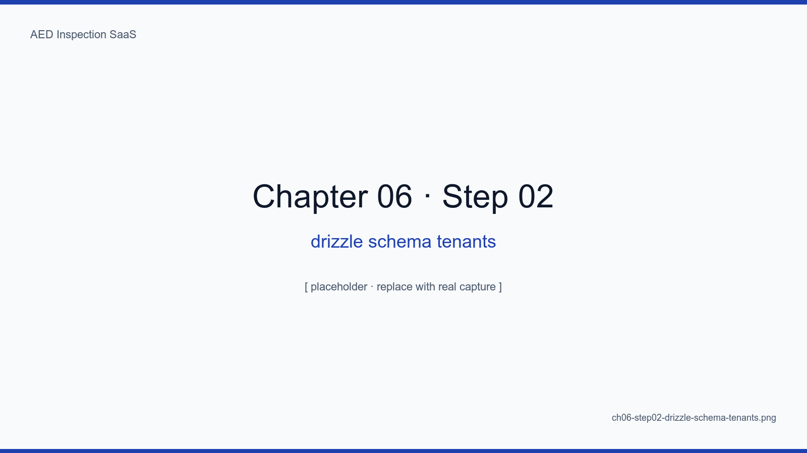
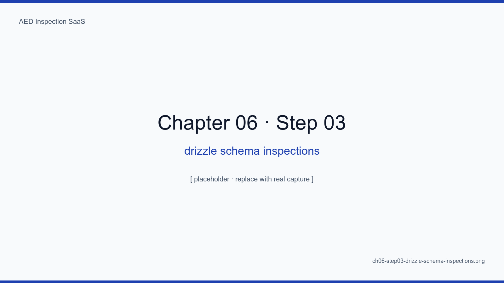
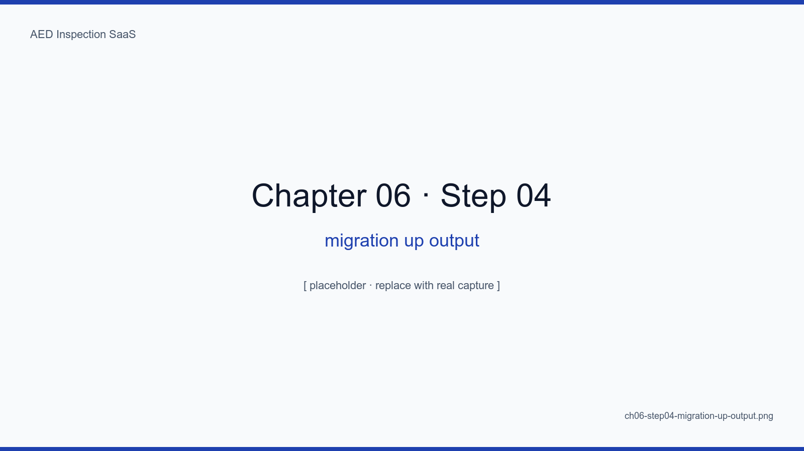
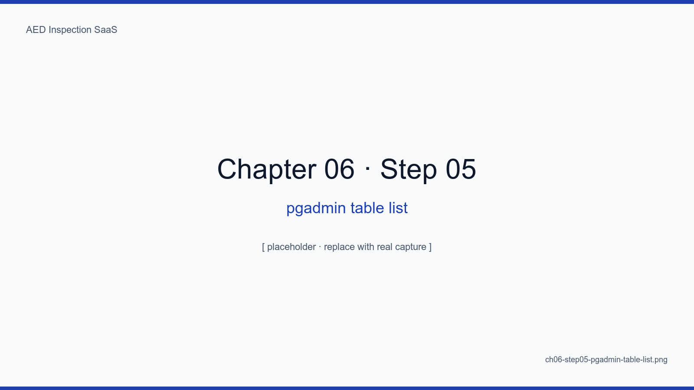

# 6장. 데이터 모델 — 8개 테이블

## 학습 목표

- 본 SaaS 의 8개 핵심 테이블과 4단계 워크플로우의 매핑을 그릴 수 있다
- Drizzle 스키마 작성 시 4가지 베스트 프랙티스(공통 타임스탬프, soft-delete, enum, JSONB 자제)를 적용한다
- ER 다이어그램으로부터 마이그레이션 파일을 자동 생성하고 실행한다
- 시드 데이터로 통합 테스트 환경을 1초 만에 복구한다
- 컬럼 추가/제거 시 다운타임 0 마이그레이션 패턴을 익힌다

## 핵심 개념

본 SaaS의 데이터 모델은 의도적으로 **8개 테이블에서 멈췄다**. 더 늘리면 한 화면이
여러 도메인을 가로지르고, 더 줄이면 JSONB 가 폭발한다. 8개는 우리가 6개월 운영
끝에 도달한 최소·충분 집합이다.

<!-- SCREENSHOT: ch06-step01-er-diagram -->

*그림 6-1. tenants 가 루트, devices 가 트렁크, inspections 가 잎. signatures, photos, reports, notifications, audit_logs 가 각 잎에 매달린다.*
<!-- /SCREENSHOT -->

## 6.1 테이블 8개

| # | 테이블 | 설명 | 워크플로우 단계 |
|---|---|---|---|
| 1 | tenants | 시설/기관 | 0 (인증 전) |
| 2 | users | 점검자/관리자 | 0 |
| 3 | devices | AED 디바이스 | 1, 2 |
| 4 | inspection_schedules | 월별 일정 | 1 |
| 5 | inspections | 점검 결과 (12항목) | 2 |
| 6 | signatures | 전자서명 + SHA-256 | 2 |
| 7 | photos | 사진 메타 + R2 키 | 2 |
| 8 | reports | 월간 보고서 (DOCX/PDF) | 4 |
| (옵션) | notifications | 알림 큐 | 1, 3 |
| (옵션) | audit_logs | 감사 로그 | 전체 |

> 옵션 2개를 포함하면 10개. 본문에서는 핵심 8개에 집중하고, 부록 B 환경변수에서
> 실제 마이그레이션 파일 목록을 확인할 수 있다.

## 6.2 tenants

```ts
export const tenants = pgTable("tenants", {
  id: uuid("id").primaryKey().defaultRandom(),
  slug: varchar("slug", { length: 64 }).notNull().unique(),
  name: varchar("name", { length: 255 }).notNull(),
  plan: tenantPlanEnum("plan").notNull().default("standard"),
  ...timestamps(),
})
```

<!-- SCREENSHOT: ch06-step02-drizzle-schema-tenants -->

*그림 6-2. drizzle/schema/tenants.ts. slug 는 URL 1계층 격리의 출발점이라 유일 제약이 핵심.*
<!-- /SCREENSHOT -->

## 6.3 inspections

```ts
export const inspections = withTenantId(pgTable("inspections", {
  id: uuid("id").primaryKey().defaultRandom(),
  deviceId: uuid("device_id").notNull().references(() => devices.id),
  scheduleId: uuid("schedule_id").references(() => inspectionSchedules.id),
  inspectedAt: timestamp("inspected_at", { withTimezone: true }).notNull(),
  inspectorUserId: uuid("inspector_user_id").notNull().references(() => users.id),
  // 12 항목은 별도 inspection_items 가 아니라 12개 컬럼으로 (인덱싱/조회 단순)
  item01_padExpiry: date("item01_pad_expiry"),
  item02_batteryLevel: smallint("item02_battery_level"),
  // ... item03 ~ item12
  notes: text("notes"),
  status: inspectionStatusEnum("status").notNull().default("submitted"),
  ...timestamps(),
}))
```

<!-- SCREENSHOT: ch06-step03-drizzle-schema-inspections -->

*그림 6-3. drizzle/schema/inspections.ts. JSONB 가 아니라 12개 명시 컬럼으로 둔 이유는 인덱싱·집계·BI 도구 호환을 위해서.*
<!-- /SCREENSHOT -->

### 6.3.1 12 컬럼 vs JSONB

JSONB 한 컬럼이 깔끔해 보이지만, "이번 달 패드 만료 임박 디바이스" 같은 BI 쿼리를
1ms 안에 끝내려면 명시 컬럼이 압도적이다. 부록 A 에서 12 항목 양식을 자세히 다룬다.

## 6.4 마이그레이션

```bash
pnpm drizzle-kit generate
pnpm drizzle-kit migrate
```

<!-- SCREENSHOT: ch06-step04-migration-up-output -->

*그림 6-4. 첫 마이그레이션 적용 시 터미널 출력. 8개 테이블, 14개 인덱스, 2개 enum 이 한 번에 들어왔다.*
<!-- /SCREENSHOT -->

## 6.5 pgAdmin 검증

<!-- SCREENSHOT: ch06-step05-pgadmin-table-list -->

*그림 6-5. 마이그레이션 후 pgAdmin 좌측 트리. 모든 테이블에 tenant_id 가 not null 로 들어가 있는지 시각 검증.*
<!-- /SCREENSHOT -->

## 6.6 시드 데이터

테스트 환경 1초 복구를 위한 fixture 패턴.

```bash
pnpm seed:reset
```

<!-- SCREENSHOT: ch06-step06-seed-fixture-output -->

*그림 6-6. seed/reset.ts 실행 결과. 통합 테스트마다 신선한 상태에서 시작할 수 있는 핵심 도구.*
<!-- /SCREENSHOT -->

## 6.7 무중단 마이그레이션 패턴

컬럼 추가/제거 시 3단계 배포로 다운타임 0.

1. **확장(Expand)**: 새 컬럼 추가, 코드는 양쪽 모두 읽고 새 컬럼에 쓴다
2. **백필(Backfill)**: 배치로 기존 행 채움
3. **수축(Contract)**: 옛 컬럼 제거

<!-- TODO: 실제 무중단 마이그레이션 사례(item13 추가) 캡처 추가 -->

## 6.8 공통 타임스탬프 헬퍼

```ts
export const timestamps = () => ({
  createdAt: timestamp("created_at", { withTimezone: true }).notNull().defaultNow(),
  updatedAt: timestamp("updated_at", { withTimezone: true }).notNull().defaultNow(),
  deletedAt: timestamp("deleted_at", { withTimezone: true }),
})
```

soft-delete 는 audit/감사 요건과 잘 맞는다. 단 `deleted_at IS NULL` 필터를
모든 기본 쿼리에 박는 것을 잊지 말 것.

## 요약

- 8개 테이블이 우리의 최소·충분 집합 — JSONB 폭발도, 도메인 가로지르기도 막는다
- 12 항목은 의도적으로 12 컬럼 (BI 쿼리·인덱싱 우선)
- 무중난 마이그레이션은 Expand → Backfill → Contract 3단계
- 시드 fixture 1초 복구가 통합 테스트 안정의 베이스

## 다음 장 미리보기

다음 장에서는 Auth.js 기반의 매직링크 인증을 다기관 컨텍스트와 결합하는 방법,
그리고 `session.user.tenantId` 라는 단 한 줄을 정확히 어디에 박는지 살펴본다.

## 캡처 체크리스트

- [ ] `ch06-step01-er-diagram.png` — ER 다이어그램 (dbdiagram.io 또는 Mermaid)
- [ ] `ch06-step02-drizzle-schema-tenants.png`
- [ ] `ch06-step03-drizzle-schema-inspections.png`
- [ ] `ch06-step04-migration-up-output.png` — 터미널 출력
- [ ] `ch06-step05-pgadmin-table-list.png` — pgAdmin
- [ ] `ch06-step06-seed-fixture-output.png` — 시드 실행 결과
