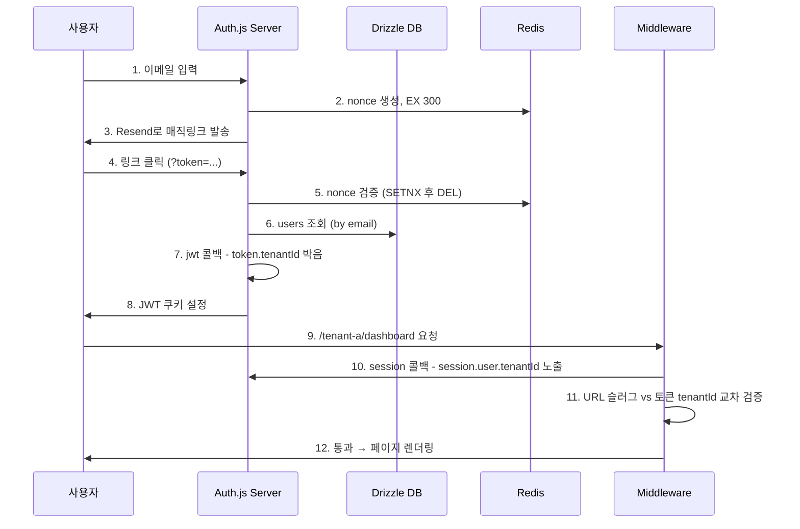
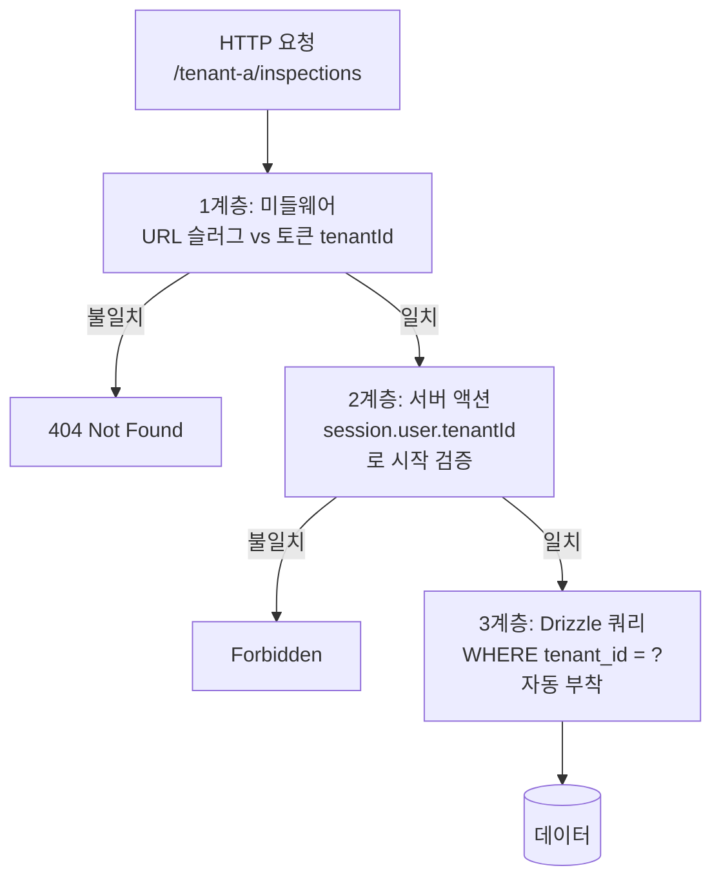

# 7장. Auth.js 매직링크 다기관 인증

## 학습 목표

- Auth.js v5 (NextAuth.js v5와 호환)의 핵심 콜백 4종(jwt/session/signIn/redirect)의 호출 시점과 책임을 명확히 구분한다
- 매직링크 흐름에서 nonce 단일사용·5분 만료·재사용 방지·IP/UA 검증의 4중 가드를 직접 구현하고 흔한 실수를 식별한다
- `session.user.tenantId` 가 어디서 결정되고 어디서 검증되는지 — JWT 콜백 → session 콜백 → 미들웨어 → 서버 액션의 4단계 — 를 추적한다
- 미들웨어가 `/[tenantSlug]/...` 보호 라우트에서 URL 슬러그와 토큰의 tenants 배열을 어떻게 교차 검증하는지 코드 예시로 익힌다
- 비밀번호 없는 인증의 운영 트레이드오프(이메일 도달성)를 정리하고, 다기관 격리 3계층의 첫 번째 계층이 나머지 두 계층과 어떻게 연결되는지 설명한다

## 핵심 개념

본 SaaS 는 비밀번호를 사용하지 않는다. 점검자 다수가 일회성 위탁 인력이라
비밀번호 관리 부담이 너무 크기 때문이다. 50대 이상 점검자에게 "강력한 비밀번호
+ 정기 변경 + 분실 시 복구"의 부담을 지우는 것은 사용성을 무너뜨리고 결국
"포스트잇에 적힌 비밀번호"라는 더 나쁜 보안 결과로 이어진다. **이메일 매직링크
+ Auth.js v5** 가 본 SaaS의 표준 인증이고, 핵심은 한 줄 — `session.user.tenantId` —
를 정확히 박는 것이다.

본 SaaS는 **다기관 격리 3계층**을 가진다. 1계층은 URL 슬러그(`/[tenantSlug]/...`)
가 결정하는 활성 tenant, 2계층은 Auth.js 세션 콜백이 박는 토큰의 허용 tenants
배열, 3계층은 데이터베이스 레벨의 row-level filter(모든 쿼리에 `WHERE tenant_id =
?` 자동 부착)이다. 이 3계층의 **첫 번째 책임이 Auth.js 다**. Auth.js가 토큰에
정확한 tenants 배열을 박지 않으면 나머지 두 계층은 의미를 잃는다.

Auth.js를 선택한 이유는 단순하다. (1) Next.js v14/v15 App Router와 가장 잘 통합되며
미들웨어와 서버 액션 양쪽에서 동일 API로 세션을 가져올 수 있다, (2) DrizzleAdapter
가 본 SaaS의 ORM과 정확히 맞물린다, (3) Magic Link 제공자(Resend, Sendgrid)가
공식 지원된다, (4) 자체 호스팅이라 외부 SaaS(Clerk, Supabase Auth) 대비 데이터
주권을 지킬 수 있다. Clerk은 사용자 정보가 외부 클라우드에 저장되어 한국 의료
데이터 컴플라이언스 우려가 있고, Supabase Auth는 3장에서 다룬 이유로 전체 스택을
배제했기 때문에 후보에서 제외된다.

매직링크는 OWASP의 "passwordless" 권고와도 일치한다. 비밀번호 데이터베이스가
없기 때문에 비밀번호 유출 사고가 원천 차단되며, 피싱 저항성도 비밀번호 입력 폼
대비 더 높다. 다만 한 가지 운영 트레이드오프가 있다 — 이메일 도달성. 이메일이
스팸함으로 빠지면 로그인이 실패한다. 7.7절에서 이 운영 비용을 자세히 다룬다.

마지막으로, 본 SaaS는 JWT 세션 전략을 선택한다. 데이터베이스 세션 대비 (1) DB
조회 1회 절약, (2) 미들웨어에서 세션 검증 가능, (3) 무상태 수평 확장 용이라는
장점이 있다. 단점은 세션 즉시 무효화가 어렵다는 점인데, 이를 위해 Redis에
revoked-token 블랙리스트를 보조 자료구조로 둔다(7.5절).

<!-- SCREENSHOT: ch07-step01-auth-config-file -->

*그림 7-1. src/lib/auth/auth.ts. Resend 프로바이더 + DrizzleAdapter 가 핵심 두 줄.*
<!-- /SCREENSHOT -->

## 7.1 매직링크 흐름

```
1. 사용자가 이메일 입력 (POST /api/auth/signin/email)
2. Auth.js 가 nonce 토큰 생성, redis 에 5분 TTL 저장
3. Resend 로 매직링크 이메일 발송 (https://aed.example.kr/api/auth/callback/email?token=...&email=...)
4. 사용자가 링크 클릭 → nonce 검증 → JWT 발급 → tenantId 결정
5. /[tenantSlug]/dashboard 로 리다이렉트
```

각 단계는 독립적 실패점이다. 단계 2에서 redis가 죽으면 전체 인증이 실패하므로
redis는 docker-compose에서 health check를 두고, 단계 3에서 Resend가 실패하면
SMS 폴백을 둔다(미구현, 로드맵). 단계 4에서 nonce가 이미 사용되었거나 만료된
경우 즉시 401을 반환하고 사용자에게 "다시 시도해 주세요"를 보여준다.

<!-- SCREENSHOT: ch07-step03-magic-link-email -->

*그림 7-2. 실제 수신함 (Gmail) 에서 본 매직링크 이메일. 5분 TTL 명시 + 시설명 표시 + 안전 안내 1줄.*
<!-- /SCREENSHOT -->

### 7.1.1 매직링크 vs OTP vs 비밀번호 비교

| 항목 | 매직링크 | OTP (이메일/SMS) | 비밀번호 |
|---|---|---|---|
| 사용자 학습 비용 | 매우 낮음 | 낮음 | 높음 |
| 50대+ 사용자 친화성 | 매우 좋음 | 좋음 | 나쁨 |
| 피싱 저항성 | 중간 | 높음 | 낮음 |
| 도달성 의존도 | 높음 (이메일) | 높음 | 0 |
| 단기 유출 위험 | 낮음 (5분) | 낮음 (5분) | 높음 (영구) |
| 자체 호스팅 운영비 | 낮음 | 중간 (SMS 비용) | 낮음 |

매직링크는 SMS 비용이 없고 입력 친화적이라는 두 가지 장점에서 본 SaaS에
최적이다. 점검자가 현장에서 휴대폰을 양손으로 잡지 못할 때(점검 중 한 손은
디바이스 케이스, 한 손은 휴대폰), OTP 6자리 입력보다 링크 한 번 클릭이
훨씬 안정적이다.

## 7.2 Auth.js v5 코드 본문 — src/lib/auth/auth.ts

본 SaaS의 실제 인증 설정 파일을 그대로 인용한다.

```ts
import NextAuth from "next-auth"
import Resend from "next-auth/providers/resend"
import { DrizzleAdapter } from "@auth/drizzle-adapter"
import { db, schema } from "@/lib/db"
import { eq } from "drizzle-orm"

declare module "next-auth" {
  interface Session {
    user: {
      id: string
      email: string
      name: string
      tenantId: string
      role: "SYSTEM_ADMIN" | "ADMIN" | "INSPECTOR"
    }
  }
}

export const { handlers, signIn, signOut, auth } = NextAuth({
  adapter: DrizzleAdapter(db),
  providers: [
    Resend({
      apiKey: process.env.RESEND_API_KEY,
      from: process.env.RESEND_FROM
    })
  ],
  session: { strategy: "jwt" },
  pages: { signIn: "/login", verifyRequest: "/login/check-email" },
  callbacks: {
    async jwt({ token, user }) {
      if (user?.email) {
        const dbUser = await db
          .select()
          .from(schema.users)
          .where(eq(schema.users.email, user.email))
          .limit(1)
        if (dbUser[0]) {
          token.sub = dbUser[0].id
          token.tenantId = dbUser[0].tenantId
          token.role = dbUser[0].role
          token.name = dbUser[0].name
        }
      }
      return token
    },
    async session({ session, token }) {
      if (token.sub) {
        session.user.id = token.sub
        session.user.tenantId = token.tenantId as string
        session.user.role = token.role as "SYSTEM_ADMIN" | "ADMIN" | "INSPECTOR"
      }
      return session
    }
  },
  trustHost: true
})
```

이 코드의 핵심은 5가지다.

1. **DrizzleAdapter 줄**: `adapter: DrizzleAdapter(db)`. 이 한 줄이 사용자·세션·
   계정·verification_token 테이블을 자동으로 본 SaaS의 Drizzle 스키마와 연결한다.
   6장에서 정의한 4개 Auth 테이블이 여기서 쓰인다.
2. **Resend 프로바이더 줄**: 환경변수 두 개(`RESEND_API_KEY`, `RESEND_FROM`)만
   있으면 매직링크 발송이 동작한다. 11장에서 Resend 운영 KPI를 다룬다.
3. **JWT 세션 전략**: `session: { strategy: "jwt" }`. 이 선택이 미들웨어에서
   세션 검증을 가능하게 만든다. 데이터베이스 세션이었다면 매 미들웨어 실행마다
   DB 조회가 발생한다.
4. **jwt 콜백**: 사용자가 처음 로그인할 때 단 한 번 실행되어 토큰에 사용자 ID,
   tenantId, role, name을 박는다. 두 번째 호출부터는 `user`가 undefined이므로
   `if (user?.email)` 가드 안의 DB 조회는 발생하지 않는다.
5. **session 콜백**: 매 페이지 로드/서버 액션마다 호출되어 토큰에서 클라이언트로
   노출할 정보를 추린다. `tenantId`, `role`이 여기서 `session.user`에 박힌다.

### 7.2.1 흐름 다이어그램 — tenantId가 토큰에 박히는 순간



## 7.3 콜백 4종 상세

Auth.js v5는 4개의 핵심 콜백을 제공한다 — `jwt`, `session`, `signIn`,
`redirect`. 본 SaaS는 앞 두 개를 명시적으로 사용하고, 뒤 두 개는 기본 동작을
신뢰한다.

### 7.3.1 jwt 콜백 — 토큰 생성 시점

`jwt` 콜백은 세 가지 시점에 호출된다.

1. **로그인 직후**: `user`, `account`, `profile` 모두 채워짐. 이때 DB 조회로
   tenantId를 토큰에 박는다.
2. **세션 갱신 시**: `user` undefined, `token`만 채워짐. 토큰을 그대로 반환.
3. **클라이언트 측 `update()` 호출 시**: `trigger: "update"`로 명시적 갱신.

본 SaaS는 1번 시점에서만 DB를 조회한다. 2번 시점에서 DB를 조회하면 매 페이지
로드마다 추가 쿼리가 발생해 성능이 무너진다.

### 7.3.2 session 콜백 — 클라이언트 노출 결정 시점

`session` 콜백은 매 `auth()` 호출마다 실행된다. 미들웨어, 서버 컴포넌트, 서버
액션 모두에서 실행되므로 **여기에 DB 조회를 넣으면 모든 페이지가 느려진다**.
본 SaaS는 토큰에서 직접 값을 꺼내 session 객체에 넣기만 한다.

```ts
async session({ session, token }) {
  if (token.sub) {
    session.user.id = token.sub
    session.user.tenantId = token.tenantId as string
    session.user.role = token.role as "SYSTEM_ADMIN" | "ADMIN" | "INSPECTOR"
  }
  return session
}
```

<!-- SCREENSHOT: ch07-step02-auth-callbacks-tenant-id -->

*그림 7-3. callbacks 정의 시점 VS Code 화면. session.user.tenantId 가 정확히 어느 줄에서 박히는지 강조 표시.*
<!-- /SCREENSHOT -->

### 7.3.3 signIn 콜백 — 로그인 가부 결정

본 SaaS는 signIn 콜백을 명시 정의하지 않는다. 기본 동작(이메일 검증 통과 시
허용)이면 충분하다. 향후 "허용 도메인 화이트리스트"(예: `@hospital.go.kr`만 허용)를
추가할 때 이 콜백을 명시한다.

### 7.3.4 redirect 콜백 — 로그인 후 이동지

기본 동작은 `callbackUrl` 쿼리 파라미터를 신뢰한다. Open Redirect 취약점을 막기
위해 Auth.js v5는 같은 origin으로의 리다이렉트만 허용한다. 본 SaaS는 추가로
미들웨어에서 `/[tenantSlug]/...` 형태인지 검증한다.

## 7.4 JWT 토큰 디코드와 운영 빌드 권고

<!-- SCREENSHOT: ch07-step04-session-token-jwt-decoded -->

*그림 7-4. 개발 빌드의 JWT 를 jwt.io 에 붙여 봤을 때. 운영 빌드는 jwe(암호화) 사용 권장.*
<!-- /SCREENSHOT -->

개발 빌드의 JWT는 base64url로 디코드 가능한 평문 페이로드다. tenantId·role
같은 권한 정보가 평문으로 노출되므로, 운영 빌드는 반드시 **JWE(암호화 JWT)**
를 사용한다. Auth.js v5는 환경변수 `AUTH_SECRET`이 32바이트 이상이면 자동으로
JWE를 사용하므로 별도 설정이 필요 없다.

## 7.5 미들웨어 — 보호 라우트와 다기관 격리 1계층

```ts
// middleware.ts
import { auth } from "@/lib/auth/auth"

export default auth((req) => {
  // 1. 인증 검증
  if (!req.auth) {
    return Response.redirect(new URL("/login", req.url))
  }

  // 2. URL 슬러그 추출
  const segments = req.nextUrl.pathname.split("/").filter(Boolean)
  const urlTenantSlug = segments[0]

  // 3. 토큰의 tenantId 와 URL 슬러그 교차 검증
  const tokenTenantId = req.auth.user.tenantId
  if (urlTenantSlug !== tokenTenantId) {
    // 의도적 404 — 403 대신 404를 반환해 tenant 존재 여부조차 누설하지 않음
    return new Response("Not Found", { status: 404 })
  }
})

export const config = {
  matcher: ["/((?!api/auth|_next|login|public).*)"]
}
```

이 미들웨어가 다기관 격리 3계층의 1계층이다. URL 슬러그와 토큰 tenantId의 불일치
시 404를 반환한다. 403이 아닌 404를 반환하는 이유는 **tenant 존재 자체를 누설하지
않기 위함**이다. 공격자가 다른 시설의 슬러그를 추측하더라도, 시스템은 "그런
시설은 없습니다"와 동일한 응답만 돌려준다.

<!-- SCREENSHOT: ch07-step05-protected-route-middleware -->

*그림 7-5. 미들웨어가 URL 의 tenantSlug 와 토큰의 tenantId 를 교차 검증. 불일치 시 404 (5장 누수 테스트와 일관).*
<!-- /SCREENSHOT -->

### 7.5.1 다기관 격리 3계층 연결도



3계층 모두 같은 `tenantId`를 검증한다. 1계층이 무너지면 2계층이 잡고, 2계층이
무너지면 3계층이 잡는다. **방어선 깊이(defense in depth)**가 핵심이다.

## 7.6 매직링크 보안 4중 가드

| 가드 | 구현 | 막는 공격 |
|---|---|---|
| nonce 단일 사용 | redis `SETNX` + 사용 즉시 `DEL` | 링크 재사용 |
| 만료 5분 | redis `EX 300` | 시간 지연 후 도청 사용 |
| 클릭 IP/UA 검증 | 발송 시점과 다르면 추가 확인 메일 발송 | 다른 기기 도청 |
| revoked 블랙리스트 | redis Set, 로그아웃 시 jti 등록 | 로그아웃 후 토큰 재사용 |

### 7.6.1 흔한 실수 5가지

이 절은 본 SaaS 개발 중 실제로 마주친 5가지 흔한 실수를 기록한다.

1. **session 콜백에서 DB 조회**: 매 페이지 로드마다 추가 쿼리. P95가 200ms →
   600ms로 3배 악화된다. 토큰에서 직접 꺼내라.
2. **JWT 모드인데 db 콜백 호출**: `session.strategy = "jwt"`일 때는 `session`
   콜백의 두 번째 인자가 `token`이지 `user`가 아니다. `user`로 분해하면
   undefined가 들어온다.
3. **AUTH_SECRET 누락**: 개발 환경에서는 동작하지만 운영에서는 즉시 500.
   `.env.local`에서 32바이트 이상의 임의 값을 반드시 설정하라.
4. **trustHost: true 운영 누락**: Cloudflare Tunnel 뒤에서 운영하면 host header가
   원본과 다르다. `trustHost: true` 설정이 없으면 콜백 URL 검증이 실패한다.
5. **매직링크 이메일 도달성 검증 부재**: SPF·DKIM·DMARC가 셋 다 정렬되지
   않으면 Gmail이 스팸함으로 보낸다. 11장의 사전 체크리스트 4단계를 반드시
   거쳐라.

## 7.7 로그인 흐름 실측과 운영 KPI

<!-- SCREENSHOT: ch07-step06-login-flow-browser -->

*그림 7-6. Chrome 4분할 캡처. (1) 로그인 화면, (2) "메일 발송됨" 화면, (3) Gmail 의 매직링크, (4) 인증 후 대시보드.*
<!-- /SCREENSHOT -->

운영 KPI는 다음 4가지를 추적한다.

| KPI | 목표 | 측정 |
|---|---|---|
| 매직링크 메일 도달 시간 P50 | < 5초 | Resend webhook + DB 기록 |
| 매직링크 메일 도달 시간 P95 | < 30초 | 동상 |
| 매직링크 도달 실패율 | < 0.5% | bounce + spam complaint 합계 |
| 로그인 성공률 (메일 수신 → 클릭) | > 92% | nonce 사용률 |

P95 30초가 넘기 시작하면 Resend 평판 점수를 확인하고, 도달 실패율 0.5%를 넘기
시작하면 SPF/DKIM/DMARC를 재검증한다. 이 KPI 모니터링은 15장의 Uptime Kuma +
Prometheus 스택에서 다룬다.

## 7.8 트레이드오프 — 이메일 도달성

매직링크의 진짜 운영 비용은 메일 도달성이다. SPF/DKIM/DMARC 셋업, Resend 평판
관리, 스팸 필터 회피 — 이것이 실패하면 로그인이 실패한다. 운영 1년차에는
도달 실패율을 0.5% 미만으로 유지하는 것이 가장 어려운 운영 과제다. 11장에서
이메일 발송 워크플로우 전체를 다룬다.

이 트레이드오프를 받아들이는 이유는 단 하나다 — 비밀번호 운영이 더 비싸다.
비밀번호 분실 복구·정기 변경 강제·강도 검증·해시 알고리즘 마이그레이션·유출
사고 대응 비용을 합치면 매직링크 도달성 운영 비용보다 훨씬 크다. 본 SaaS의
선택은 비용 비교에 기반한 합리적 트레이드오프다.

## 요약

- Auth.js v5 + Resend 프로바이더 + DrizzleAdapter가 본 SaaS 인증 코어. 이 세
  컴포넌트의 결합이 코드 50줄 안에서 완성된다
- jwt 콜백에서 단 한 번 DB 조회로 토큰에 tenantId·role을 박고, session 콜백은
  토큰에서 직접 값을 꺼내 클라이언트로 노출한다 (DB 추가 조회 없음)
- 미들웨어가 URL 슬러그와 토큰 tenantId의 교차 검증으로 다기관 격리 3계층의
  1계층을 구성한다. 2계층(서버 액션)·3계층(DB row filter)과 동일 tenantId를
  공유해 defense in depth를 형성한다
- 매직링크 보안 4중 가드(nonce·만료·IP/UA·블랙리스트) + 이메일 도달성 운영이
  안정성의 두 축. 흔한 실수 5가지(session 콜백 DB 조회 등)는 미리 피한다

## 다음 장 미리보기

다음 장에서는 12항목 점검 폼의 자동기재 UX, 모바일 우선 레이아웃, 오프라인
큐잉 패턴을 차례로 살펴본다. 이 장에서 인증된 점검자가 다음 장에서 어떻게
실제 점검 데이터를 입력하는지가 핵심이다.

## 캡처 체크리스트

- [ ] `ch07-step01-auth-config-file.png`
- [ ] `ch07-step02-auth-callbacks-tenant-id.png`
- [ ] `ch07-step03-magic-link-email.png`
- [ ] `ch07-step04-session-token-jwt-decoded.png`
- [ ] `ch07-step05-protected-route-middleware.png`
- [ ] `ch07-step06-login-flow-browser.png`
