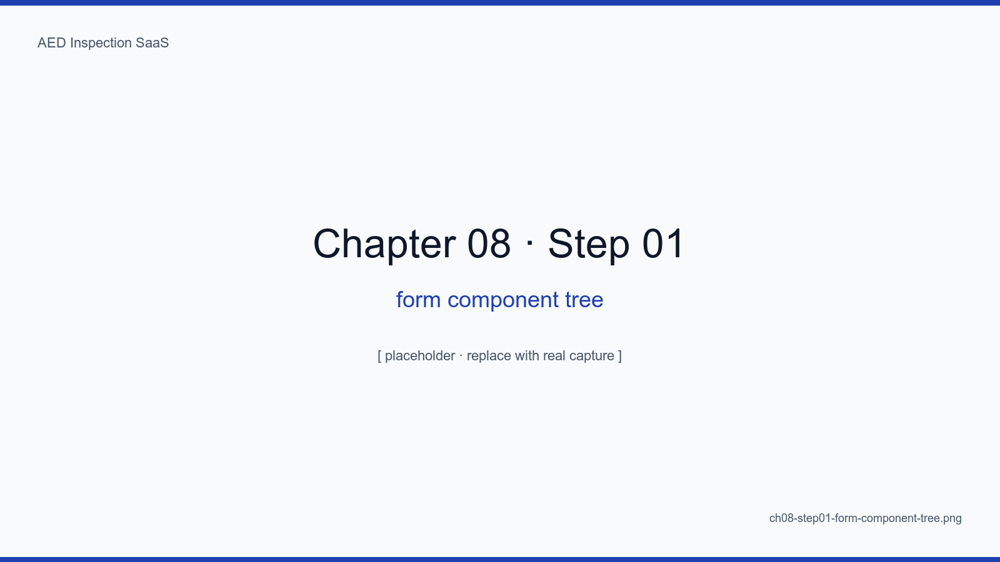
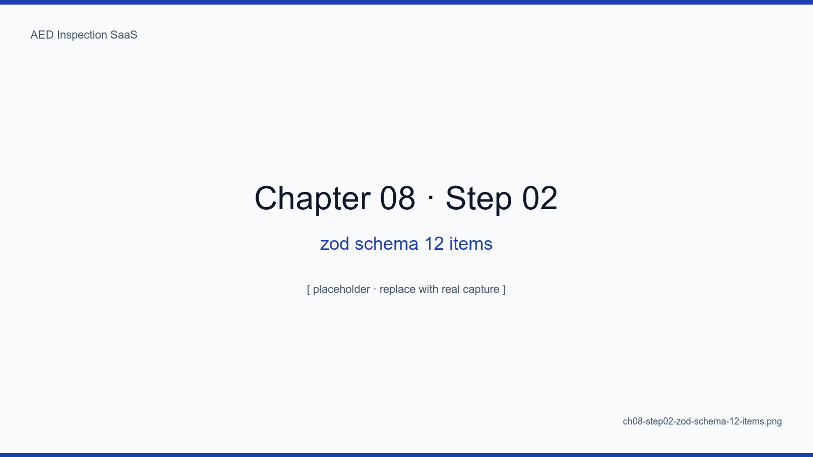
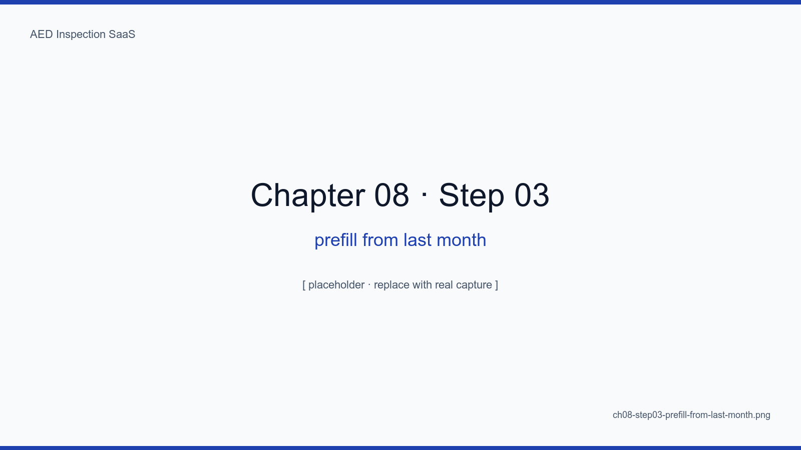
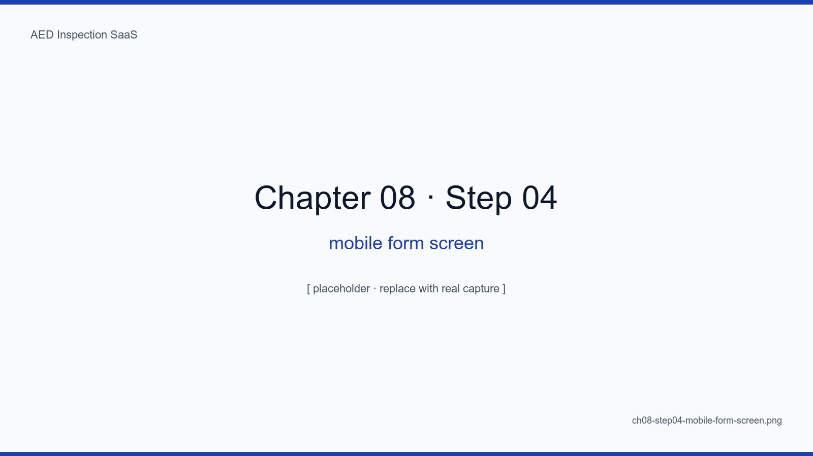
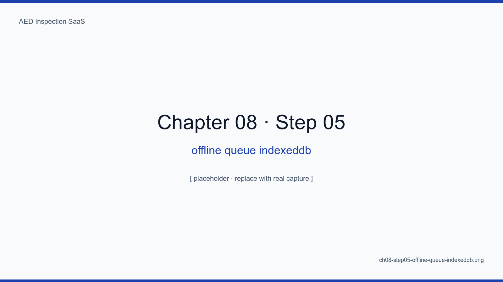
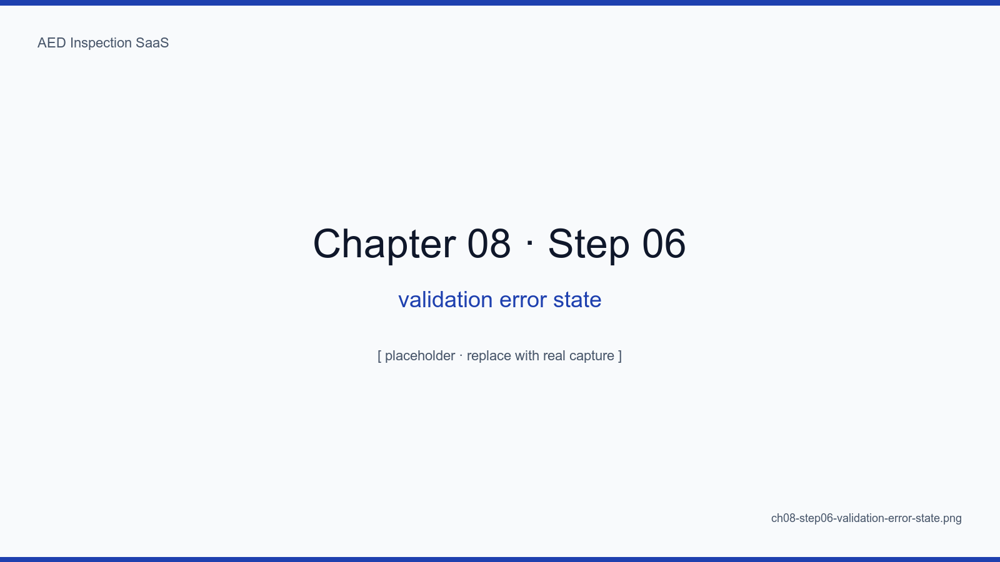

# 8장. 12항목 점검 폼과 자동기재 UX

## 학습 목표

- 12항목 점검 폼을 React Hook Form + Zod 로 타입 안전하게 구성한다
- 지난달 점검값을 자동기재(prefill)하여 "변경된 것만 누르는" UX 를 구현한다
- 모바일 우선 레이아웃의 8가지 작은 결정(터치 타깃, 키보드 회피 등)을 적용한다
- IndexedDB 오프라인 큐로 신호 음영 지역 점검을 지원한다
- 폼 검증 실패 상태의 명확한 사용자 피드백 패턴을 마련한다

## 핵심 개념

12항목 폼은 본 SaaS 의 가장 자주 열리는 화면이다. 점검자는 한 달에 100회 이상
이 폼을 본다. 그래서 우리의 목표는 "필드 채우기"가 아니라 "**필드를 안 채워도
되게 만들기**"다. 자동기재가 폼의 핵심 디자인 결정이다.

<!-- SCREENSHOT: ch08-step01-form-component-tree -->

*그림 8-1. components/inspection/. 컴포넌트 9개로 분할 — 한 파일이 200줄 이하 유지 원칙.*
<!-- /SCREENSHOT -->

## 8.1 Zod 스키마

```ts
export const inspectionInputSchema = z.object({
  deviceId: z.string().uuid(),
  inspectedAt: z.string().datetime(),
  item01_padExpiry: z.string().date().nullable(),
  item02_batteryLevel: z.number().int().min(0).max(100),
  // ... 12개
  notes: z.string().max(2000).optional(),
})
```

<!-- SCREENSHOT: ch08-step02-zod-schema-12-items -->

*그림 8-2. lib/inspection/schema.ts. 클라이언트 검증과 서버 액션 검증이 같은 스키마를 공유.*
<!-- /SCREENSHOT -->

## 8.2 자동기재 — "변경된 것만"

지난달 점검 결과 + 디바이스 메타(설치일, 모델)를 기본값으로 끌어와 RHF 의
`defaultValues` 에 박는다.

<!-- SCREENSHOT: ch08-step03-prefill-from-last-month -->

*그림 8-3. 자동기재된 필드는 회색 텍스트, 사용자가 손대면 파란색으로 변한다. 시각적 차별이 핵심.*
<!-- /SCREENSHOT -->

### 8.2.1 위험

자동기재는 "복붙 점검"의 위험도 함께 가져온다. 완화책: (1) 7일 이상 변경 없는
값에 노란 경고 점, (2) 패드/배터리 만료일은 자동기재하지 않음, (3) 사진은 매번
신규 첨부 강제.

## 8.3 모바일 우선 레이아웃

<!-- SCREENSHOT: ch08-step04-mobile-form-screen -->

*그림 8-4. 한 항목당 한 카드. 다음 항목으로 스와이프. 키보드 올라와도 입력 필드가 가려지지 않게 sticky bottom CTA.*
<!-- /SCREENSHOT -->

### 8.3.1 8가지 작은 결정

1. 터치 타깃 최소 44×44px (iOS HIG)
2. 숫자 입력은 `inputMode="numeric"` 로 숫자 키패드 강제
3. 날짜 입력은 네이티브 `<input type="date">` (capacitor 없이도 충분)
4. 사진 첨부는 `<input type="file" accept="image/*" capture="environment">`
5. 키보드 회피: `position: sticky; bottom: 0` 의 다음 버튼
6. 스와이프 진행률: 상단 12분할 progress bar
7. 흔들어 되돌리기 비활성화 (실수 방지)
8. 다크모드 자동 대응

## 8.4 오프라인 큐

지하 1층, 옥상, 산속 시설은 신호가 끊긴다. 모든 입력은 즉시 IndexedDB 에
저장하고, 신호 복귀 시 백그라운드 sync 로 일괄 전송한다.

<!-- SCREENSHOT: ch08-step05-offline-queue-indexeddb -->

*그림 8-5. 오프라인 상태에서 3개 점검을 큐잉. 우측 패널에 상태(pending/syncing/synced)와 retry 카운트가 보인다.*
<!-- /SCREENSHOT -->

```ts
// lib/offline/queue.ts (요약)
export async function enqueueInspection(input) {
  await db.inspection_queue.add({ ...input, status: "pending", tries: 0 })
  if (navigator.onLine) tryFlush()
}
```

<!-- TODO: 실제 lib/offline/queue.ts 발췌로 대체 -->

## 8.5 검증 실패 상태

<!-- SCREENSHOT: ch08-step06-validation-error-state -->

*그림 8-6. 패드 만료일이 과거 → 빨간 테두리 + "만료일을 다시 확인해주세요" + aria-describedby 로 스크린리더 안내.*
<!-- /SCREENSHOT -->

## 요약

- 12항목 폼의 핵심은 "안 채우게 만드는 자동기재"
- 자동기재의 함정(복붙 점검)은 시각 차별 + 만료 항목 제외 + 사진 강제로 막는다
- 모바일 우선의 작은 결정 8가지가 누적되어 사용성을 결정한다
- IndexedDB 큐 + 백그라운드 sync 로 신호 음영 지역도 안전하게 점검 가능

## 다음 장 미리보기

다음 장에서는 전자서명 캔버스 + SHA-256 해시 + R2 업로드라는 무결성 핵심을
어떻게 구현했는지 코드와 함께 살펴본다.

## 캡처 체크리스트

- [ ] `ch08-step01-form-component-tree.png`
- [ ] `ch08-step02-zod-schema-12-items.png`
- [ ] `ch08-step03-prefill-from-last-month.png`
- [ ] `ch08-step04-mobile-form-screen.png` — iPhone 13 mini 시뮬레이터
- [ ] `ch08-step05-offline-queue-indexeddb.png`
- [ ] `ch08-step06-validation-error-state.png`
