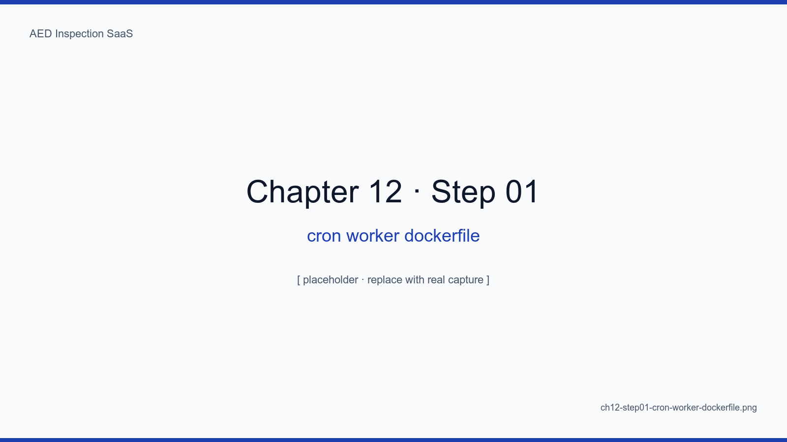
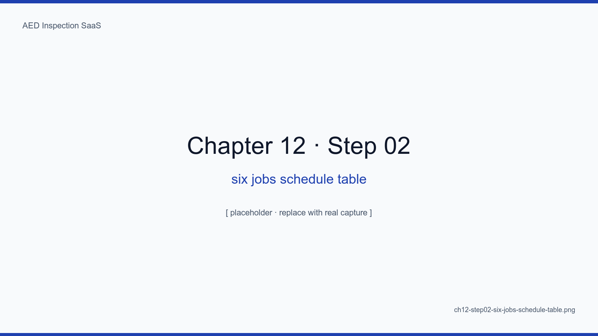
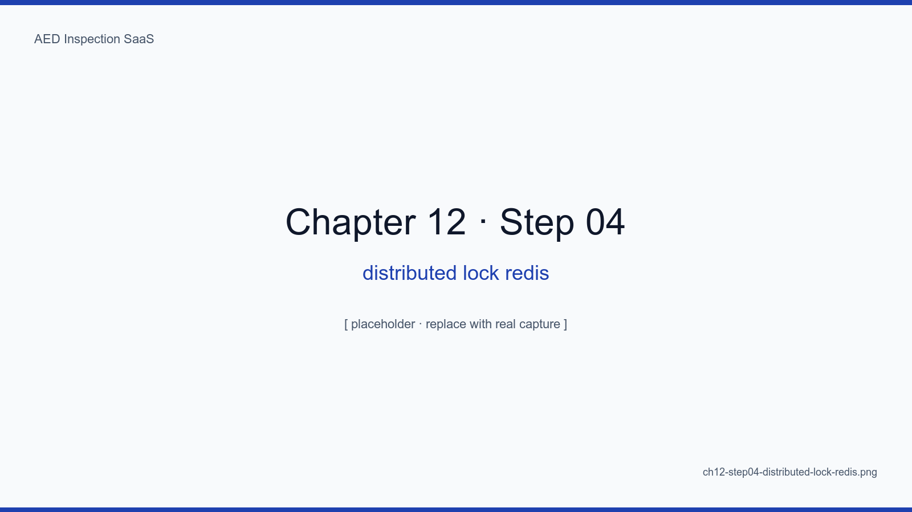
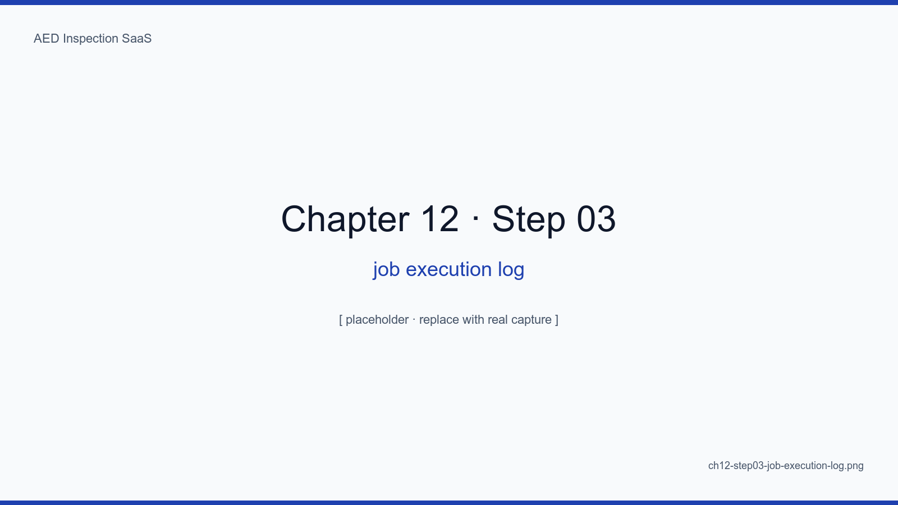
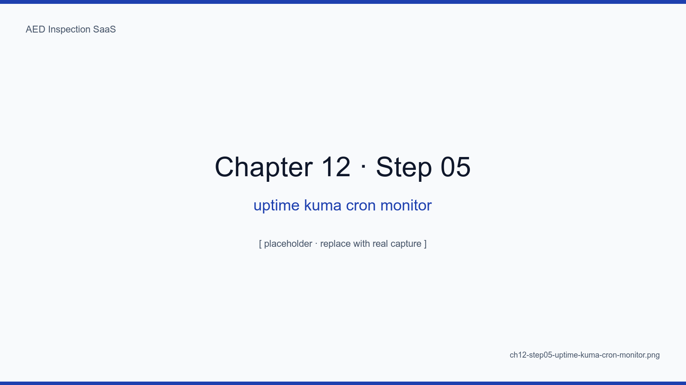
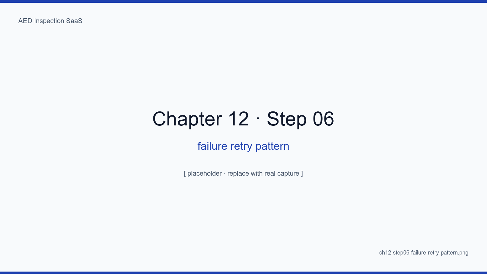

# 12장. cron-worker와 알림 6종

## 학습 목표

- cron-worker 컨테이너 1개에 6종 잡을 안정적으로 묶는 패턴을 이해한다
- Redis 분산 락으로 중복 실행을 방지한다
- 잡 실패 시 재시도/백오프/알림 3종 패턴을 적용한다
- Uptime Kuma push monitor 로 "잡이 돌고 있다"를 외부에서 검증한다
- 6종 잡의 의존 그래프를 그리고 실행 순서를 결정한다

## 핵심 개념

cron-worker 는 본 SaaS 의 "심장 박동"이다. 매일 자정·매월 1일·15분 간격으로 6개
잡이 정확히 돌아야 한다. 한 번 멈추면 점검 누락·보고서 누락·백업 누락이 동시에
일어난다. 그래서 컨테이너 1개에 6종을 묶되, 잡 사이를 **Redis 분산 락 + Uptime
Kuma push** 로 격리·감시한다.

<!-- SCREENSHOT: ch12-step01-cron-worker-dockerfile -->

*그림 12-1. cron-worker 의 Dockerfile. tini 가 PID 1 시그널 처리, healthcheck 가 마지막 잡 실행 시각을 watch.*
<!-- /SCREENSHOT -->

## 12.1 6종 잡 일정

| # | 잡 | cron | 설명 |
|---|---|---|---|
| 1 | schedule-monthly | `0 0 1 * *` | 매월 1일 점검 일정 자동 생성 |
| 2 | report-monthly | `0 2 1 * *` | 매월 1일 02:00 전월 보고서 일괄 생성 |
| 3 | notify-deadline | `0 9 25-31 * *` | 월말 5일간 09:00 미점검 알림 |
| 4 | backup-daily | `0 3 * * *` | 매일 03:00 DB 덤프 + R2 미러 |
| 5 | cleanup-stale | `*/15 * * * *` | 15분 간격 만료 토큰/세션 청소 |
| 6 | retry-failed | `*/5 * * * *` | 5분 간격 실패 큐 재시도 |

<!-- SCREENSHOT: ch12-step02-six-jobs-schedule-table -->

*그림 12-2. cron-worker/src/jobs/index.ts. 한 파일에 6개 잡 등록을 모아 가독성 우선.*
<!-- /SCREENSHOT -->

## 12.2 Redis 분산 락

```ts
async function withLock(key: string, ttlMs: number, fn: () => Promise<void>) {
  const ok = await redis.set(`lock:${key}`, instanceId, "PX", ttlMs, "NX")
  if (!ok) return // another instance is running
  try { await fn() }
  finally { await redis.del(`lock:${key}`) }
}
```

<!-- SCREENSHOT: ch12-step04-distributed-lock-redis -->

*그림 12-3. redis-cli MONITOR. SETNX → fn → DEL 의 3단계가 깔끔하게 보인다. 두 컨테이너 인스턴스가 떠도 한 번만 실행된다.*
<!-- /SCREENSHOT -->

## 12.3 잡 실행 로그

<!-- SCREENSHOT: ch12-step03-job-execution-log -->

*그림 12-4. structured logging. job, run_id, status, duration_ms, error 가 한 줄에. CloudWatch/Datadog 없이도 grep 으로 충분.*
<!-- /SCREENSHOT -->

## 12.4 외부 감시 — Uptime Kuma push monitor

```ts
const url = process.env.KUMA_PUSH_URL_REPORT_MONTHLY
await fetch(`${url}?status=up&msg=ok&ping=${duration}`)
```

<!-- SCREENSHOT: ch12-step05-uptime-kuma-cron-monitor -->

*그림 12-5. 잡이 끝날 때마다 Kuma 에 push. "어제 03:00 backup 잡이 안 왔다"를 5분 안에 알람.*
<!-- /SCREENSHOT -->

### 12.4.1 push 모델의 이유

pull (Kuma 가 잡을 깨우는 모델) 은 잡이 죽었을 때 Kuma 도 같이 침묵한다. push
모델은 "안 오면 알람"이라 한 방향 신뢰성이 높다.

## 12.5 실패 패턴

<!-- SCREENSHOT: ch12-step06-failure-retry-pattern -->

*그림 12-6. retry-failed 잡의 백오프 곡선. 4번째 실패 시 dead-letter 로 옮겨 사람이 본다.*
<!-- /SCREENSHOT -->

| 단계 | 행동 |
|---|---|
| 1차 실패 | 5초 후 재시도 |
| 2차 실패 | 30초 후 재시도 |
| 3차 실패 | 5분 후 재시도 |
| 4차 실패 | dead-letter + 관리자 알림 |

## 12.6 의존 그래프

```
schedule-monthly → notify-deadline (수정 일정 반영)
report-monthly → email-send (큐 트리거)
backup-daily → r2-mirror (백업 후)
```

<!-- TODO: 의존 그래프 시각화 다이어그램 캡처 추가 -->

## 요약

- 컨테이너 1개에 6종 잡, 사이는 Redis 분산 락으로 격리
- 외부 감시는 push 모델 — 침묵이 곧 알람
- 재시도 백오프 4단계 + dead-letter 가 표준
- 의존 그래프는 명시적으로 — 묵시적 순서 의존이 가장 위험

## 다음 장 미리보기

다음 장에서는 abada-65 서버에 Docker Compose 와 Cloudflare Tunnel 을 처음부터
끝까지 배포하는 단계별 절차를 다룬다.

## 캡처 체크리스트

- [ ] `ch12-step01-cron-worker-dockerfile.png`
- [ ] `ch12-step02-six-jobs-schedule-table.png`
- [ ] `ch12-step03-job-execution-log.png`
- [ ] `ch12-step04-distributed-lock-redis.png`
- [ ] `ch12-step05-uptime-kuma-cron-monitor.png`
- [ ] `ch12-step06-failure-retry-pattern.png`
