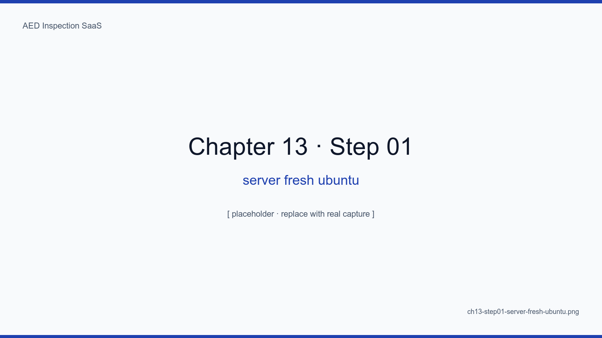
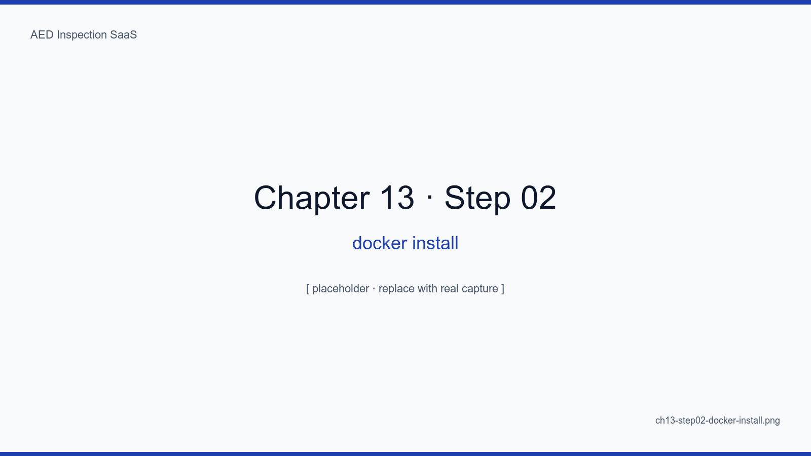
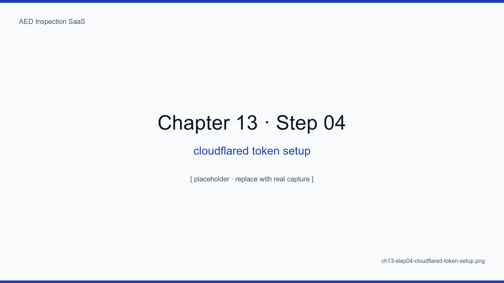
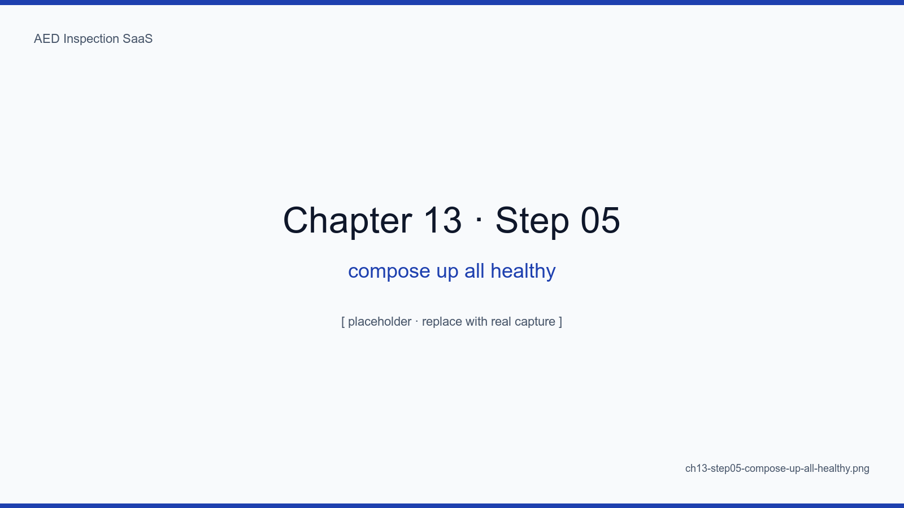
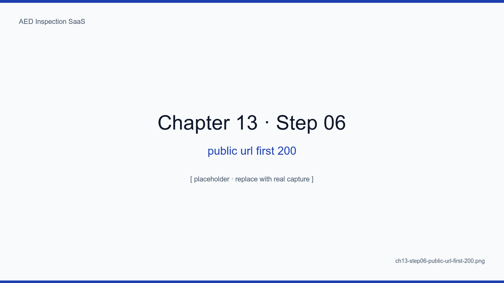
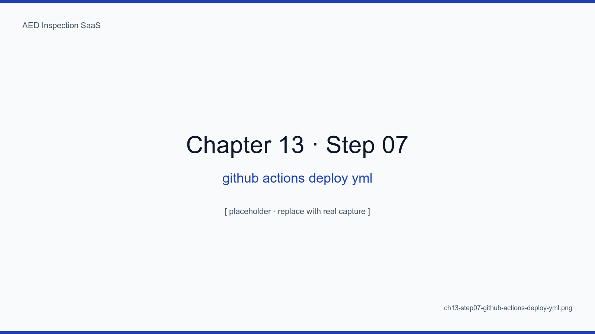

# 13장. Docker Compose + Cloudflare Tunnel 배포

## 학습 목표

- 깨끗한 Ubuntu 22.04 서버에서 본 SaaS 를 30분 안에 배포한다
- Docker + Compose v2 + cloudflared 의 기본 설치 절차를 수행한다
- `.env.production` 의 핵심 25개 변수를 설정한다
- GitHub Actions 로 무인 배포 파이프라인을 구성한다
- 첫 트래픽 200 응답을 외부에서 검증한다

## 핵심 개념

배포는 신비롭지 않다. 잘 정리된 30개 셀의 셸 스크립트일 뿐이다. 이 장에서는
실제 명령을 그대로 따라 칠 수 있도록 한 줄 한 줄 캡처와 함께 정리한다.

<!-- SCREENSHOT: ch13-step01-server-fresh-ubuntu -->

*그림 13-1. 갓 받은 서버. 디스크 200GB, 메모리 8GB, 커널 5.15. 이 상태에서 시작한다.*
<!-- /SCREENSHOT -->

## 13.1 Docker 설치

```bash
curl -fsSL https://get.docker.com | sh
sudo usermod -aG docker $USER
docker compose version
```

<!-- SCREENSHOT: ch13-step02-docker-install -->

*그림 13-2. Docker 25.x, Compose v2 확인.*
<!-- /SCREENSHOT -->

## 13.2 저장소 클론 + 환경변수

```bash
sudo mkdir -p /data/aed
sudo chown $USER:$USER /data/aed
cd /data/aed
git clone https://github.com/saintgo7/saas-aed.git .
cp .env.example .env.production
$EDITOR .env.production   # 부록 B 환경변수 25개 채움
```

<!-- SCREENSHOT: ch13-step03-clone-repo-env -->

*그림 13-3. VS Code Remote SSH 로 본 .env.production. 시크릿 값은 캡처 시 모자이크 처리 (캡처 워크플로우 4절 참조).*
<!-- /SCREENSHOT -->

## 13.3 Cloudflare Tunnel 토큰

```bash
# Cloudflare Dashboard → Zero Trust → Networks → Tunnels → Create
# Tunnel token 발급 → .env.production 의 CLOUDFLARED_TOKEN 에 박음
```

<!-- SCREENSHOT: ch13-step04-cloudflared-token-setup -->

*그림 13-4. Tunnel 생성 후 받는 docker run 명령에서 --token 뒤 값만 추출해 환경변수로.*
<!-- /SCREENSHOT -->

## 13.4 첫 기동

```bash
docker compose --env-file .env.production up -d
docker compose ps
```

<!-- SCREENSHOT: ch13-step05-compose-up-all-healthy -->

*그림 13-5. 첫 기동 후 1분. 모든 컨테이너가 healthy 면 다음 단계로.*
<!-- /SCREENSHOT -->

## 13.5 첫 트래픽 검증

```bash
curl -sS https://aed.example.kr/healthz
# ok
```

<!-- SCREENSHOT: ch13-step06-public-url-first-200 -->

*그림 13-6. 노트북에서 curl 200 + 브라우저에서 로그인 화면. 인바운드 포트 0인데 외부에서 닿는 마법.*
<!-- /SCREENSHOT -->

## 13.6 GitHub Actions 무인 배포

```yaml
# .github/workflows/deploy.yml (요약)
on: { push: { branches: [main] } }
jobs:
  deploy:
    runs-on: ubuntu-latest
    steps:
      - uses: actions/checkout@v4
      - uses: webfactory/ssh-agent@v0.9.0
      - run: ssh deploy@abada-65 "cd /data/aed && git pull && docker compose pull && docker compose up -d"
      - run: |
          for i in 1 2 3 4 5; do
            sleep 10
            curl -fsS https://aed.example.kr/healthz && exit 0
          done
          exit 1
```

<!-- SCREENSHOT: ch13-step07-github-actions-deploy-yml -->

*그림 13-7. push → 3분 → 200. 헬스체크 5회 재시도가 마이그레이션 동안의 콜드 스타트를 흡수한다.*
<!-- /SCREENSHOT -->

### 13.6.1 배포 대형 사고 1차 — Node.js wget

처음에는 nginx healthcheck 를 BusyBox `wget` 으로 했다가 실패했다. 결국 Node.js
한 줄로 교체. (참고: `49a1976`, `f79a3b1` 커밋)

<!-- TODO: 사고 일지 회고 인용 -->

## 13.7 롤백

```bash
docker compose down
git checkout v1.4.2
docker compose up -d
```

이미지를 git tag 와 1:1 매핑해 두면 롤백이 30초로 끝난다.

## 요약

- 30개 셀의 셸 스크립트 = 배포의 본질
- Cloudflare Tunnel 토큰 한 줄로 인바운드 포트 0
- nginx healthz 분리 + 헬스체크 5회 재시도 = 콜드 스타트 흡수
- GitHub Actions 로 push → 3분 → 200 의 무인 파이프라인

## 다음 장 미리보기

다음 장에서는 일 1회 백업, gpg 암호화, R2 미러라는 운영의 진짜 보험을 어떻게
세팅했는지, 그리고 복구 리허설을 6개월에 한 번 하는 이유를 다룬다.

## 캡처 체크리스트

- [ ] `ch13-step01-server-fresh-ubuntu.png`
- [ ] `ch13-step02-docker-install.png`
- [ ] `ch13-step03-clone-repo-env.png` — 시크릿 모자이크
- [ ] `ch13-step04-cloudflared-token-setup.png` — 토큰 모자이크
- [ ] `ch13-step05-compose-up-all-healthy.png`
- [ ] `ch13-step06-public-url-first-200.png`
- [ ] `ch13-step07-github-actions-deploy-yml.png`
