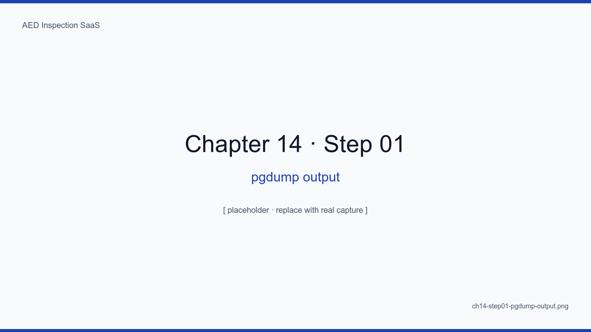
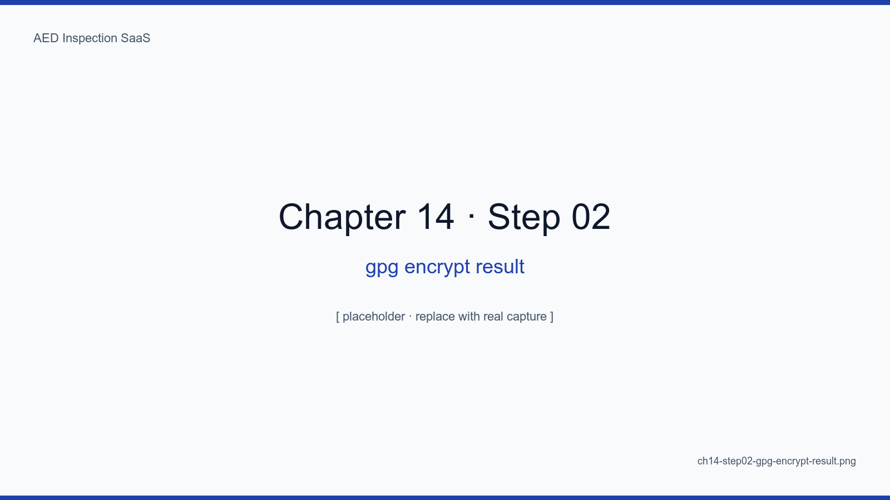
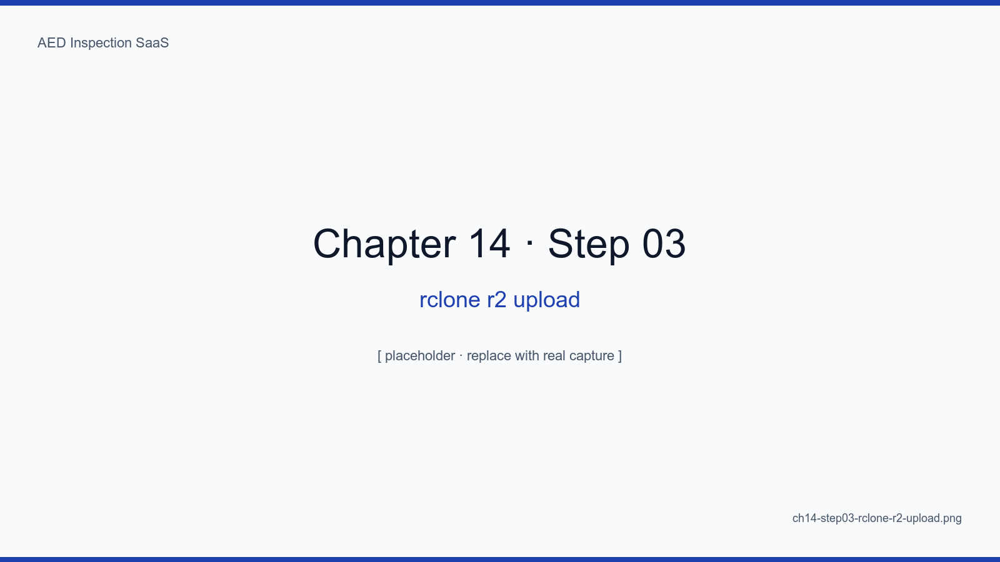
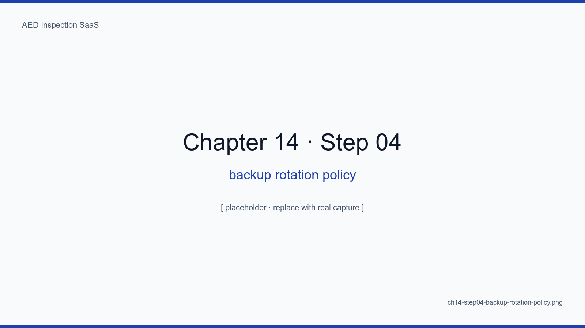
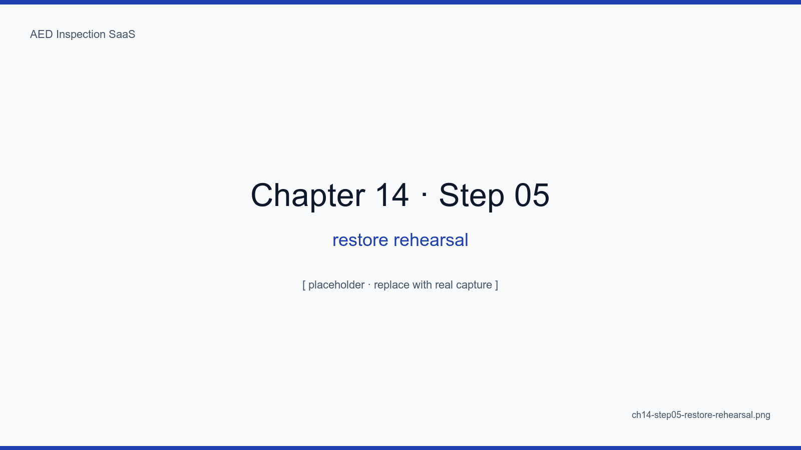

# 14장. 일 1회 백업, gpg 암호화, R2 미러

## 학습 목표

- pg_dump + gzip + gpg 의 3단계 백업 파이프라인을 구축한다
- Cloudflare R2 에 rclone 으로 미러링한다
- 7-30-365 보관 정책으로 비용과 안전을 동시에 챙긴다
- 6개월 1회 복구 리허설을 자동화한다
- 백업 파이프라인의 5가지 실패 모드와 알람을 정리한다

## 핵심 개념

백업의 진짜 의미는 "백업이 있는 것"이 아니라 "**복구 가능한 백업이 있는 것**"이다.
복구 리허설을 한 적 없는 백업은 백업이 아니다. 그래서 우리는 6개월에 한 번
실제 복구 시나리오를 자동 실행하고 통과 여부를 알람으로 받는다.

## 14.1 3단계 파이프라인

```bash
pg_dump $DATABASE_URL \
  | gzip \
  | gpg --encrypt --recipient backup@aed.example.kr \
  > /backup/pg-$(date +%Y%m%d).sql.gz.gpg
```

<!-- SCREENSHOT: ch14-step01-pgdump-output -->

*그림 14-1. 100대 시설 1년치 ~120MB. gzip 후 ~25MB. gpg 후 ~25MB (암호화는 크기 거의 변동 없음).*
<!-- /SCREENSHOT -->

## 14.2 gpg 암호화

키는 운영팀 관리자 1명 + 비상 콜드 스토리지 1개로 이중화. 비밀번호는 운영팀과
별도로 보관.

<!-- SCREENSHOT: ch14-step02-gpg-encrypt-result -->

*그림 14-2. file -i 결과: application/pgp. 누군가 R2 버킷을 통째로 가져가도 키 없이는 무용지물.*
<!-- /SCREENSHOT -->

## 14.3 R2 미러

```bash
rclone copy /backup remote:aed-backup-r2 \
  --include "pg-*.gpg" --transfers 4 --checkers 8
```

<!-- SCREENSHOT: ch14-step03-rclone-r2-upload -->

*그림 14-3. 매일 03:30 자동 실행. R2 egress 무료 정책 덕에 비용 무시 가능.*
<!-- /SCREENSHOT -->

## 14.4 보관 정책 — 7-30-365

| 보관 위치 | 보존 |
|---|---|
| abada-65 로컬 (`/backup`) | 7일 |
| R2 (Hot) | 30일 |
| R2 (Infrequent / Glacier 유사) | 365일 |

<!-- SCREENSHOT: ch14-step04-backup-rotation-policy -->

*그림 14-4. cron 의 cleanup-stale 잡 안에 통합. 단순 find -mtime 으로 충분.*
<!-- /SCREENSHOT -->

## 14.5 복구 리허설

매 6개월마다 자동 실행:

1. 최신 R2 백업 다운로드
2. 임시 컨테이너에 복원
3. seed 시점 대비 행 수 검증
4. 무결성 통과 여부 → Uptime Kuma push

<!-- SCREENSHOT: ch14-step05-restore-rehearsal -->

*그림 14-5. 자동 리허설 로그. row_diff 가 +방향이고 last_record 가 어제 이내면 통과.*
<!-- /SCREENSHOT -->

### 14.5.1 6개월 주기 결정

매월은 너무 잦고 1년은 너무 길다. 6개월이 우리의 트레이드오프 sweet spot.

## 14.6 5가지 실패 모드

| 실패 | 알람 |
|---|---|
| pg_dump 실패 | 즉시 (Kuma push 누락 → 5분 내) |
| gpg 키 만료 | 30일 전 사전 알람 |
| rclone 업로드 실패 | 다음 잡 사이클에서 인지 |
| R2 키 만료 | 분기 1회 점검 |
| 복구 리허설 실패 | 다음 영업일 즉시 |

## 요약

- 백업 = pg_dump + gzip + gpg + rclone, 4단계 파이프라인
- 7-30-365 보관 정책 + R2 무료 egress 가 비용 효율의 핵심
- 6개월 1회 자동 복구 리허설이 "복구 가능한 백업" 의 보증
- 5가지 실패 모드 모두에 명시적 알람 경로 있음

## 다음 장 미리보기

다음 장에서는 Uptime Kuma + Cloudflare Analytics 로 24/7 모니터링을 구축하고,
알람이 운영자의 잠을 깨울 가치가 있는지 결정하는 룰을 다룬다.

## 캡처 체크리스트

- [ ] `ch14-step01-pgdump-output.png`
- [ ] `ch14-step02-gpg-encrypt-result.png`
- [ ] `ch14-step03-rclone-r2-upload.png`
- [ ] `ch14-step04-backup-rotation-policy.png`
- [ ] `ch14-step05-restore-rehearsal.png`
