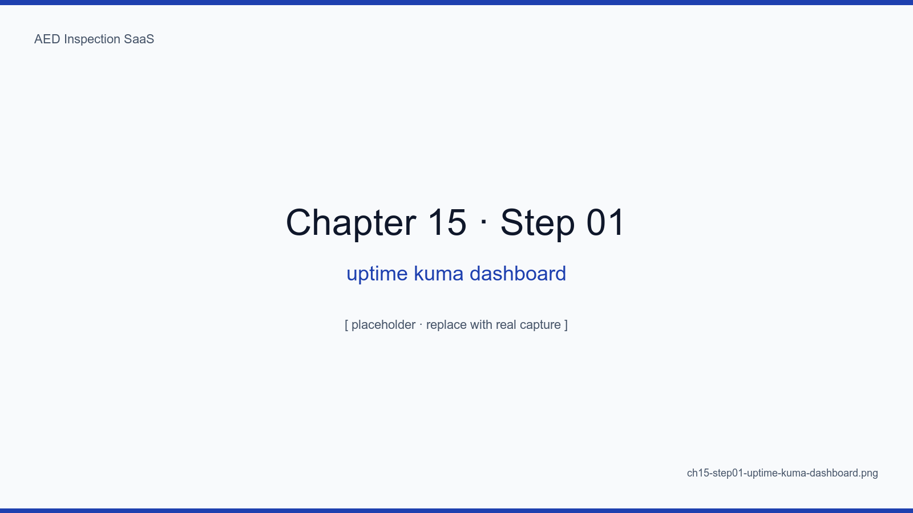
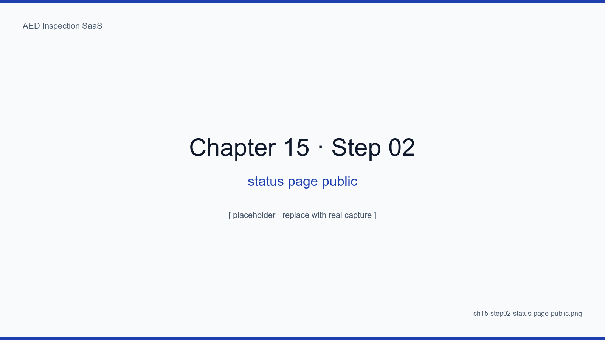
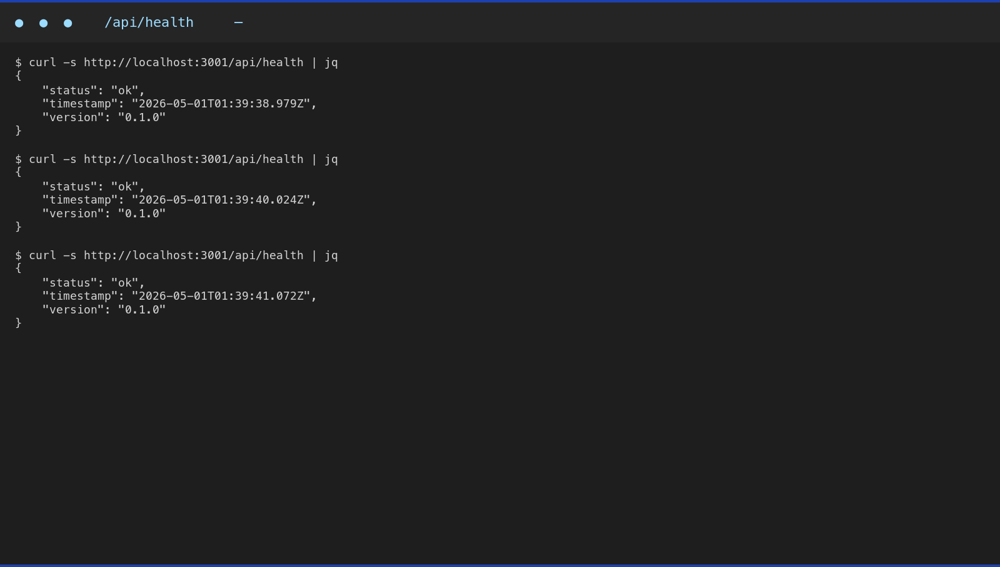
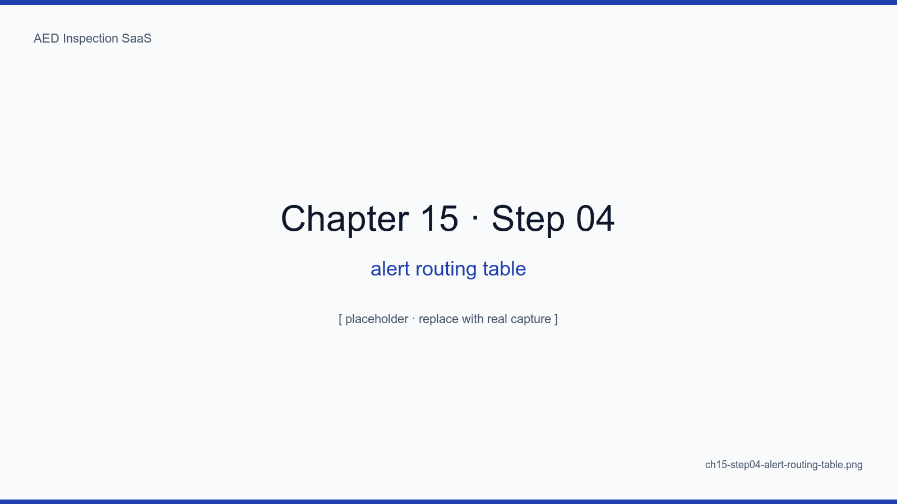
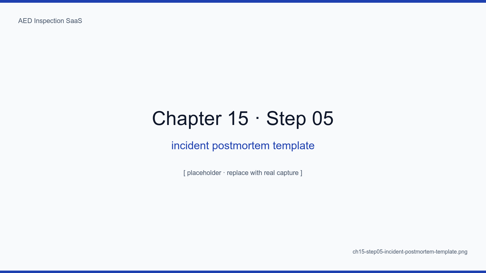

# 15장. 모니터링 — Uptime Kuma + Cloudflare Analytics

## 학습 목표

- Uptime Kuma 의 push monitor / pull monitor 분리 운영을 이해한다
- Cloudflare Analytics 로 엣지 트래픽·WAF 차단·에러율을 본다
- 알람 라우팅 4단계(Slack → 카카오 → 전화 → 호출)를 설정한다
- 알람의 "잠을 깨울 가치"를 판정하는 5가지 룰을 정한다
- 포스트모템 템플릿으로 한 번의 사고가 두 번 일어나지 않게 만든다

## 핵심 개념

모니터링의 진짜 목표는 "그래프를 예쁘게 보는 것"이 아니라 "**잠을 깨울 가치 있는
알람만 받는 것**"이다. 잘못 세팅된 알람은 양치기 소년이 되고, 진짜 사고에 면역이
생긴다. 그래서 우리는 알람 카탈로그를 작게 유지한다.

<!-- SCREENSHOT: ch15-step01-uptime-kuma-dashboard -->

*그림 15-1. 12개 모니터(컨테이너 6 + cron push 6). 99.95% 이상 유지.*
<!-- /SCREENSHOT -->

## 15.1 Push vs Pull 모니터

| 종류 | 적합 |
|---|---|
| Pull (Kuma 가 깨우는) | 외부 URL, 컨테이너 헬스 |
| Push (잡이 알리는) | cron 잡, 백업, 리허설 |

12장에서 다룬 push 가 cron 침묵 알람의 핵심.

## 15.2 공개 상태 페이지

```
https://status.aed.example.kr
```

<!-- SCREENSHOT: ch15-step02-status-page-public -->

*그림 15-2. 시설 관리자에게 "지금 SaaS 가 살아 있나?" 를 1초에 보여주는 것이 신뢰의 출발점.*
<!-- /SCREENSHOT -->

## 15.3 Cloudflare Analytics

엣지 레이어의 트래픽·캐시 적중률·WAF 차단률·5xx 비율을 본다.

<!-- SCREENSHOT: ch15-step03-cloudflare-analytics-traffic -->

*그림 15-3. 일일 PV ~3K, WAF 차단 ~50건. 차단 50건 중 49건은 봇 스캔, 1건은 유효 트래픽 → false positive 룰 검토.*
<!-- /SCREENSHOT -->

## 15.4 알람 라우팅 4단계

<!-- SCREENSHOT: ch15-step04-alert-routing-table -->

*그림 15-4. info=Slack, warn=카카오워크, critical=전화, emergency=직접 호출. 잠을 깨울 가치는 critical 부터.*
<!-- /SCREENSHOT -->

## 15.5 "잠을 깨울 가치" 5룰

1. **사용자에게 보이는 영향이 있는가?** (없으면 morning queue)
2. **자동 복구 30분 안에 가능한가?** (가능하면 morning queue)
3. **보고서/매직링크/cron 핵심 잡인가?** (yes 면 즉시)
4. **2회 이상 반복되었는가?** (반복=노이즈 가능성)
5. **점검 데드라인 임박 시기인가?** (월말 5일은 더 민감하게)

<!-- TODO: 운영 6개월간 false positive 비율 통계 추가 -->

## 15.6 포스트모템 템플릿

```markdown
# Postmortem: <one-line summary>
- Date / Severity
- What happened
- Why (5 whys)
- Impact (사용자 N명, 시간 X분)
- Detection (알람? 사용자 보고? 자동?)
- Action items (체크박스)
```

<!-- SCREENSHOT: ch15-step05-incident-postmortem-template -->

*그림 15-5. docs/incidents/2026-01-15-cron-deadlock.md. 사건 당일 30분 안에 초안, 일주일 안에 액션 아이템 PR 까지 완료.*
<!-- /SCREENSHOT -->

## 요약

- 알람의 절제가 알람의 신뢰를 만든다 — 카탈로그를 작게 유지
- Push (cron 침묵) + Pull (외부 헬스) 두 계열의 결합
- Cloudflare Analytics 가 엣지 레이어의 절반을 무료로 본다
- 포스트모템 1사건 1페이지 = 학습의 누적

## 다음 장 미리보기

다음 장에서는 어댑터 패턴으로 BaaS 종속 없는 코드를 유지하고, 필요 시 30분
안에 타사 인프라로 이전 가능한 구조를 다룬다.

## 캡처 체크리스트

- [ ] `ch15-step01-uptime-kuma-dashboard.png`
- [ ] `ch15-step02-status-page-public.png`
- [ ] `ch15-step03-cloudflare-analytics-traffic.png`
- [ ] `ch15-step04-alert-routing-table.png`
- [ ] `ch15-step05-incident-postmortem-template.png`
