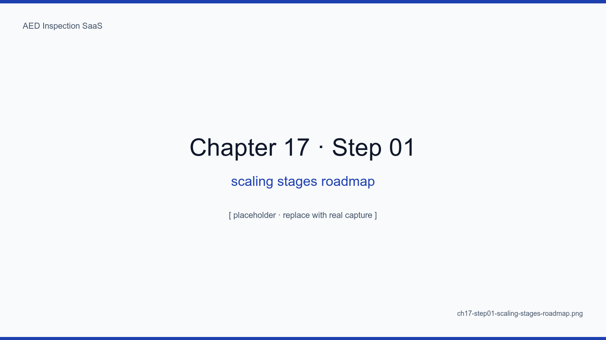
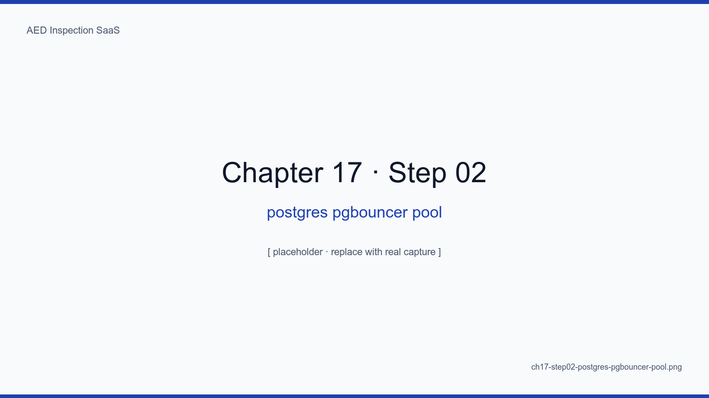
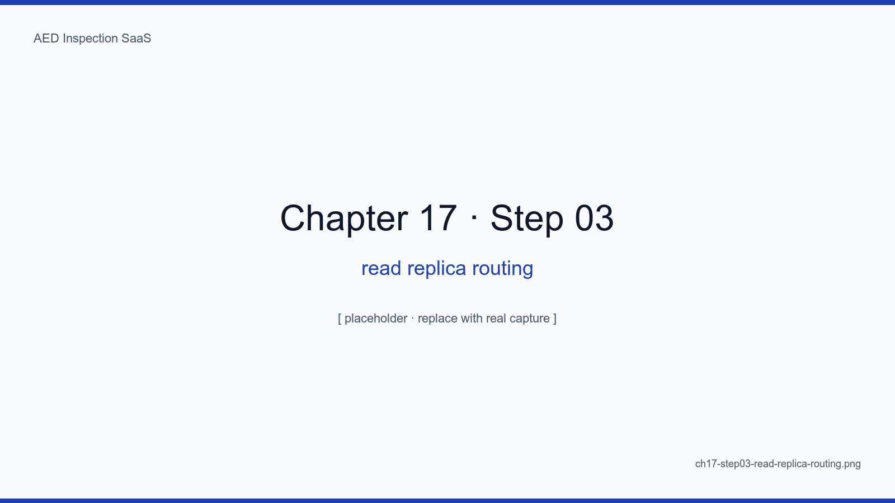
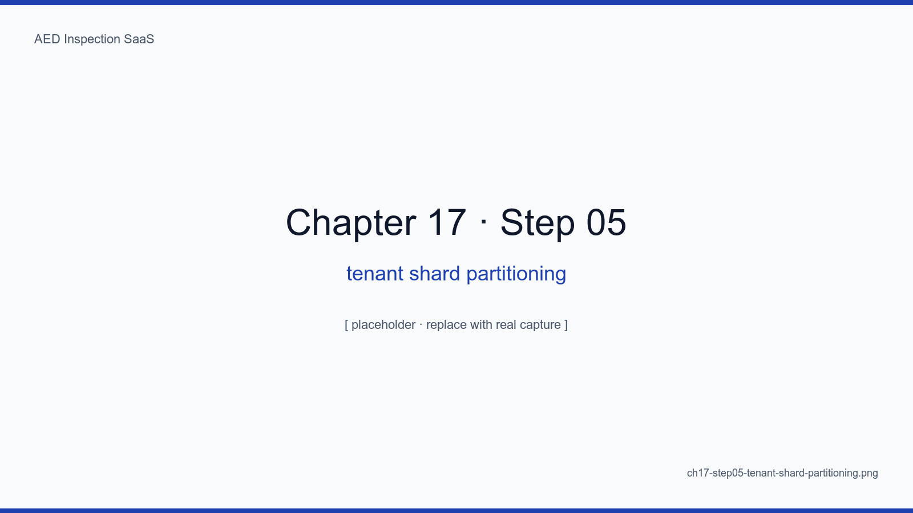
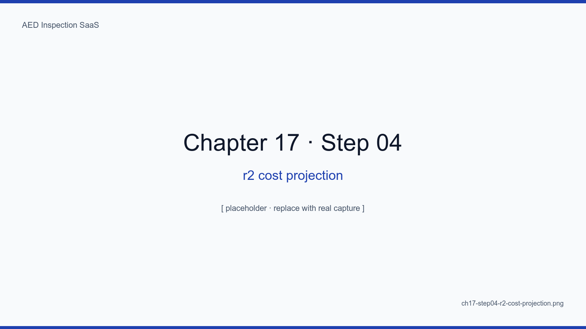
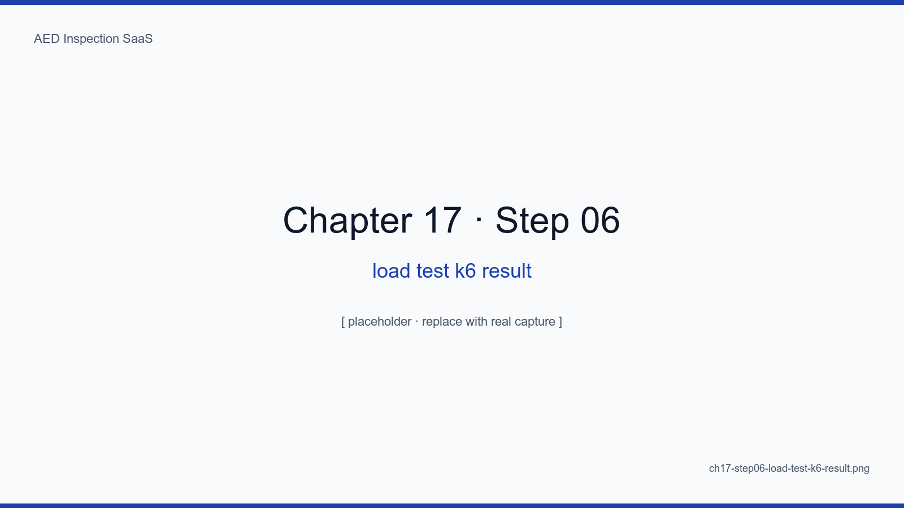

# 17장. 1,000대 → 10,000대 스케일링 로드맵

## 학습 목표

- 100대 / 1,000대 / 10,000대 각 단계에서 무엇이 깨지는지 식별한다
- Postgres pgbouncer + read replica 도입 시점과 패턴을 정한다
- 큰 테넌트 전용 샤드(tenant shard) 도입 임계점을 정량화한다
- k6 부하 테스트로 스케일 한계를 사전 측정한다
- 단일 호스트 → 다중 호스트 전환의 4가지 결정 트리거를 정리한다

## 핵심 개념

100대에서 1,000대까지는 **수직 확장(서버 사양 업그레이드)** 이면 충분하다.
1,000대에서 10,000대 사이 어디선가 우리는 수평 확장 결정을 내려야 한다. 이
장은 그 임계점을 식별하고 미리 준비하는 로드맵이다.

<!-- SCREENSHOT: ch17-step01-scaling-stages-roadmap -->

*그림 17-1. 단계마다 깨지는 컴포넌트 + 도입할 기술 + 예상 비용. 1K 와 10K 사이에 read replica + pgbouncer 가 등장.*
<!-- /SCREENSHOT -->

## 17.1 100대 단계 — 수직 확장만

vCPU 4 / RAM 8GB / NVMe 200GB. 책 1~16장의 구성 그대로. P95 응답 < 200ms,
월간 보고서 5분.

## 17.2 1,000대 단계 — pgbouncer + 캐시

DB 연결이 한계에 다다른다. pgbouncer 로 connection pooling.

```yaml
# docker-compose.yml 추가
pgbouncer:
  image: edoburu/pgbouncer
  environment:
    POOL_MODE: transaction
    MAX_CLIENT_CONN: 1000
    DEFAULT_POOL_SIZE: 25
```

<!-- SCREENSHOT: ch17-step02-postgres-pgbouncer-pool -->

*그림 17-2. pgbouncer SHOW POOLS. 클라이언트 폭증을 DB 커넥션으로부터 격리.*
<!-- /SCREENSHOT -->

### 17.2.1 Redis 캐시

테넌트 메타·디바이스 메타·"이번 달 일정" 같은 핫 데이터를 60초 TTL 로 캐시.

## 17.3 5,000대 단계 — read replica

월말 리포트 생성 시 master 가 무릎을 꿇는다. read replica 분리.

<!-- SCREENSHOT: ch17-step03-read-replica-routing -->

*그림 17-3. lib/db/routing.ts. select 는 replica, insert/update/delete 는 master. 잘못된 라우팅을 잡는 ESLint 룰 동반.*
<!-- /SCREENSHOT -->

### 17.3.1 일관성 함정

방금 INSERT 한 행을 SELECT 했는데 안 보인다 → "쓰기 직후 5초 read-after-write
보장" 룰을 transaction context 로 처리. 17.3 절을 잘못 따라 하면 사고가 난다.

## 17.4 10,000대 단계 — 큰 테넌트 샤드

특정 대형 시설(예: 대학병원 본원 200대) 1개가 전체 부하의 30% 를 먹는 상황 발생.
이 시점에 **선택적 Silo** 를 도입한다. 5장에서 미뤘던 결정이다.

<!-- SCREENSHOT: ch17-step05-tenant-shard-partitioning -->

*그림 17-4. lib/db/shard.ts. 기본 shard + 큰 테넌트 전용 shard 2개로 시작. 매핑 테이블이 곧 운영 자산.*
<!-- /SCREENSHOT -->

## 17.5 R2 비용 곡선

<!-- SCREENSHOT: ch17-step04-r2-cost-projection -->

*그림 17-5. 10K 디바이스 × 5년 × 12 항목 사진 = 약 1.2TB. R2 storage $20 + Class A $5 + Class B $5.*
<!-- /SCREENSHOT -->

## 17.6 k6 부하 테스트

```js
// load-tests/inspection-submit.js
import http from "k6/http"
export const options = { vus: 200, duration: "5m" }
export default function () {
  http.post("https://staging.aed.example.kr/api/inspection", JSON.stringify(payload))
}
```

<!-- SCREENSHOT: ch17-step06-load-test-k6-result -->

*그림 17-6. 동시 200 VU, 5분간. P95 180ms 면 1K 대 운영 안전 마진. 10K 대상 부하 모델은 이 기준에서 5x 스케일링.*
<!-- /SCREENSHOT -->

## 17.7 4가지 결정 트리거

다음 4개 중 2개 이상 yes 면 다음 단계 전환.

1. **P95 응답 200ms 초과 한 달 연속**
2. **월말 보고서 생성 시간 30분 초과**
3. **DB 커넥션 사용률 80% 이상**
4. **R2 storage 1TB 초과**

## 17.8 단일 → 다중 호스트 전환

이 시점이 오면 abada-65 1대 + 보조 1대 (active-passive) 부터 시작한다. 16장의
어댑터 패턴이 이 전환을 지원한다.

<!-- TODO: 실제 1년 운영 후의 P95 추이 차트 추가 -->

## 요약

- 100대까지는 책의 구성 그대로, 1,000대는 pgbouncer + Redis 캐시
- 5,000대는 read replica, 10,000대는 큰 테넌트 선택적 Silo
- 4가지 결정 트리거를 명시화 — "느낌"이 아니라 "수치"로 결정
- 16장의 어댑터 + 17장의 로드맵이 합쳐져 미래 가변성을 흡수

## 다음 장 미리보기

다음으로 부록 A~D 가 이어진다. 12 항목 점검 양식, 환경변수 25개, 운영 체크리스트,
트러블슈팅 12선이다. 책의 본문은 여기서 끝나지만, 운영의 본문은 이제부터 시작이다.

## 캡처 체크리스트

- [ ] `ch17-step01-scaling-stages-roadmap.png`
- [ ] `ch17-step02-postgres-pgbouncer-pool.png`
- [ ] `ch17-step03-read-replica-routing.png`
- [ ] `ch17-step04-r2-cost-projection.png`
- [ ] `ch17-step05-tenant-shard-partitioning.png`
- [ ] `ch17-step06-load-test-k6-result.png`
