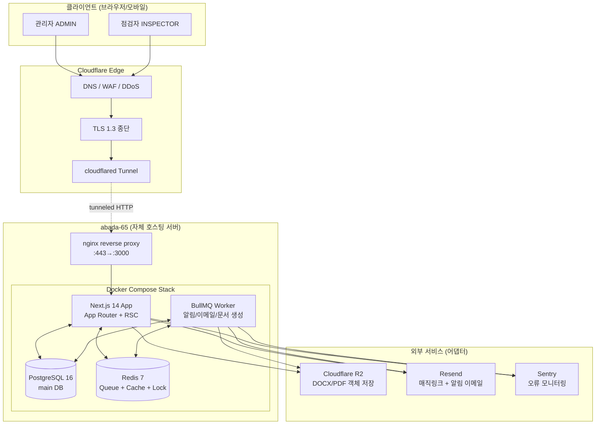
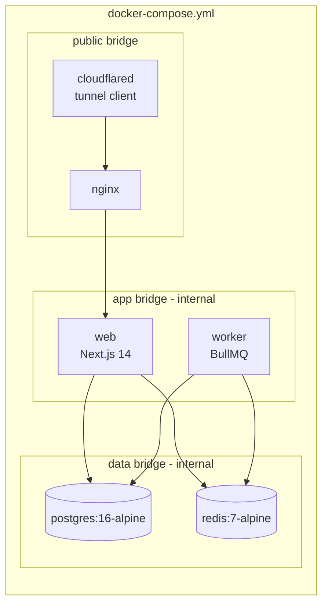
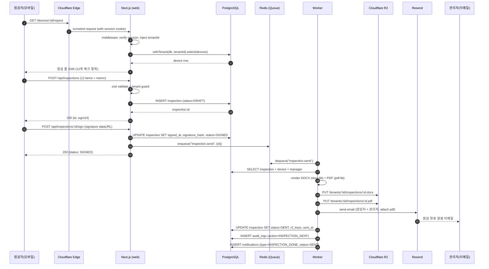

# 01. 시스템 아키텍처 설계

> AED 점검 관리 SaaS의 전체 시스템 아키텍처. 다기관(multi-tenant) 환경에서 "간단입력 → 서명 → 발송 → 보존" 워크플로우를 제공한다.

---

## 1. 설계 목표

| 목표 | 설명 |
|------|------|
| **다기관 격리** | 한 인스턴스에서 다수 기관(병원/관공서/학교)을 운영하되, 데이터는 서로 보이지 않는다 |
| **저비용 자체 호스팅** | abada-65 서버 + Cloudflare Tunnel 조합으로 SaaS 수준의 가용성을 무료/저비용으로 확보 |
| **법적 증빙성** | 서명/발송 기록을 7년 보존(R2 immutable), audit_logs로 누가 무엇을 변경했는지 재구성 가능 |
| **외부 의존성 교체 가능** | R2/Resend/Cloudflare 어댑터 패턴으로 설계, 운영 환경 이전 시 인터페이스만 갈아끼움 |
| **빠른 점검 입력** | 현장 점검자가 모바일에서 12개 항목을 30초 이내에 입력하고 서명까지 완료 |

---

## 2. 전체 아키텍처 (네트워크 토폴로지)



### 2.1 트래픽 경로 요약

1. **사용자 → Cloudflare Edge**: HTTPS(443). DNS, WAF, 봇 차단, TLS 종단이 여기서 끝난다.
2. **Cloudflare Edge → abada-65**: `cloudflared` 데몬이 outbound-only 터널을 유지. 서버에 80/443 포트를 열 필요가 없다.
3. **nginx → Next.js**: 컨테이너 내부 :3000 프록시. 정적 자산은 nginx가 직접 캐시.
4. **Next.js ↔ PostgreSQL/Redis**: Docker bridge network로 연결, 외부 노출 없음.
5. **Worker → R2/Resend**: BullMQ 잡 처리 중 객체 업로드, 이메일 발송.

---

## 3. 컨테이너 토폴로지



### 3.1 컨테이너 책임 분리

| 컨테이너 | 이미지 | 책임 | 포트 |
|----------|--------|------|------|
| `cloudflared` | `cloudflare/cloudflared:latest` | 터널 유지, 자동 재연결 | (outbound) |
| `nginx` | `nginx:1.27-alpine` | TLS 오프로드(이미 CF 종단), 정적 자산, gzip | 80 (internal) |
| `web` | `node:20-alpine` 빌드 | App Router 렌더링, API 라우트 | 3000 (internal) |
| `worker` | `node:20-alpine` 빌드 | BullMQ 컨슈머, cron 스케줄 | (없음) |
| `postgres` | `postgres:16-alpine` | 트랜잭션 DB, /data/postgres 볼륨 | 5432 (internal) |
| `redis` | `redis:7-alpine` AOF 활성 | 큐/캐시/락, /data/redis 볼륨 | 6379 (internal) |

### 3.2 데이터 볼륨 (abada-65 /data 규칙 준수)

```yaml
volumes:
  postgres_data:
    driver_opts:
      type: none
      device: /data/saas-aed/postgres
      o: bind
  redis_data:
    driver_opts:
      type: none
      device: /data/saas-aed/redis
      o: bind
  r2_cache:
    driver_opts:
      type: none
      device: /data/saas-aed/r2-cache
      o: bind
```

---

## 4. 풀 시나리오: 점검 입력 → 서명 → 발송



### 4.1 단계별 SLA 목표

| 단계 | 목표 응답시간 | 실패 시 동작 |
|------|----------------|---------------|
| 1~5 (페이지 로드) | < 500ms | nginx 5xx 페이지 |
| 6~10 (저장) | < 300ms | 클라이언트 재시도 (idempotency-key) |
| 11~13 (서명) | < 200ms | 트랜잭션 롤백, 사용자에게 재시도 안내 |
| 14~24 (Worker) | < 30s | BullMQ exponential backoff (max 5회), 실패 시 dead-letter + 관리자 알림 |

---

## 5. 외부 의존성 어댑터 패턴

> 모든 외부 SaaS는 인터페이스 뒤에 숨긴다. 비용/장애/규제로 교체할 때 인터페이스만 만족하면 된다.

```typescript
// src/lib/adapters/storage.ts
export interface StorageAdapter {
  put(key: string, body: Buffer, contentType: string): Promise<void>
  getSignedUrl(key: string, ttlSeconds: number): Promise<string>
  delete(key: string): Promise<void>
}

// src/lib/adapters/email.ts
export interface EmailAdapter {
  send(input: {
    to: string[]
    subject: string
    html: string
    attachments?: { filename: string; content: Buffer }[]
  }): Promise<{ messageId: string }>
}
```

### 5.1 어댑터 ↔ 구현 매핑

| 인터페이스 | 1차 구현 | 대체 후보 | 교체 트리거 |
|------------|----------|-----------|--------------|
| `StorageAdapter` | `R2StorageAdapter` (Cloudflare R2) | `S3StorageAdapter` (AWS), `MinIOAdapter` (self-host) | R2 비용 급증 / 리전 규제 |
| `EmailAdapter` | `ResendEmailAdapter` | `SESEmailAdapter` (AWS), `SmtpEmailAdapter` (자체 SMTP) | Resend 발송 한도 초과 / 한국 발송 정책 변경 |
| `TunnelAdapter` | `CloudflaredAdapter` | `tailscale funnel`, 직접 nginx + Let's Encrypt | Cloudflare 차단 / 사내망 정책 |
| `QueueAdapter` | `BullMQAdapter` (Redis) | `PgBossAdapter` (PostgreSQL queue) | Redis 운영 부담 |
| `PdfRenderAdapter` | `PdfLibAdapter` (server-side) | `PuppeteerAdapter` (HTML→PDF) | 폰트/디자인 복잡도 증가 |

### 5.2 의존성 주입 (DI) 컨테이너

```typescript
// src/lib/di/container.ts
import { R2StorageAdapter } from "@/lib/adapters/r2"
import { ResendEmailAdapter } from "@/lib/adapters/resend"

export function buildAppContainer(env: NodeJS.ProcessEnv) {
  return {
    storage: new R2StorageAdapter({
      accountId: env.R2_ACCOUNT_ID!,
      bucket: env.R2_BUCKET!,
      accessKeyId: env.R2_ACCESS_KEY_ID!,
      secretAccessKey: env.R2_SECRET_ACCESS_KEY!,
    }),
    email: new ResendEmailAdapter({
      apiKey: env.RESEND_API_KEY!,
      fromAddress: env.RESEND_FROM!,
    }),
  } as const
}
```

테스트에서는 동일한 인터페이스를 만족하는 `InMemoryStorageAdapter`, `InMemoryEmailAdapter`를 주입하여 외부 호출 없이 통합 테스트를 수행한다.

---

## 6. 가용성 / 백업 전략

| 영역 | 전략 |
|------|------|
| **PostgreSQL** | 매일 02:00 KST `pg_dump` → `/data/saas-aed/backups/` 보관 7일 + 주간 1회 R2 사본 (보관 90일) |
| **Redis** | AOF + 매시간 RDB 스냅샷, 큐 데이터는 휘발성 허용 (실패 시 재처리) |
| **R2 객체** | versioning 활성화, lifecycle: 30일 이후 cold tier, 7년 후 만료 (법적 보관기간) |
| **Cloudflare Tunnel** | systemd 등 자동 재시작 + healthcheck (`/api/health`), 30초 무응답 시 알림 |
| **Sentry** | release 트래킹, p95 응답시간 / 5xx 비율 임계치 알림 |

---

## 7. 환경 분리

| 환경 | 도메인 | DB | R2 버킷 | 비고 |
|------|--------|----|--------|------|
| Production | `aed.abada.kr` | `saas_aed_prod` | `saas-aed-prod` | abada-65 본 인스턴스 |
| Staging | `aed-stg.abada.kr` | `saas_aed_stg` | `saas-aed-stg` | abada-64 (별도 호스트) |
| Local Dev | `localhost:3000` | docker pg | MinIO 로컬 | `pnpm dev` |

`NODE_ENV` + `APP_ENV` 두 변수로 분기. 환경별 `.env.{env}` 파일은 1Password에서 동기화하며 git에는 들어가지 않는다.

---

## 8. 다음 문서로의 연결

- 데이터 모델은 [02-erd.md](./02-erd.md)에서 8개 테이블의 컬럼/인덱스/관계까지 상세화한다.
- API 계약은 [03-api-spec.md](./03-api-spec.md)에서 12개 엔드포인트별 요청/응답을 정의한다.
- 다기관 격리 3계층은 [04-tenant-isolation.md](./04-tenant-isolation.md)에서 코드 레벨로 다룬다.
