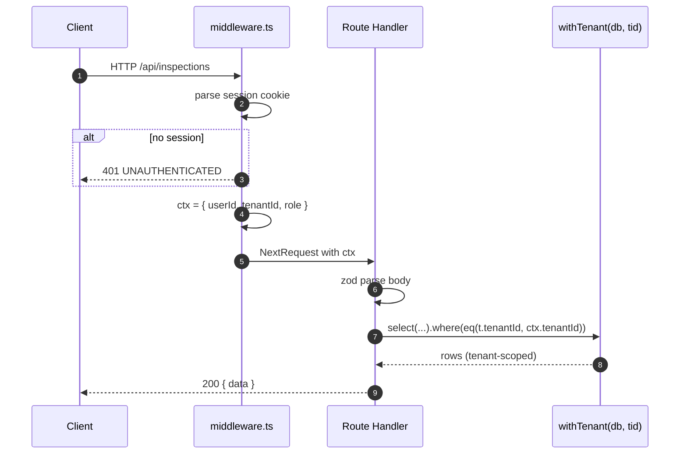

# 03. API 명세

> Next.js 14 App Router의 Route Handlers (`app/api/**/route.ts`) 기반. 모든 응답은 JSON, 인증은 Auth.js v5 세션 쿠키, 다기관 격리는 미들웨어 + ORM 가드 2중 검증.

---

## 1. 공통 규칙

### 1.1 베이스 URL

| 환경 | URL |
|------|-----|
| Production | `https://aed.abada.kr/api` |
| Staging | `https://aed-stg.abada.kr/api` |
| Local | `http://localhost:3000/api` |

### 1.2 공통 헤더

| 헤더 | 필수 | 설명 |
|------|------|------|
| `Cookie: authjs.session-token=...` | 인증 라우트 외 모두 | Auth.js 세션 |
| `Idempotency-Key: <uuid>` | POST/PATCH 권장 | 중복 요청 방지 (24h) |
| `X-Request-Id` | 자동 발급 | 미설정 시 서버가 생성, 응답에 echo |

### 1.3 공통 응답 포맷

```jsonc
// 성공
{ "data": <payload>, "meta": { "requestId": "req_..." } }

// 에러
{
  "error": {
    "code": "TENANT_FORBIDDEN",
    "message": "다른 기관의 자원에 접근할 수 없습니다",
    "details": { "resource": "device", "id": "..." }
  },
  "meta": { "requestId": "req_..." }
}
```

### 1.4 공통 에러 코드

| HTTP | code | 의미 |
|------|------|------|
| 400 | `VALIDATION_ERROR` | zod 검증 실패 |
| 401 | `UNAUTHENTICATED` | 세션 없음/만료 |
| 403 | `FORBIDDEN_ROLE` | 권한 부족 (INSPECTOR가 ADMIN 전용 호출) |
| 403 | `TENANT_FORBIDDEN` | 타 테넌트 자원 접근 시도 |
| 404 | `NOT_FOUND` | 자원 없음 (또는 가시 권한 없음) |
| 409 | `CONFLICT` | 멱등성 위반/중복 자원 |
| 422 | `UNPROCESSABLE` | 비즈니스 규칙 위반 (예: SIGNED 상태에서 재서명) |
| 429 | `RATE_LIMITED` | rate limit 초과 |
| 500 | `INTERNAL` | 처리 중 알 수 없는 오류 |

### 1.5 권한 / 테넌트 가드 적용 표

| 라우트 | 인증 | 역할 | 테넌트 가드 |
|--------|------|------|--------------|
| `/api/auth/*` | 부분 | ─ | ─ |
| `/api/health` | 불필요 | ─ | ─ |
| `/api/devices*` | 필요 | INSPECTOR(R), ADMIN(W) | `withTenant` 강제 |
| `/api/inspections*` | 필요 | INSPECTOR(W), ADMIN(R) | `withTenant` 강제 |
| `/api/inspections/:id/sign` | 필요 | 자신의 DRAFT만 | `withTenant` + `inspector_id == session.userId` |
| `/api/inspections/:id/send` | 필요 | ADMIN | `withTenant` 강제 |
| `/api/history` | 필요 | INSPECTOR/ADMIN | `withTenant` 강제 |

---

## 2. 엔드포인트 (12개)

### 2.1 `POST /api/auth/magic-link` — 매직링크 발송

**역할**: 이메일로 1회용 로그인 링크 전송. Auth.js v5 EmailProvider 위임.

요청:

```json
{ "email": "user@smc.example", "tenantSlug": "smc" }
```

응답 200:

```json
{ "data": { "sent": true, "expiresInSeconds": 900 }, "meta": { "requestId": "req_..." } }
```

에러:

| HTTP | code |
|------|------|
| 400 | `VALIDATION_ERROR` (이메일 형식, slug 누락) |
| 404 | `NOT_FOUND` (해당 tenant slug에 등록되지 않은 이메일 — 단, 보안상 200으로 동일 응답하는 옵션 사용) |
| 429 | `RATE_LIMITED` |

---

### 2.2 `GET /api/auth/callback?token=...` — 매직링크 검증

**역할**: 토큰 해시 검증, 세션 쿠키 발급. (Auth.js 내부 라우트, 명세 문서화 목적)

요청 쿼리: `token` (opaque)

응답: 302 리다이렉트 `/dashboard` + `Set-Cookie: authjs.session-token=...`

에러: 410 `GONE` (만료/사용됨), 400 `VALIDATION_ERROR`.

---

### 2.3 `POST /api/auth/signout` — 로그아웃

요청: 본문 없음.

응답 204: 쿠키 삭제.

---

### 2.4 `GET /api/devices` — 기기 목록 (페이지네이션)

**역할**: 현재 테넌트의 기기 목록.

요청 쿼리:

| 파라미터 | 타입 | 기본 |
|----------|------|------|
| `q` | string | (검색: serial/location) |
| `cursor` | string | (커서) |
| `limit` | number | 20 (max 100) |
| `expiringWithin` | number(days) | (옵션, pad/device 만료 임박 필터) |

응답 200:

```json
{
  "data": {
    "items": [
      {
        "id": "uuid",
        "serialNo": "AED-001",
        "model": "Philips FRx",
        "locationName": "본관 1F",
        "padExpiresAt": "2026-09-01",
        "batteryExpiresAt": "2027-03-01",
        "deviceExpiresAt": "2030-01-01",
        "lastInspectedAt": "2026-04-15T09:00:00Z"
      }
    ],
    "nextCursor": "..."
  }
}
```

권한: INSPECTOR(R), ADMIN(R/W). 가드: `withTenant(db, ctx.tenantId)`.

---

### 2.5 `POST /api/devices` — 기기 생성

**권한**: ADMIN only.

요청:

```json
{
  "serialNo": "AED-002",
  "model": "ZOLL AED Plus",
  "locationName": "별관 2F",
  "locationAddr": "...",
  "padExpiresAt": "2027-01-01",
  "batteryExpiresAt": "2028-01-01",
  "deviceExpiresAt": "2032-01-01",
  "managers": [{ "userId": "uuid", "role": "PRIMARY" }]
}
```

응답 201: `{ "data": { "id": "uuid", ... } }`

에러:

| HTTP | code |
|------|------|
| 403 | `FORBIDDEN_ROLE` (INSPECTOR가 호출) |
| 409 | `CONFLICT` (`serialNo` 중복 — 같은 테넌트 내) |
| 422 | `UNPROCESSABLE` (만료일이 과거) |

---

### 2.6 `PATCH /api/devices/:id` — 기기 수정

**권한**: ADMIN only.

요청 (부분 업데이트):

```json
{ "locationName": "본관 1F (이전)", "padExpiresAt": "2027-06-01" }
```

응답 200: 갱신된 자원.

가드: `withTenant` + `WHERE id = :id AND tenant_id = :tid`. 다른 테넌트 id를 넣으면 404 (존재 자체를 노출하지 않음).

---

### 2.7 `DELETE /api/devices/:id` — 기기 폐기 (soft)

**권한**: ADMIN only.

응답 204. 내부적으로 `deleted_at = now()`. 관련 미점검 알림은 cancel.

---

### 2.8 `POST /api/inspections` — 점검 입력 (DRAFT 생성)

**권한**: INSPECTOR/ADMIN.

요청:

```json
{
  "deviceId": "uuid",
  "checklist": {
    "OP_POWER": "OK", "OP_PAD": "OK", "OP_BATTERY": "OK",
    "BX_ALARM": "OK", "BX_GUIDE": "OK", "BX_EMG": "OK", "BX_CPR": "OK", "BX_EXP": "NG",
    "LOC_ENT": "OK", "LOC_DIR": "OK",
    "DOC_FILE": "OK", "TIME_24": "OK"
  },
  "memo": "EXP 항목 패드 만료 임박, 교체 요청"
}
```

응답 201:

```json
{ "data": { "id": "uuid", "status": "DRAFT", "signUrl": "/inspections/<id>/sign" } }
```

가드: `device.tenantId === ctx.tenantId` 확인 후 INSERT. 12개 키 모두 필수 (zod enum 검증).

---

### 2.9 `POST /api/inspections/:id/sign` — 서명

**권한**: 해당 inspection의 `inspector_id`와 동일한 사용자만.

요청:

```json
{
  "signatureDataUrl": "data:image/png;base64,iVBORw0KG...",
  "signedAt": "2026-05-01T09:00:00Z"
}
```

응답 200:

```json
{
  "data": {
    "id": "uuid",
    "status": "SIGNED",
    "signatureHash": "sha256:abcd...",
    "signedAt": "2026-05-01T09:00:00Z"
  }
}
```

처리:
1. inspection 상태가 `DRAFT`인지 확인 (아니면 422 `UNPROCESSABLE`).
2. signature PNG → R2 업로드, SHA256 해시 계산.
3. `signatureHash`, `signatureUrl`, `signedAt` 저장 + `status=SIGNED`.
4. BullMQ에 `inspection.send` 잡 enqueue.
5. `audit_logs` INSERT (`action=INSPECTION_SIGNED`).

---

### 2.10 `POST /api/inspections/:id/send` — 강제 재발송

**권한**: ADMIN only.

요청 (옵션):

```json
{ "additionalRecipients": ["manager2@smc.example"] }
```

응답 202:

```json
{ "data": { "queued": true, "jobId": "bull:..." } }
```

이미 SENT 상태여도 재발송 허용 (사용 사례: 이메일 분실).

---

### 2.11 `GET /api/history` — 점검 이력 조회

**역할**: 기관 전체 점검 이력 + 필터.

요청 쿼리:

| 파라미터 | 설명 |
|----------|------|
| `deviceId` | 특정 기기로 한정 |
| `inspectorId` | 특정 점검자 |
| `from`, `to` | ISO 날짜 범위 |
| `status` | DRAFT/SIGNED/SENT/FAILED |
| `cursor`, `limit` | 페이지네이션 |

응답 200:

```json
{
  "data": {
    "items": [
      {
        "id": "uuid",
        "deviceId": "uuid",
        "deviceSerial": "AED-001",
        "inspector": { "id": "uuid", "name": "홍길동" },
        "status": "SENT",
        "inspectedAt": "2026-04-15T09:00:00Z",
        "sentAt": "2026-04-15T09:01:23Z",
        "pdfUrl": "https://...signed-r2-url..."
      }
    ],
    "nextCursor": null
  }
}
```

가드: `withTenant`. `pdfUrl`은 5분 유효한 signed URL.

---

### 2.12 `GET /api/health` — 헬스체크

**역할**: nginx/cloudflared/uptime 체크용. 인증 불필요.

응답 200:

```json
{
  "data": {
    "status": "ok",
    "version": "1.4.2",
    "checks": { "db": "ok", "redis": "ok", "r2": "ok" }
  }
}
```

DB/Redis 둘 중 하나라도 실패하면 503 + `status: "degraded"`.

---

## 3. Rate Limit 정책

> Redis(`@upstash/ratelimit` 호환 sliding window)로 구현. 키 = `${ip}:${tenantId}:${endpoint}`.

| 엔드포인트 | 한도 | 윈도우 | 위반 시 |
|------------|------|--------|---------|
| `POST /api/auth/magic-link` | 5회 | 10분 | 429 + 60초 cooldown |
| `GET /api/auth/callback` | 20회 | 1분 | 429 |
| `POST /api/devices` | 30회 | 1분 | 429 |
| `PATCH /api/devices/:id` | 60회 | 1분 | 429 |
| `POST /api/inspections` | 120회 | 1분 | 429 (현장 빠른 입력 허용) |
| `POST /api/inspections/:id/sign` | 60회 | 1분 | 429 |
| `POST /api/inspections/:id/send` | 10회 | 1분 | 429 (재발송 남용 방지) |
| `GET /api/history` | 120회 | 1분 | 429 |
| `GET /api/devices` | 240회 | 1분 | 429 |
| `GET /api/health` | 무제한 | ─ | ─ (단, IP당 1000/분 안전망) |
| 기본 (catch-all) | 60회 | 1분 | 429 |

응답 헤더에 항상 포함:

```
X-RateLimit-Limit: 60
X-RateLimit-Remaining: 12
X-RateLimit-Reset: 1714531200
```

---

## 4. OpenAPI 스타일 요약 (발췌)

```yaml
# openapi/aed.yaml (발췌)
paths:
  /devices:
    get:
      summary: List devices (tenant-scoped)
      security: [{ sessionCookie: [] }]
      parameters:
        - { in: query, name: q, schema: { type: string } }
        - { in: query, name: cursor, schema: { type: string } }
        - { in: query, name: limit, schema: { type: integer, maximum: 100 } }
      responses:
        '200': { $ref: '#/components/responses/DeviceList' }
        '401': { $ref: '#/components/responses/Unauthenticated' }
    post:
      summary: Create device (ADMIN only)
      security: [{ sessionCookie: [] }]
      requestBody: { $ref: '#/components/requestBodies/DeviceCreate' }
      responses:
        '201': { $ref: '#/components/responses/Device' }
        '403': { $ref: '#/components/responses/ForbiddenRole' }
        '409': { $ref: '#/components/responses/Conflict' }

  /inspections/{id}/sign:
    post:
      summary: Sign an inspection (DRAFT → SIGNED)
      security: [{ sessionCookie: [] }]
      parameters:
        - { in: path, name: id, required: true, schema: { type: string, format: uuid } }
      requestBody: { $ref: '#/components/requestBodies/InspectionSign' }
      responses:
        '200': { $ref: '#/components/responses/Inspection' }
        '422': { $ref: '#/components/responses/Unprocessable' }
```

---

## 5. 공통 미들웨어 흐름



다음은 [04-tenant-isolation.md](./04-tenant-isolation.md)에서 위 미들웨어와 `withTenant`의 구현 상세, ESLint 강제, 침투 테스트 시나리오를 다룬다.
